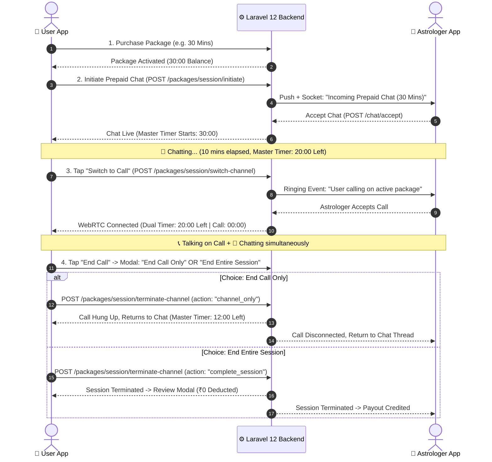

# 🚀 Prepaid Package Hybrid Consultation Engine — Complete System Specification & Integration Blueprint
**Target Audience:** Mobile Developers (Flutter / React Native), Backend Engineers, UI/UX Designers, and QA Engineers.  
**Document Version:** 2.0 (Production Architecture)

---

## 📑 Table of Contents
1. [Core Architectural Invariants](#1-core-architectural-invariants)
2. [Dual-Timer Mechanism (Master Countdown + Call Stopwatch)](#2-dual-timer-mechanism)
3. [WhatsApp-Style Concurrent Chat & Call Experience](#3-whatsapp-style-concurrent-chat--call-experience)
4. [Complete End-to-End Lifecycle Flow](#4-complete-end-to-end-lifecycle-flow)
5. [Granular End-Session Modal Matrix](#5-granular-end-session-modal-matrix)
6. [Complete API Endpoints Reference Matrix](#6-complete-api-endpoints-reference-matrix)
7. [Real-Time WebSocket & Push Notification Events](#7-real-time-websocket--push-notification-events)
8. [Edge Cases & Error Recovery Handbook](#8-edge-cases--error-recovery-handbook)

---

## 1. Core Architectural Invariants

| Rule | Specification |
|---|---|
| **Zero Wallet Deductions** | Rates for both Chat and Call subchannels inside an active package are strictly `0.00`. The user's main wallet balance is never touched. |
| **No Chat Destruction on Call Switch** | Switching to a voice/video call **NEVER closes or completes** the chat session. The chat thread remains continuously alive, allowing both parties to message, share photos, and view Kundli charts while on the call. |
| **One-Time Chat Acceptance (Zero Re-Acceptance)** | Chat acceptance is required **only ONCE** at the initial session start. When switching from Call back to Chat, the chat is **instantly active (`ongoing`) with 0 prompts/0 waiting**. |
| **Call-Only Acceptance Prompt** | The "Accept Call" ringing prompt is **strictly and exclusively for Voice/Video Calls** (because audio/mic access requires active astrologer pickup). |
| **Unified Wall-Clock Calculation** | Time remaining is calculated server-side based on `subSession.started_at` and `purchase.remaining_duration`. App crashes, kills, or phone restarts do not corrupt the timer. |
| **Guaranteed Astrologer Payout** | Astrologer earnings for the package duration are locked and credited upon session completion without dispute. |

---

## 2. Dual-Timer Mechanism

When a call is connected inside a Prepaid Package session, the mobile app renders **TWO distinct timers**:

```text
┌────────────────────────────────────────────────────────┐
│ 👤 Acharya Sharma           [ 💬 Floating Chat Button ]│
│ ────────────────────────────────────────────────────── │
│ ⏳ Master Package Left: 22:15    (Counting Down ↓)     │
│ 📞 Call Connected Duration: 04:30 (Counting Up ↑)      │
│ 🏷️ Zero Additional Charges (Prepaid Hybrid Pack)       │
└────────────────────────────────────────────────────────┘
```

### 1. Timer 1: Master Package Countdown (Counts Down ↓)
- **Source:** Backend `remaining_seconds` calculated from `started_at`.
- **Behavior:** Starts when the first channel (Chat or Call) is accepted (e.g., `30:00` $\rightarrow$ `29:59` $\rightarrow$ `00:00`).
- **Persistence:** Never pauses or resets when switching between Call and Chat.

### 2. Timer 2: Active Call Stopwatch (Counts Up ↑)
- **Source:** Client WebRTC Call connection timestamp (`call_connected_at`).
- **Behavior:** Starts from `00:00` the exact second the audio/video stream connects between User and Astrologer.
- **Purpose:** Shows how long the current voice conversation has lasted (e.g., `04:30`).

---

## 3. WhatsApp-Style Concurrent Chat & Call Experience

When user or astrologer switches to a Call:
1. The **Audio/Video stream** runs in a foreground/background WebRTC service.
2. The **Chat Screen** remains accessible via a floating widget or minimized in-call drawer:
   - User can send Kundli images, palm photos, and text questions while talking.
   - Astrologer can send remedy links, birth chart screenshots, and notes while talking.
3. If the call is hung up, the user lands directly back into the live Chat Room without reloading or re-initiating.

---

## 4. Complete End-to-End Lifecycle Flow



---

## 5. Granular End-Session Modal Matrix

When either the User or Astrologer taps the **Red End Button**, the app determines the user's intent based on current state:

### Case A: Session has BOTH Active Chat & Active Call (Switch Occurred)
Prompt the Granular Modal:
```text
┌────────────────────────────────────────────────────────┐
│ ❓ End Consultation Options                            │
│ ────────────────────────────────────────────────────── │
│ Remaining Package Time: 14 Mins 20 Secs               │
│                                                        │
│ [ 📞 End Call Only (Continue Chatting) ]               │
│   Hangs up audio call and returns you to chat thread.  │
│                                                        │
│ [ 🔴 End Entire Session ]                              │
│   Completes consultation and finalizes package time.   │
│                                                        │
│ [ ✖ Cancel ]                                           │
└────────────────────────────────────────────────────────┘
```

### Case B: Session Started with Call ONLY (No Chat Initiated)
- Direct Confirmation Dialog:
  *"Are you sure you want to end this consultation?"* $\rightarrow$ Ends the call and completes the session.

### Case C: Master Timer hits 00:00
- Auto-terminates both Call and Chat channels simultaneously $\rightarrow$ Displays completion invoice & rating dialog.

---

## 6. Complete API Endpoints Reference Matrix

### 1. Initiate Hybrid Package Session
- **URL:** `POST https://suryapathkundli.com/api/v1/user/packages/session/initiate`
- **Headers:** `Authorization: Bearer <USER_TOKEN>`, `Content-Type: application/json`
- **Request Body:**
  ```json
  {
    "purchase_id": 15,
    "initial_channel": "chat",
    "question": "Regarding marriage & career"
  }
  ```
- **Response (200 OK):**
  ```json
  {
    "success": true,
    "message": "Package sub-session initiated successfully",
    "data": {
      "sub_session_id": 42,
      "chat_session_id": 105,
      "call_session_id": null,
      "remaining_seconds": 1800,
      "mode": "chat",
      "session_state": "in_progress"
    }
  }
  ```

---

### 2. Switch Channel (Chat $\leftrightarrow$ Call)
- **URL:** `POST https://suryapathkundli.com/api/v1/user/packages/session/switch-channel` (or astrologer endpoint)
- **Request Body (Chat $\rightarrow$ Call):**
  ```json
  {
    "sub_session_id": 42,
    "from_channel": "chat",
    "to_channel": "call",
    "offer": "audio"
  }
  ```
- **Response (200 OK):**
  ```json
  {
    "success": true,
    "message": "Switched to Call successfully.",
    "data": {
      "action_performed": "switch_channel",
      "from_channel": "chat",
      "to_channel": "call",
      "sub_session_id": 42,
      "chat_session_id": 105,
      "call_session_id": 88,
      "remaining_seconds": 1420,
      "call_session": {
        "id": 88,
        "consumer_id": 12,
        "provider_id": 4,
        "status": "ringing",
        "rate_per_minute": 0.0
      }
    }
  }
  ```

---

### 3. Terminate Channel (End Call Only vs Complete Session)
- **URL:** `POST https://suryapathkundli.com/api/v1/user/packages/session/terminate-channel`
- **Request Body:**
  ```json
  {
    "sub_session_id": 42,
    "channel_type": "call",
    "action": "channel_only"
  }
  ```
  *(Note: Pass `action: "complete_session"` to end both channels and finish consultation).*
- **Response (200 OK):**
  ```json
  {
    "success": true,
    "message": "Call channel terminated. Chat remains active.",
    "data": {
      "sub_session_id": 42,
      "action_performed": "channel_only",
      "active_media": "chat_only",
      "remaining_seconds": 1340,
      "session_state": "in_progress"
    }
  }
  ```

---

### 4. Fetch Current Active Session (Re-join & Heartbeat)
- **URL:** `GET https://suryapathkundli.com/api/v1/user/packages/session/current`
- **Response (200 OK):**
  ```json
  {
    "success": true,
    "data": {
      "sub_session_id": 42,
      "purchase_id": 15,
      "astrologer_name": "Acharya Sharma",
      "astrologer_avatar": "https://suryapathkundli.com/storage/profiles/astro_4.jpg",
      "remaining_seconds": 1260,
      "session_state": "in_progress",
      "chat_status": "active",
      "call_status": "connected",
      "active_media": "concurrent_both",
      "active_route_priority": "CALL",
      "routing_context": {
        "chat_session_id": 105,
        "call_session_id": 88,
        "call_channel_id": "call_88",
        "can_resume_call": true,
        "can_resume_chat": true
      }
    }
  }
  ```

---

### 5. Fetch Session Chat Messages
- **URL:** `GET https://suryapathkundli.com/api/v1/chat/{sessionId}/messages?direction=asc&per_page=50`
- **Safety:** Automatically returns HTTP 404 JSON if `sessionId <= 0`.
- **Response (200 OK):** Paginated latest messages with newest slice on Page 1.

---

## 7. Real-Time WebSocket & Push Notification Events

All real-time events are broadcasted on Laravel Echo / Socket.IO channels:

| Event Class | Broadcast Channel | Payload | App UI Action |
|---|---|---|---|
| `CallInitiated` | `private-user.{astroId}` | `{ id, name, is_package: true, sub_session_id }` | Opens Incoming Call Ringing Dialog with "Prepaid" badge. |
| `ChatInitiated` | `private-user.{astroId}` | `{ id, consumer, is_package: true }` | Opens Incoming Chat Banner in Astrologer App. |
| `PackageSessionStateUpdated` | `private-package-session.{userId}` | `banner_data` (dual timer, active media, route context) | Synchronizes floating timer and switch buttons in real-time. |
| `CallEnded` | `private-call.{callId}` | `{ is_package: true, action: "switch_channel" }` | Closes audio stream and routes user to active chat screen. |
| `PackageSessionTerminated` | `private-package-session.{userId}` | `{ sub_session_id, final_cost: 0.00, duration_used }` | Displays Completion Review Modal. |

---

## 8. Edge Cases & Error Recovery Handbook

| Scenario | System Behavior |
|---|---|
| **App Crashes or Kills Mid-Call** | On app re-launch, `GET /packages/session/current` returns accurate server remaining time (`now() - started_at`). Floating banner allows 1-tap re-join. |
| **Astrologer Rejects Mid-Session Switch** | If astrologer cannot take call, Call cancels ($0 charge) and session seamlessly stays on Chat without dropping remaining minutes. |
| **Timer hits 00:00 while talking** | Server background job automatically hangs up WebRTC call and marks chat completed. $0.00 wallet deduction guaranteed. |
| **User switches back and forth multiple times** | Unlimited free switches allowed within remaining package time. No duplicate sessions created. |
