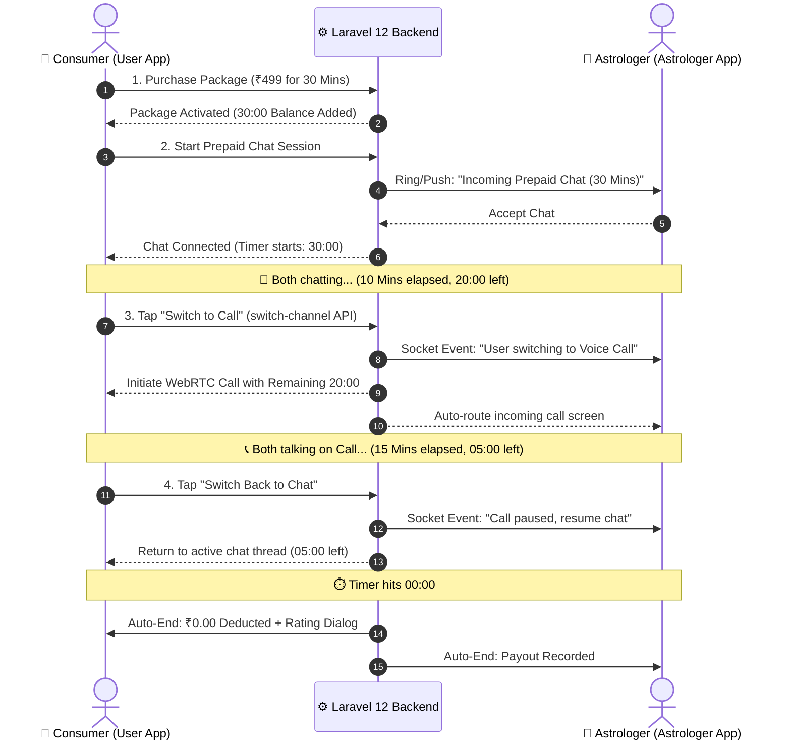

# 📱 Prepaid Package Session — Complete UI/UX Specification & Flow Guide
**Target Audience:** Mobile Developers (Flutter / React Native), Frontend Engineers, and Product Designers.  
**Scope:** Complete End-to-End User & Astrologer Journey for Hybrid Call + Chat Prepaid Packages.

---

## 🌟 Core Architecture Principles

1. **Hybrid Bundling:** A user purchases bundled minutes (e.g., 30 minutes) that can be split between **Voice/Video Calls** and **Live Chat** in any combination.
2. **Zero Wallet Deduction Guarantee:** All in-session transitions (Chat $\leftrightarrow$ Call) are 100% free of charge (`rate_per_minute = 0.00`). No per-minute wallet debits occur.
3. **Shared Synchronous Timer:** One master countdown timer tracks the remaining time across both channels.
4. **Instant Channel Migration:** Switching channel preserves chat history and connects the call without kicking either party out to the home screen.

---



---

# 👤 PART 1: User (Consumer) UI/UX Flow

---

### Step 1: Package Discovery & Purchase Screen
Located on the **Astrologer Profile Page** or **Store Tab**:

```text
┌────────────────────────────────────────────────────────┐
│ 🌟 30-Minute Hybrid Consultation Pack                 │
│ ────────────────────────────────────────────────────── │
│ ⏳ 30 Mins Shared (Use for Call & Chat seamlessly)     │
│ 💰 ₹499  (Save 35% vs ₹15/min regular rate)            │
│ 🔄 Switch between Call & Chat anytime with 1 tap       │
│                                                        │
│   [ ⚡ Buy & Activate Now (₹499) ]                     │
└────────────────────────────────────────────────────────┘
```
- **Tap Action:** Triggers payment gateway (Razorpay / Wallet).
- **Post-Purchase State:** Instant celebratory toast + Green badge added to astrologer profile: `👑 30 Mins Available`.

---

### Step 2: Astrologer Profile with Active Package
When the user revisits the astrologer profile:

```text
┌────────────────────────────────────────────────────────┐
│ 👤 Acharya Sharma           ⭐ 4.9 (1.2k Reviews)      │
│ ────────────────────────────────────────────────────── │
│ 👑 ACTIVE PREPAID SESSION: 30:00 REMAINING             │
│ Free consultation active • No wallet balance required  │
│                                                        │
│   [ 💬 Start Chat ]          [ 📞 Start Call ]         │
└────────────────────────────────────────────────────────┘
```
- User taps either **Start Chat** or **Start Call**.

---

### Step 3: Active Chat Screen UI (Prepaid HUD)
When inside the chat room, the top header displays the **Prepaid Heads-Up Display (HUD)**:

```text
┌────────────────────────────────────────────────────────┐
│ ← 👤 Acharya Sharma    ⭐ 4.9   [ 📞 Switch to Call ]  │
│ ────────────────────────────────────────────────────── │
│ ⏱️ Package Left: 24:18  •  🏷️ Zero Charge Active       │
├────────────────────────────────────────────────────────┤
│                                                        │
│  [Astro]: Pranam Rahul ji, batayein kya query hai?     │
│  10:04 AM                                              │
│                                                        │
│  [User]: Guruji, meri career growth slow lag rahi hai. │
│  10:05 AM                                              │
│                                                        │
├────────────────────────────────────────────────────────┤
│ ✍️ Type message...                          [ Send 🚀 ] │
└────────────────────────────────────────────────────────┘
```

#### ✨ UI Details on Chat:
- **Timer Badge:** Live countdown ticking down second-by-second (`24:18`, `24:17`...).
- **Switch Button:** Always visible on top right (`[ 📞 Switch to Call ]`).
- **Prepaid Pill:** Green badge `Zero Charge Active` reassuring the user that wallet is not being debited.

---

### Step 4: Channel Switch Action (Chat $\rightarrow$ Call)
When user taps `[ 📞 Switch to Call ]`:

1. **Confirmation Bottom Sheet (Modal):**
   ```text
   ┌────────────────────────────────────────────────────┐
   │ 🔄 Switch to Voice Call                            │
   │ ────────────────────────────────────────────────── │
   │ Your chat will pause and voice call will connect.  │
   │ ⏱️ Remaining Balance: 24 Mins 18 Secs              │
   │ 💰 Additional Fee: ₹0.00 (Free Switch)             │
   │                                                    │
   │       [ 📞 Confirm & Connect Call ]                │
   │               [ Keep Chatting ]                    │
   └────────────────────────────────────────────────────┘
   ```
2. **Transition Overlay (0.5s):**
   - App calls: `POST /api/v1/user/packages/session/switch-channel`
   - Smooth animated overlay: *"Connecting audio line with Acharya Sharma..."*
   - Seamlessly opens the WebRTC Call Screen without leaving the session context.

---

### Step 5: Active Call Screen UI
On the Call Screen, the same shared timer continues:

```text
┌────────────────────────────────────────────────────────┐
│                   Acharya Sharma                       │
│                  Voice Consultation                    │
│                                                        │
│                   [ 👨‍🦱 Astro Avatar ]                 │
│                                                        │
│                 ⏱️ Remaining: 21:05                    │
│             Prepaid Hybrid Consultation                │
│                                                        │
│      [ 🔇 Mute ]     [ 🔊 Speaker ]    [ 💬 Chat ]     │
│                                                        │
│                   [ 🔴 End Session ]                   │
└────────────────────────────────────────────────────────┘
```

- **Tap `[ 💬 Chat ]`:** Prompts bottom sheet: *"Switch back to text chat?"* $\rightarrow$ smoothly returns to Chat Screen with `21:05` preserved.

---

### Step 6: Low Time Warning & Auto-End Dialog
1. **At 02:00 Remaining:** Non-intrusive Top Banner Toast:  
   `⚠️ 2 minutes remaining in your prepaid session.`
2. **At 00:00 Remaining (Session Completed):**
   ```text
   ┌────────────────────────────────────────────────────────┐
   │                 🎉 Session Completed!                  │
   │ ────────────────────────────────────────────────────── │
   │ ⏱️ Total Time Used: 30 Mins (12m Chat + 18m Call)      │
   │ 💰 Wallet Deducted: ₹0.00 (Covered by Prepaid Pack)    │
   │                                                        │
   │ How was your consultation with Acharya Sharma?         │
   │              ⭐ ⭐ ⭐ ⭐ ⭐                            │
   │                                                        │
   │ [ Write a review...                                  ] │
   │                                                        │
   │                  [ Submit & Done ]                     │
   └────────────────────────────────────────────────────────┘
   ```

---

# 🧘 PART 2: Astrologer UI/UX Flow

---

### Step 1: Incoming Consultation Request
When user initiates the prepaid session, Astrologer receives a special ringing popup:

```text
┌────────────────────────────────────────────────────────┐
│ 🔔 INCOMING PREPAID CONSULTATION                      │
│ ────────────────────────────────────────────────────── │
│ 👤 Client: Rahul Verma (Age: 29, Pune)                 │
│ 👑 Type: Prepaid Package (30 Minutes Guaranteed)       │
│ 💬 Initial Channel: Live Chat                          │
│                                                        │
│       [ 🟢 Accept Consultation ]    [ 🔴 Reject ]      │
└────────────────────────────────────────────────────────┘
```
- **Astrologer Benefit:** Clearly sees that this is a prepaid bundle (guaranteed time and no billing disputes).

---

### Step 2: Astrologer Chat Screen UI
Astrologer sees client Kundli tools alongside the shared timer:

```text
┌────────────────────────────────────────────────────────┐
│ ← 👤 Rahul Verma  [ 📜 View Kundli ]  ⏱️ 28:40 Left    │
│ 🏷️ PREPAID SESSION (Chat Channel)                      │
├────────────────────────────────────────────────────────┤
│                                                        │
│  [User]: Guruji job switch ke baare me puchna hai...   │
│  10:06 AM                                              │
│                                                        │
│  [Astro]: Haan Rahul ji, aapki Dasha check kar raha hu │
│  10:07 AM                                              │
│                                                        │
├────────────────────────────────────────────────────────┤
│ ✍️ Type astrologer guidance...              [ Send 🚀 ] │
└────────────────────────────────────────────────────────┘
```

---

### Step 3: Astrologer Channel Switch Notification
When user switches from Chat to Call, Astrologer's screen receives an instant socket event and smooth transition popup:

```text
┌────────────────────────────────────────────────────────┐
│ 🔄 User Switched to Voice Call                         │
│ ────────────────────────────────────────────────────── │
│ Rahul Verma has requested to switch to Voice Call.     │
│ Remaining Session Time: 24:18                          │
│                                                        │
│             [ 📞 Connecting Audio... ]                 │
└────────────────────────────────────────────────────────┘
```
- App automatically switches astrologer to the Audio Call interface without requiring astrologer to accept a new call.

---

### Step 4: Astrologer Call Screen UI

```text
┌────────────────────────────────────────────────────────┐
│                     Rahul Verma                        │
│                Prepaid Voice Calling                   │
│                                                        │
│                   [ 👤 User Avatar ]                   │
│                                                        │
│                 ⏱️ Remaining: 24:10                    │
│             Guaranteed Payout Consultation             │
│                                                        │
│      [ 🔇 Mute ]     [ 📜 Kundli ]     [ 💬 Chat ]     │
│                                                        │
│                   [ 🔴 End Session ]                   │
└────────────────────────────────────────────────────────┘
```

---

### Step 5: Astrologer Session Summary & Earnings Log
When session ends:

```text
┌────────────────────────────────────────────────────────┐
│                 ✅ Session Completed                   │
│ ────────────────────────────────────────────────────── │
│ 👤 Client: Rahul Verma                                 │
│ ⏱️ Total Duration: 30 Mins                             │
│ 💰 Payout Credited to Astrologer Wallet: ₹350.00       │
│                                                        │
│                  [ Back to Dashboard ]                 │
└────────────────────────────────────────────────────────┘
```

---

# 📡 PART 3: Real-Time WebSockets State Matrix

| Event Name | Sender | Trigger Condition | Payload Data | UI Reaction |
|---|---|---|---|---|
| `package.channel_switched` | Backend | User calls `switch-channel` API | `{ sub_session_id, from_channel, to_channel, remaining_seconds }` | Switches active screen between Chat $\leftrightarrow$ Call. |
| `package.timer_tick` | Backend / Local | Every second in active subsession | `{ remaining_seconds, elapsed_seconds }` | Updates top timer badge `MM:SS`. |
| `package.session_ended` | Backend | Timer hits 0 or user/astro ends | `{ sub_session_id, total_duration, final_cost: 0.00 }` | Closes call/chat and renders Completion Review Modal. |

---

# 🛠️ PART 4: Frontend API Request & Response Reference

### 1. Switch Channel API
- **Endpoint:** `POST https://suryapathkundli.com/api/v1/user/packages/session/switch-channel`
- **Headers:** `Authorization: Bearer <TOKEN>`, `Content-Type: application/json`
- **Request Body:**
  ```json
  {
    "sub_session_id": 42,
    "from_channel": "chat",
    "to_channel": "call",
    "call_type": "audio"
  }
  ```
- **Success Response (200 OK):**
  ```json
  {
    "status": true,
    "message": "Channel switched successfully",
    "data": {
      "sub_session_id": 42,
      "current_channel": "call",
      "previous_channel": "chat",
      "remaining_seconds": 1458,
      "call_session_id": 108,
      "rate_per_minute": 0.0,
      "is_free_switch": true
    }
  }
  ```

---

# 📋 PART 5: Flutter / Mobile Developer Checklist

- [x] **Top HUD Component:** Build a reusable `PrepaidTimerHeader(remainingSeconds, onSwitchTap)` used in both `ChatScreen` and `CallScreen`.
- [x] **Zero Deduction Assertion:** Ensure no per-minute wallet debit dialogs or low-wallet balance warnings trigger during prepaid sessions.
- [x] **Single Unified Timer:** Calculate remaining seconds from backend `started_at` + `package_duration_seconds` to prevent timer drift across app pauses/resumes.
- [x] **Seamless Switch Modal:** Implement bottom sheet trigger calling `/session/switch-channel` with clean loading indicator.
