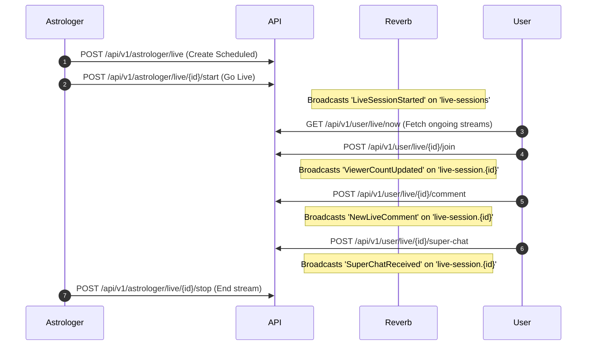

# Live Session & Super Chat API & WebSocket Guide

This guide details the complete step-by-step lifecycle of Live Streaming and Super Chats in the Astrologer Backend. It includes exact HTTP routes, payload parameters (required vs. optional), server responses, and Laravel Reverb WebSocket event details for both **Scheduled** and **Instant** live streams.

---

## 1. Authentication & Base Setup

All API requests require the following headers:
- `Authorization: Bearer <sanctum_token>`
- `Accept: application/json`
- `Content-Type: application/json`

WebSockets are handled using **Laravel Reverb**. All WebSocket connection authentication (for presence and private channels) uses:
- `POST /api/v1/broadcasting/auth`

---

## 2. Step-by-Step Flow: Scheduled Live Session



### Step 1: Create Scheduled Session (Astrologer)
The astrologer schedules a session for the future.

- **HTTP Request**: `POST /api/v1/astrologer/live`
- **Payload Parameters**:
  - `title` (Required, string, max:255)
  - `description` (Optional, string, max:1000)
  - `scheduled_at` (Required, date_format:Y-m-d H:i:s, after:now)
  - `session_type` (Required, in:public,private)
  - `duration_minutes` (Optional, integer, min:15, max:480, default:60)
  - `max_participants` (Optional, integer, min:1, max:5000, default:100)
- **Request Body**:
  ```json
  {
    "title": "Weekly Astrology Prediction",
    "description": "Weekly horoscope analysis",
    "scheduled_at": "2026-06-20 18:00:00",
    "session_type": "public",
    "duration_minutes": 60,
    "max_participants": 500
  }
  ```
- **Response (`201 Created`)**:
  ```json
  {
    "success": true,
    "data": {
      "id": 15,
      "astrologer_id": 5,
      "title": "Weekly Astrology Prediction",
      "description": "Weekly horoscope analysis",
      "scheduled_at": "2026-06-20 18:00:00",
      "scheduled_date": "2026-06-20",
      "scheduled_time": "18:00:00",
      "session_type": "public",
      "status": "upcoming",
      "live_url": null,
      "stream_key": null,
      "stream_url": null,
      "started_at": null,
      "ended_at": null,
      "duration_minutes": 60,
      "max_participants": 500,
      "current_participants": 0,
      "viewer_count": 0,
      "created_at": "2026-06-16 14:00:00",
      "updated_at": "2026-06-16 14:00:00"
    },
    "message": "Live session created successfully"
  }
  ```

---

### Step 2: Start Scheduled Session (Astrologer)
When the scheduled time arrives, the astrologer starts the stream.

- **HTTP Request**: `POST /api/v1/astrologer/live/{id}/start` (where `{id}` is `15`)
- **Request Body**: None
- **Response (`200 OK`)**:
  ```json
  {
    "success": true,
    "data": {
      "id": 15,
      "astrologer_id": 5,
      "title": "Weekly Astrology Prediction",
      "description": "Weekly horoscope analysis",
      "scheduled_at": "2026-06-20 18:00:00",
      "scheduled_date": "2026-06-20",
      "scheduled_time": "18:00:00",
      "session_type": "public",
      "status": "ongoing",
      "live_url": null,
      "stream_key": "streamkey_random_value_32_chars",
      "stream_url": null,
      "started_at": "2026-06-20 18:00:05",
      "ended_at": null,
      "duration_minutes": 60,
      "max_participants": 500,
      "current_participants": 0,
      "viewer_count": 0,
      "created_at": "2026-06-16 14:00:00",
      "updated_at": "2026-06-20 18:00:05"
    },
    "message": "Live session started successfully"
  }
  ```
- **Real-Time WebSocket Event**:
  - **Channel**: `live-sessions` (Public Channel)
  - **Event Name**: `LiveSessionStarted`
  - **Payload**:
    ```json
    {
      "id": 15,
      "title": "Weekly Astrology Prediction",
      "astrologer": {
        "id": 5,
        "name": "Priya Sharma",
        "profile_photo": "https://astrogravity.com/storage/photos/abc.jpg"
      },
      "viewer_count": 0,
      "started_at": "2026-06-20T18:00:05.000000Z"
    }
    ```
- **System Notification**: Triggered immediately to all app users via `NotificationHelper`:
  - **Title**: `Astrologer Live Now!`
  - **Body**: `Priya Sharma is now streaming live. Join the session to ask your questions!`
  - **Meta**: `{"type": "live_session", "live_session_id": 15}`

---

## 3. Step-by-Step Flow: Instant Live Session

### Step 1: Go Live Instantly (Astrologer)
The astrologer skips scheduling and goes live right away.

- **HTTP Request**: `POST /api/v1/astrologer/live`
- **Payload Parameters**:
  - `title` (Required, string, max:255)
  - `description` (Optional, string, max:1000)
  - `is_instant` (Required, boolean, true)
  - `session_type` (Required, in:public,private)
  - `duration_minutes` (Optional, integer, min:15, max:480, default:60)
  - `max_participants` (Optional, integer, min:1, max:5000, default:100)
- **Request Body**:
  ```json
  {
    "title": "Instant Tarot Reading & QA",
    "description": "Ask me anything live!",
    "is_instant": true,
    "session_type": "public",
    "duration_minutes": 45,
    "max_participants": 300
  }
  ```
- **Response (`201 Created`)**:
  ```json
  {
    "success": true,
    "data": {
      "id": 16,
      "astrologer_id": 5,
      "title": "Instant Tarot Reading & QA",
      "description": "Ask me anything live!",
      "scheduled_at": "2026-06-16 14:30:00",
      "scheduled_date": "2026-06-16",
      "scheduled_time": "14:30:00",
      "session_type": "public",
      "status": "ongoing",
      "live_url": null,
      "stream_key": "streamkey_instant_32_chars_random",
      "stream_url": null,
      "started_at": "2026-06-16 14:30:00",
      "ended_at": null,
      "duration_minutes": 45,
      "max_participants": 300,
      "current_participants": 0,
      "viewer_count": 0,
      "created_at": "2026-06-16 14:30:00",
      "updated_at": "2026-06-16 14:30:00"
    },
    "message": "Live session created successfully"
  }
  ```
- **Real-Time WebSocket Event**:
  - **Channel**: `live-sessions` (Public Channel)
  - **Event Name**: `LiveSessionStarted`
  - **Payload**:
    ```json
    {
      "id": 16,
      "title": "Instant Tarot Reading & QA",
      "astrologer": {
        "id": 5,
        "name": "Priya Sharma",
        "profile_photo": "https://astrogravity.com/storage/photos/abc.jpg"
      },
      "viewer_count": 0,
      "started_at": "2026-06-16T14:30:00.000000Z"
    }
    ```
- **System Notification**: Triggered immediately to all app users via `NotificationHelper`:
  - **Title**: `Astrologer Live Now!`
  - **Body**: `Priya Sharma is now streaming live. Join the session to ask your questions!`
  - **Meta**: `{"type": "live_session", "live_session_id": 16}`

---

## 4. User (Viewer) Interaction Steps

Once the stream is `ongoing` (from Scheduled or Instant steps), users interact as follows:

### Step 1: List Active Live Streams
Users fetch a list of all active streams to click and join.

- **HTTP Request**: `GET /api/v1/user/live/now`
- **Request Body**: None
- **Response (`200 OK`)**:
  ```json
  {
    "success": true,
    "data": [
      {
        "id": 16,
        "title": "Instant Tarot Reading & QA",
        "astrologer": {
          "id": 5,
          "name": "Priya Sharma",
          "profile_photo": "https://astrogravity.com/storage/photos/abc.jpg"
        },
        "viewer_count": 0,
        "started_at": "2026-06-16T14:30:00.000000Z"
      }
    ],
    "message": "Live sessions retrieved successfully"
  }
  ```

---

### Step 2: Join the Live Session
User clicks on a live session card to watch and subscribe to real-time chats.

- **HTTP Request**: `POST /api/v1/user/live/{id}/join` (where `{id}` is `16`)
- **Request Body**: None
- **Response (`200 OK`)**:
  ```json
  {
    "success": true,
    "data": null,
    "message": "Joined live session successfully"
  }
  ```
- **Real-Time WebSocket Event**:
  - **Channel**: `presence-live-session.16` (Presence Channel)
  - **Event Name**: `ViewerCountUpdated`
  - **Payload**:
    ```json
    {
      "live_session_id": 16,
      "viewer_count": 1
    }
    ```

---

### Step 3: Send Real-time Comment
User writes a text message in the chat box.

- **HTTP Request**: `POST /api/v1/user/live/{id}/comment`
- **Payload Parameters**:
  - `message` (Required, string, max:500)
- **Request Body**:
  ```json
  {
    "message": "Hello Priya, please answer my question! 🔮"
  }
  ```
- **Response (`210 Created`)**:
  ```json
  {
    "success": true,
    "data": {
      "id": 110,
      "message": "Hello Priya, please answer my question! 🔮",
      "created_at": "2026-06-16T14:32:00.000000Z"
    },
    "message": "Comment sent successfully"
  }
  ```
- **Real-Time WebSocket Event**:
  - **Channel**: `presence-live-session.16` (Presence Channel)
  - **Event Name**: `NewLiveComment`
  - **Payload**:
    ```json
    {
      "user_id": 42,
      "user_name": "Rahul Kumar",
      "user_avatar": "https://astrogravity.com/storage/photos/user42.jpg",
      "message": "Hello Priya, please answer my question! 🔮",
      "created_at": "2026-06-16T14:32:00.000000Z"
    }
    ```

---

### Step 4: Send Super Chat (Gift Tip)
User tips a pre-defined Gift from their wallet balance.

- **HTTP Request**: `POST /api/v1/user/live/{id}/super-chat`
- **Payload Parameters**:
  - `gift_id` (Required, integer, exists:gifts,id)
  - `message` (Optional, string, max:500)
- **Request Body**:
  ```json
  {
    "gift_id": 3,
    "message": "Here is a Red Rose for you!"
  }
  ```
- **Response (`201 Created`)**:
  ```json
  {
    "success": true,
    "data": {
      "id": 22,
      "amount": 50.00,
      "message": "[Gift: Red Rose] Here is a Red Rose for you!",
      "created_at": "2026-06-16T14:34:00.000000Z"
    },
    "message": "Super Chat sent successfully"
  }
  ```
- **Real-Time WebSocket Event**:
  - **Channel**: `presence-live-session.16` (Presence Channel)
  - **Event Name**: `SuperChatReceived`
  - **Payload**:
    ```json
    {
      "user_id": 42,
      "user_name": "Rahul Kumar",
      "user_avatar": "https://astrogravity.com/storage/photos/user42.jpg",
      "amount": 50.00,
      "message": "[Gift: Red Rose] Here is a Red Rose for you!",
      "gift": {
        "id": 3,
        "title": "Red Rose",
        "icon_url": "https://astrogravity.com/storage/gifts/icons/red_rose.png"
      },
      "created_at": "2026-06-16T14:34:00.000000Z"
    }
    ```

---

### Step 5: Leave the Live Session
User closes the stream window.

- **HTTP Request**: `POST /api/v1/user/live/{id}/leave`
- **Request Body**: None
- **Response (`200 OK`)**:
  ```json
  {
    "success": true,
    "data": null,
    "message": "Left live session successfully"
  }
  ```
- **Real-Time WebSocket Event**:
  - **Channel**: `presence-live-session.16` (Presence Channel)
  - **Event Name**: `ViewerCountUpdated`
  - **Payload**:
    ```json
    {
      "live_session_id": 16,
      "viewer_count": 0
    }
    ```

---

## 5. Astrologer Stream Interruption & End Flows

### Astrologer Resume Stream (If app crashes or back-button clicked)
If the astrologer's app closes accidentally but they are still streaming:

- **HTTP Request**: `GET /api/v1/astrologer/live/current`
- **Request Body**: None
- **Response (`200 OK - Active Stream found`)**:
  ```json
  {
    "success": true,
    "data": {
      "id": 16,
      "astrologer_id": 5,
      "title": "Instant Tarot Reading & QA",
      "description": "Ask me anything live!",
      "scheduled_at": "2026-06-16 14:30:00",
      "scheduled_date": "2026-06-16",
      "scheduled_time": "14:30:00",
      "session_type": "public",
      "status": "ongoing",
      "live_url": null,
      "stream_key": "streamkey_instant_32_chars_random",
      "stream_url": null,
      "started_at": "2026-06-16 14:30:00",
      "ended_at": null,
      "duration_minutes": 45,
      "max_participants": 300,
      "current_participants": 0,
      "viewer_count": 0,
      "created_at": "2026-06-16 14:30:00",
      "updated_at": "2026-06-16 14:30:00"
    },
    "message": "Current active live session retrieved successfully"
  }
  ```

---

### Step 6: End Live Session (Astrologer)
The astrologer finishes the live session.

- **HTTP Request**: `POST /api/v1/astrologer/live/{id}/stop` (where `{id}` is `16`)
- **Request Body**: None
- **Response (`200 OK`)**:
  ```json
  {
    "success": true,
    "data": {
      "id": 16,
      "astrologer_id": 5,
      "title": "Instant Tarot Reading & QA",
      "description": "Ask me anything live!",
      "scheduled_at": "2026-06-16 14:30:00",
      "scheduled_date": "2026-06-16",
      "scheduled_time": "14:30:00",
      "session_type": "public",
      "status": "completed",
      "live_url": null,
      "stream_key": "streamkey_instant_32_chars_random",
      "stream_url": null,
      "started_at": "2026-06-16 14:30:00",
      "ended_at": "2026-06-16 15:15:00",
      "duration_minutes": 45,
      "max_participants": 300,
      "current_participants": 0,
      "viewer_count": 0,
      "created_at": "2026-06-16 14:30:00",
      "updated_at": "2026-06-16 15:15:00"
    },
    "message": "Live session ended successfully"
  }
  ```

---

## 6. Real-Time WebSocket Event Definitions (Laravel Reverb)

Here is a quick reference for the frontend to bind events:

```javascript
// 1. Listen to global live streams additions
Echo.channel('live-sessions')
    .listen('.LiveSessionStarted', (e) => {
        console.log('New Stream Started:', e);
    });

// 2. Listen to updates inside a specific stream (e.g. stream ID = 16)
Echo.join('live-session.16')
    .listen('.ViewerCountUpdated', (e) => {
        console.log('Updated Viewers:', e.viewer_count);
    })
    .listen('.NewLiveComment', (e) => {
        console.log('New Comment:', e.message);
    })
    .listen('.SuperChatReceived', (e) => {
        console.log('Tipped Gift:', e.gift.title, 'Amount:', e.amount);
    });
```
