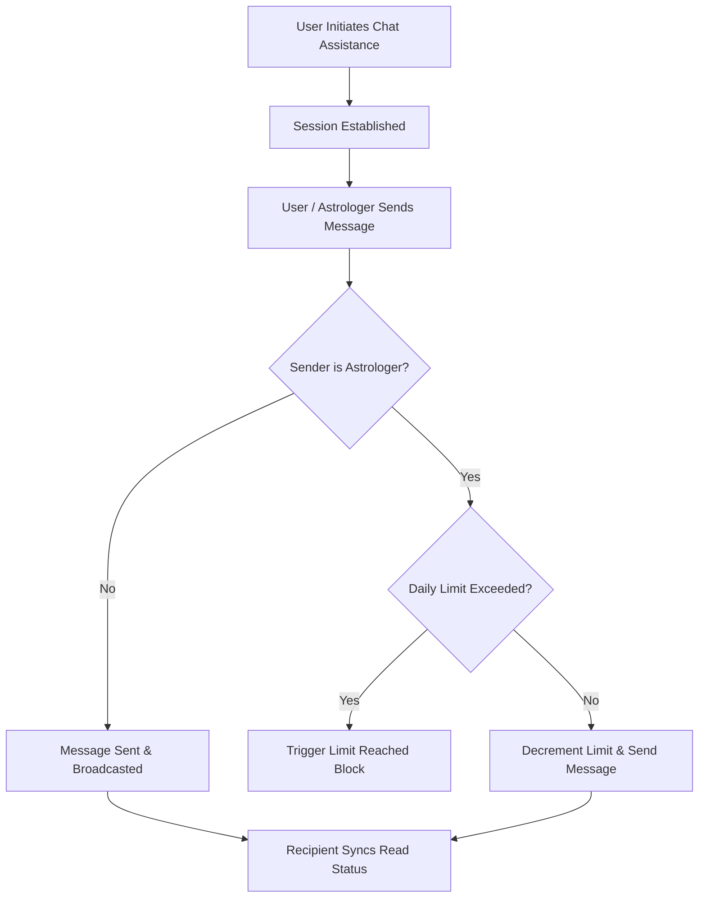

# Chat Assistance System Integration Specification

This document provides a production-grade specification of the HTTP APIs and real-time WebSocket events for the **Chat Assistance System** (separate from Package Sessions). This specification is prepared to guide front-end Flutter developers in building the in-app chat assistance interface.

---

## 1. Architectural System Overview

The Chat Assistance System allows a user (consumer) to chat directly with an astrologer (provider) for free assistance, usually before or during a live call session. The backend enforces a daily limit configuration (e.g., maximum 5 free messages per day per astrologer) to prevent spam.

### 1.1 Chat Assistance Operational Flow
1. **Initiation:** The client initiates a chat assistance session with an astrologer.
2. **Messaging:** Both parties exchange messages. If the sender is an astrologer, the system checks and decrements their daily limit.
3. **Limit Reached:** When the astrologer reaches their daily reply limit, the system blocks outgoing messages and broadcasts a limit reached event.
4. **Status Syncing:** Deliver/Read receipts are synced bidirectionally to update the bubble status (Sent -> Delivered -> Seen).



---

## 2. Standardized HTTP API Endpoints

### 2.1 Initiate Chat Assistance
Creates or retrieves an active chat assistance session between a user and an astrologer.

*   **URL**: `/api/v1/chat-assistance/initiate`
*   **Method**: `POST`
*   **Headers**:
    *   `Authorization: Bearer <token>`
    *   `Accept: application/json`
    *   `Content-Type: application/json`
*   **Request Body**:
    ```json
    {
      "provider_id": 42,
      "call_session_id": 105 // Optional: Link to an active call session if initiated during a call
    }
    ```
*   **Success Response (`200 OK`)**:
    ```json
    {
      "success": true,
      "status": "success",
      "message": "Chat assistance initiated successfully",
      "data": {
        "session": {
          "id": 15,
          "consumer_id": 12,
          "provider_id": 42,
          "created_at": "2026-07-18T17:00:00.000000Z",
          "updated_at": "2026-07-18T17:00:00.000000Z"
        }
      }
    }
    ```
*   **Error Response (`400 Bad Request` - Feature Disabled by Admin)**:
    ```json
    {
      "success": false,
      "status": "error",
      "message": "Chat Assistance feature is currently disabled by Admin."
    }
    ```

---

### 2.2 Send Message in Chat Assistance
Sends a message containing text, attachment, or both.

*   **URL**: `/api/v1/chat-assistance/{sessionId}/message`
*   **Method**: `POST`
*   **Headers**:
    *   `Authorization: Bearer <token>`
    *   `Accept: application/json`
    *   `Content-Type: application/json`
*   **Request Body**:
    ```json
    {
      "message": "Can you check my birth chart details?", // Required if attachment_url is null
      "attachment_url": "https://astrology-bucket.s3.amazonaws.com/charts/12.jpg", // Optional
      "type": "text", // Optional: "text" | "image" | "document" | "file" | "audio" | "video"
      "call_session_id": 105 // Optional: link to active call
    }
    ```
*   **Success Response (`200 OK`)**:
    ```json
    {
      "success": true,
      "status": "success",
      "message": "Message sent successfully",
      "data": {
        "message": {
          "id": 182,
          "chat_assistance_session_id": 15,
          "sender_id": 12,
          "receiver_id": 42,
          "message": "Can you check my birth chart details?",
          "attachment_url": "https://astrology-bucket.s3.amazonaws.com/charts/12.jpg",
          "type": "text",
          "is_read": false,
          "is_delivered": false,
          "created_at": "2026-07-18T17:01:00.000000Z",
          "updated_at": "2026-07-18T17:01:00.000000Z"
        }
      }
    }
    ```
*   **Error Response (`400 Bad Request` - Astrologer Out of Daily Limit)**:
    ```json
    {
      "success": false,
      "status": "error",
      "message": "Daily reply limit reached. Upgrade packages or consult admin."
    }
    ```

---

### 2.3 Retrieve Messages (History)
Retrieves paginated message history for the chat assistance session.

*   **URL**: `/api/v1/chat-assistance/{sessionId}/messages`
*   **Method**: `GET`
*   **Headers**:
    *   `Authorization: Bearer <token>`
    *   `Accept: application/json`
*   **Success Response (`200 OK`)**:
    ```json
    {
      "success": true,
      "status": "success",
      "message": "Messages retrieved successfully",
      "data": {
        "current_page": 1,
        "data": [
          {
            "id": 182,
            "chat_assistance_session_id": 15,
            "sender_id": 12,
            "receiver_id": 42,
            "message": "Can you check my birth chart details?",
            "attachment_url": null,
            "type": "text",
            "is_read": true,
            "is_delivered": true,
            "created_at": "2026-07-18T17:01:00.000000Z"
          }
        ],
        "first_page_url": "http://localhost/api/v1/chat-assistance/15/messages?page=1",
        "from": 1,
        "last_page": 1,
        "last_page_url": "http://localhost/api/v1/chat-assistance/15/messages?page=1",
        "next_page_url": null,
        "path": "http://localhost/api/v1/chat-assistance/15/messages",
        "per_page": 30,
        "prev_page_url": null,
        "to": 1,
        "total": 1
      }
    }
    ```

---

### 2.4 Sync Message Status (Delivered / Read Receipts)
Updates the read or delivery status of a batch of messages.

*   **URL**: `/api/v1/chat-assistance/{sessionId}/sync-status`
*   **Method**: `POST`
*   **Headers**:
    *   `Authorization: Bearer <token>`
    *   `Accept: application/json`
    *   `Content-Type: application/json`
*   **Request Body**:
    ```json
    {
      "status": "seen", // "delivered" | "seen"
      "message_ids": [182]
    }
    ```
*   **Success Response (`200 OK`)**:
    ```json
    {
      "success": true,
      "status": "success",
      "message": "Status synced successfully"
    }
    ```

---

### 2.5 Retrieve Astrologer Limit Status
Gets the remaining and total daily message limits for the logged-in astrologer.

*   **URL**: `/api/v1/chat-assistance/astrologer/status`
*   **Method**: `GET`
*   **Headers**:
    *   `Authorization: Bearer <token>`
    *   `Accept: application/json`
*   **Success Response (`200 OK`)**:
    ```json
    {
      "success": true,
      "status": "success",
      "message": "Astrologer limits status retrieved successfully",
      "data": {
        "astrologer_id": 42,
        "daily_limit": 5,
        "messages_sent_today": 2,
        "remaining_messages": 3,
        "limit_reached": false
      }
    }
    ```

---

### 2.6 Retrieve Chat Assistance Sessions List (History)
Retrieves a paginated list of chat assistance sessions for the logged-in user (astrologer or consumer). This provides the chat list screen on the astrologer's side, showing last message preview, name, and profile photos. Clicking any item routes the astrologer directly to the selected chat room.

*   **URL**: `/api/v1/chat-assistance/sessions`
*   **Method**: `GET`
*   **Query Parameters**:
    *   `per_page=15` (Optional, default is 15, max 50)
    *   `page=1` (Optional)
*   **Headers**:
    *   `Authorization: Bearer <token>`
    *   `Accept: application/json`
*   **Success Response (`200 OK`)**:
    ```json
    {
      "success": true,
      "status": "success",
      "message": "Chat assistance sessions retrieved successfully",
      "data": {
        "current_page": 1,
        "data": [
          {
            "id": 15,
            "consumer_id": 12,
            "provider_id": 42,
            "created_at": "2026-07-18T17:00:00.000000Z",
            "updated_at": "2026-07-18T17:01:00.000000Z",
            "consumer": {
              "id": 12,
              "name": "Amit Kumar",
              "profile_photo": "http://localhost/storage/profiles/12.png"
            },
            "provider": {
              "id": 42,
              "name": "Astrologer Firoz",
              "profile_photo": "http://localhost/storage/profiles/42.png"
            },
            "latest_message": {
              "id": 182,
              "chat_assistance_session_id": 15,
              "sender_id": 12,
              "receiver_id": 42,
              "message": "Can you check my birth chart details?",
              "attachment_url": null,
              "type": "text",
              "is_read": true,
              "is_delivered": true,
              "created_at": "2026-07-18T17:01:00.000000Z"
            }
          }
        ],
        "first_page_url": "http://localhost/api/v1/chat-assistance/sessions?page=1",
        "from": 1,
        "last_page": 1,
        "last_page_url": "http://localhost/api/v1/chat-assistance/sessions?page=1",
        "next_page_url": null,
        "path": "http://localhost/api/v1/chat-assistance/sessions",
        "per_page": 15,
        "prev_page_url": null,
        "to": 1,
        "total": 1
      }
    }
    ```

---

## 3. WebSocket Real-Time Events Specification

All WebSocket events broadcast on private channels using Laravel Echo. The channel name format is `private-user.<user_id>` (representing the private channel of the recipient).

### 3.1 `ChatAssistanceInitiated`
Fires immediately on the astrologer's private user channel when a user initiates a chat assistance session with them.

*   **Channel**: `private-user.<astrologer_id>`
*   **Event Name**: `ChatAssistanceInitiated`
*   **Payload**:
    ```json
    {
      "session": {
        "id": 15,
        "consumer_id": 12,
        "provider_id": 42,
        "created_at": "2026-07-18T17:00:00.000000Z"
      },
      "senderData": {
        "id": 12,
        "name": "Amit Kumar",
        "profile_photo": "http://localhost/storage/profiles/12.png"
      }
    }
    ```

---

### 3.2 `ChatAssistanceMessageSent`
Fires on the recipient's private user channel when a new message is sent.

*   **Channel**: `private-user.<receiver_id>`
*   **Event Name**: `ChatAssistanceMessageSent`
*   **Payload**:
    ```json
    {
      "messageData": {
        "id": 182,
        "chat_assistance_session_id": 15,
        "sender_id": 12,
        "receiver_id": 42,
        "message": "Can you check my birth chart details?",
        "attachment_url": null,
        "type": "text",
        "is_read": false,
        "is_delivered": false,
        "created_at": "2026-07-18T17:01:00.000000Z"
      },
      "receiverId": 42
    }
    ```

---

### 3.3 `ChatAssistanceMessageStatusUpdated`
Fires on the sender's private user channel when the recipient marks messages as delivered or seen.

*   **Channel**: `private-user.<receiver_id>` (the sender of the original messages)
*   **Event Name**: `ChatAssistanceMessageStatusUpdated`
*   **Payload**:
    ```json
    {
      "messageIds": [182],
      "status": "seen",             // "delivered" | "seen"
      "receiverId": 12,             // Recipient of the event
      "sessionId": 15,
      "updatedBy": 42,              // User who updated the status
      "timestamp": "2026-07-18T17:02:00.000000Z"
    }
    ```

---

### 3.4 `ChatAssistanceLimitReached`
Fires on the astrologer's private channel when they consume their last daily message and hit their limit.

*   **Channel**: `private-user.<astrologer_id>`
*   **Event Name**: `ChatAssistanceLimitReached`
*   **Payload**:
    ```json
    {
      "astrologerId": 42,
      "message": "Daily reply limit reached."
    }
    ```

---

## 4. Flutter Integration UI/UX Guidelines

1. **Active Call Overlay Integration:** If an active call exists between the astrologer and user, the chat assistance module should dynamically suggest linking the call session using `call_session_id` in request payloads.
2. **Delivery & Read status:** When rendering the message bubbles, use the status check attributes:
   - Double gray checkmark: `is_delivered = true`
   - Double blue checkmark: `is_read = true`
   - Single gray checkmark: `is_delivered = false` and `is_read = false`
3. **Limit Lockout UI:** If the astrologer receives a `ChatAssistanceLimitReached` event or the status endpoint reports `limit_reached: true`, disable the message input field and display a warning banner: *"You have reached your daily free assistance reply limit for today."*
4. **Auto Status Syncer:** When the chat screen comes into focus, collect all message IDs where `sender_id != current_user_id` and `is_read == false`, and immediately call `POST /api/v1/chat-assistance/{sessionId}/sync-status` with `status: "seen"` to clear unread counts on the opposite end.
