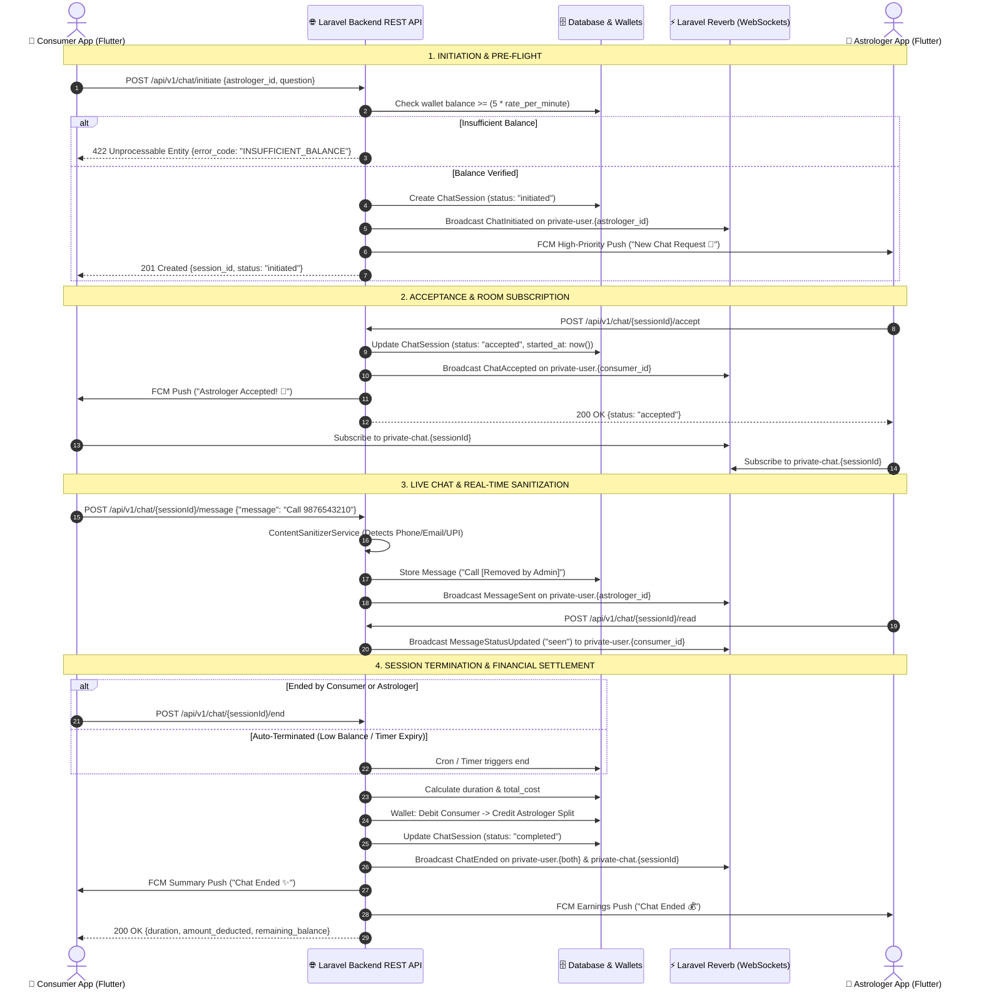

# 📱 Flutter Chat System Architecture & Mobile Integration Specification

**Version:** 2.4.0 (Production Live)  
**Target Platform:** Flutter (Android & iOS)  
**Backend Protocol:** REST API (HTTPS) + Laravel Reverb / WebSockets (WSS) + Firebase Cloud Messaging (FCM)  
**Document Owner:** Backend Engineering Team  
**Last Updated:** August 2026

---

## 1. 🏗️ High-Level Architecture & Lifecycle Flow

The chat system supports two primary consultation modes:
1. **Pay-Per-Minute Chat (PPM):** Real-time per-minute billing calculated upon session termination with automatic low-balance guards.
2. **Prepaid Package Chat:** Deducts duration from pre-purchased minute balances with an automated server-side timer.
3. **Chat Assistance:** Free asynchronous Q&A consultation layer between consumers and astrologers.

### 🔄 End-to-End Mermaid Lifecycle Sequence Diagram



---

## 2. 🔌 Complete REST API Specification (A to Z)

All authenticated endpoints require:
* **Header:** `Authorization: Bearer <SANCTUM_TOKEN>`
* **Header:** `Accept: application/json`
* **Header:** `Content-Type: application/json`

---

### `POST /api/v1/chat/initiate`
Initiates a standard pay-per-minute chat consultation request.

* **Request Body:**
```json
{
  "astrologer_id": 22,
  "question": "Career guidance query for 2026"
}
```

* **Success Response (`201 Created`):**
```json
{
  "status": "success",
  "message": "Chat initiated successfully.",
  "data": {
    "session": {
      "id": 105,
      "consumer_id": 14,
      "provider_id": 22,
      "status": "initiated",
      "channel_name": "chat_session_105",
      "question": "Career guidance query for 2026",
      "rate_per_minute": "20.00",
      "created_at": "2026-08-18T12:00:00.000000Z"
    }
  }
}
```

* **Error Responses:**
  * `422 Unprocessable Entity`: Insufficient wallet balance for minimum consultation duration (minimum 5 mins required).
  ```json
  {
    "status": "error",
    "error_code": "INSUFFICIENT_BALANCE",
    "message": "Minimum wallet balance of ₹100.00 required to initiate chat."
  }
  ```
  * `400 Bad Request`: Astrologer is currently busy or offline.
  ```json
  {
    "status": "error",
    "message": "Astrologer is currently busy in another consultation."
  }
  ```

---

### `POST /api/v1/user/packages/session/start`
Starts a prepaid package chat consultation.

* **Request Body:**
```json
{
  "astrologer_id": 22,
  "mode": "chat",
  "question": "Regarding marriage matching"
}
```

* **Success Response (`200 OK`):**
```json
{
  "success": true,
  "message": "Package sub-session started successfully.",
  "data": {
    "sub_session": {
      "id": 42,
      "package_purchase_id": 1,
      "mode": "chat",
      "chat_session_id": 105,
      "started_at": null,
      "ended_at": null
    },
    "remaining_duration": 900,
    "chat_session": {
      "id": 105,
      "consumer_id": 14,
      "provider_id": 22,
      "status": "initiated"
    }
  }
}
```

---

### `POST /api/v1/chat/{sessionId}/accept`
Called by the **Astrologer** to accept an incoming chat request.

* **URL Parameter:** `sessionId` (integer, e.g. `105`)
* **Success Response (`200 OK`):**
```json
{
  "status": "success",
  "message": "Chat session accepted successfully.",
  "data": {
    "session": {
      "id": 105,
      "status": "ongoing",
      "started_at": "2026-08-18T12:01:00.000000Z"
    }
  }
}
```

---

### `POST /api/v1/chat/{sessionId}/reject`
Called by the **Astrologer** to decline an incoming chat request.

* **URL Parameter:** `sessionId` (integer, e.g. `105`)
* **Success Response (`200 OK`):**
```json
{
  "status": "success",
  "message": "Chat rejected successfully."
}
```

---

### `POST /api/v1/chat/{sessionId}/cancel`
Called by the **Consumer User** before the astrologer accepts if they choose to cancel.

* **URL Parameter:** `sessionId` (integer, e.g. `105`)
* **Success Response (`200 OK`):**
```json
{
  "status": "success",
  "message": "Chat cancelled successfully."
}
```

---

### `POST /api/v1/chat/{sessionId}/message`
Sends a text or media message inside an active chat session.

> [!IMPORTANT]
> **Bidirectional Contact Redaction (Both Sender & Receiver):**
> Any phone numbers, emails, UPI IDs, or social handles inside `message` are strictly replaced with `[Removed by Admin]` on the backend before database insertion.
> - **For the Sender:** The REST API `200 OK` response returns the sanitized text (`[Removed by Admin]`). The Flutter app should update the local bubble with the response payload so the sender also sees `[Removed by Admin]`.
> - **For the Receiver:** The real-time WebSocket `MessageSent` event receives the sanitized text (`[Removed by Admin]`).
> - **In Chat History:** `GET /api/v1/chat/{sessionId}/messages` returns the sanitized text for both parties.

* **Request Body:**
```json
{
  "message": "Please call me at 9876543210 or email test@gmail.com",
  "attachment_url": null,
  "type": "text" // "text" | "image" | "audio" | "document" | "system"
}
```

* **Success Response (`200 OK`):**
```json
{
  "status": "success",
  "message": "Message sent",
  "data": {
    "message": {
      "id": 501,
      "chat_session_id": 105,
      "sender_id": 14,
      "receiver_id": 22,
      "message": "Please call me at [Removed by Admin] or email [Removed by Admin]",
      "attachment_url": null,
      "type": "text",
      "is_read": false,
      "is_delivered": false,
      "created_at": "2026-08-18T12:02:15.000000Z"
    }
  }
}
```

---

### `POST /api/v1/chat/upload-attachment`
Uploads a chat attachment file (Image, Audio, PDF, Document) before sending message.

* **Headers:** `Content-Type: multipart/form-data`
* **Request Form Data:** `file: <binary_data>`, `type: "image"`
* **Success Response (`200 OK`):**
```json
{
  "status": "success",
  "message": "Attachment uploaded successfully.",
  "data": {
    "attachment_url": "https://suryapathkundli.com/storage/chat-attachments/14/abc_123.jpg",
    "type": "image"
  }
}
```

---

### `GET /api/v1/chat/{sessionId}/messages`
Retrieves chat conversation history with pagination.

* **Success Response (`200 OK`):**
```json
{
  "status": "success",
  "message": "Messages retrieved",
  "data": [
    {
      "id": 501,
      "chat_session_id": 105,
      "sender_id": 14,
      "receiver_id": 22,
      "message": "Namaste Guruji",
      "attachment_url": null,
      "type": "text",
      "is_read": true,
      "is_delivered": true,
      "created_at": "2026-08-18T12:01:30.000000Z"
    }
  ]
}
```

---

### `POST /api/v1/chat/{sessionId}/read`
Marks unread messages as read and broadcasts real-time seen receipt.

* **Success Response (`200 OK`):**
```json
{
  "status": "success",
  "message": "Messages marked as read",
  "data": {
    "marked_count": 2,
    "message_ids": [501, 502]
  }
}
```

---

### `POST /api/v1/chat/{sessionId}/end`
Ends the consultation session and initiates financial settlement.

* **Success Response (`200 OK`):**
```json
{
  "status": "success",
  "message": "Chat ended successfully.",
  "data": {
    "session": {
      "id": 105,
      "status": "completed",
      "duration_seconds": 300,
      "total_cost": "100.00",
      "ended_at": "2026-08-18T12:06:00.000000Z"
    },
    "financials": {
      "duration_formatted": "05:00",
      "amount_deducted": 100.00,
      "amount_credited": 70.00,
      "user_remaining_balance": 400.00,
      "astrologer_wallet_balance": 1270.00,
      "ended_by_role": "user"
    }
  }
}
```

---

## 3. ⚡ Real-Time WebSocket Architecture (Laravel Reverb)

### 📡 Channel Subscription Naming Scheme
All channels require Sanctum Token authentication via `POST /api/v1/broadcasting/auth`.

| Channel Name | Channel Type | Purpose & Scope |
| :--- | :--- | :--- |
| **`private-user.{userId}`** | Private | Direct signalling channel for notifications, incoming requests, acceptance, endings, and read receipts. |
| **`private-chat.{sessionId}`** | Private | Room channel for active session participants (User & Astrologer only). |
| **`presence-user.{userId}`** | Presence | Live online/offline heartbeat status sync. |

---

### 📦 Broadcast Event Catalog & Payloads

#### 1. `ChatInitiated`
Broadcasted to `private-user.{astrologer_user_id}` when a user requests a chat.
```json
{
  "event": "ChatInitiated",
  "data": {
    "session": {
      "id": 105,
      "consumer_id": 14,
      "provider_id": 22,
      "status": "initiated",
      "question": "Career query 2026",
      "rate_per_minute": "20.00"
    },
    "user": {
      "id": 14,
      "name": "Rahul Verma",
      "profile_photo": "https://suryapathkundli.com/storage/profiles/14.jpg"
    }
  }
}
```

---

#### 2. `ChatAccepted`
Broadcasted to `private-user.{consumer_user_id}` when astrologer accepts.
```json
{
  "event": "ChatAccepted",
  "data": {
    "session": {
      "id": 105,
      "status": "ongoing",
      "started_at": "2026-08-18T12:01:00.000000Z"
    },
    "astrologer": {
      "id": 22,
      "name": "Acharya Sharma",
      "profile_photo": "https://suryapathkundli.com/storage/profiles/22.jpg"
    }
  }
}
```

---

#### 3. `MessageSent`
Broadcasted to `private-user.{receiver_user_id}` when a new message arrives.
```json
{
  "event": "MessageSent",
  "data": {
    "messageData": {
      "id": 501,
      "chat_session_id": 105,
      "sender_id": 14,
      "receiver_id": 22,
      "message": "Namaste Guruji",
      "attachment_url": null,
      "type": "text",
      "is_read": false,
      "is_delivered": false,
      "created_at": "2026-08-18T12:01:30.000000Z"
    },
    "receiverId": 22
  }
}
```

---

#### 4. `MessageStatusUpdated`
Broadcasted to `private-user.{sender_user_id}` for delivery and seen status.
```json
{
  "event": "MessageStatusUpdated",
  "data": {
    "message_ids": [501, 502],
    "status": "seen",
    "receiver_id": 14,
    "session_id": 105,
    "updated_by": 22,
    "timestamp": "2026-08-18T12:02:00.000000Z"
  }
}
```

---

#### 5. `ChatEnded`
Broadcasted to `private-user.{both}` and `private-chat.{sessionId}` upon completion.
```json
{
  "event": "ChatEnded",
  "data": {
    "session": {
      "id": 105,
      "status": "completed",
      "duration_seconds": 300,
      "total_cost": "100.00"
    },
    "ended_by_id": 14,
    "ended_by_role": "user",
    "ended_by_name": "Rahul Verma",
    "duration_formatted": "05:00",
    "amount_deducted": "100.00",
    "amount_credited": "70.00",
    "user_remaining_balance": "400.00",
    "astrologer_wallet_balance": "1270.00"
  }
}
```

---

#### 6. `ChatDismissed`
Broadcasted to `private-user.{other_participant}` if rejected, cancelled, or timed out.
```json
{
  "event": "ChatDismissed",
  "data": {
    "session": {
      "id": 105,
      "status": "cancelled"
    },
    "dismissed_by": 14,
    "reason": "cancelled" // "rejected" | "cancelled" | "missed"
  }
}
```

---

## 4. 📲 Google FCM Push Notifications & Deep-Linking Contract

### 📬 Payload Schema Matrix

| Scenario | `type` in data | `screen_route` | Sound / Channel | Action Required |
| :--- | :--- | :--- | :--- | :--- |
| **Incoming Chat Request** | `CHAT_REQUEST` | `/chat-request` | `chats_channel` | Open Incoming Request Screen with Countdown (60s) |
| **Request Accepted** | `CHAT_ACCEPTED` | `/chat-room` | `session_channel` | Open Active Chat Room and Subscribe to Socket |
| **Chat Session Ended** | `CHAT_ENDED` | `/session-summary` | `session_channel` | Open Billing & Review Summary Screen |
| **Request Declined** | `CHAT_DISMISSED` | `/home` | `default` | Show Toast Alert & Return to Home |
| **Package Purchased** | `package` | `/package-status` | `wallet_channel` | Open Package Details Screen |
| **Package Finished** | `PACKAGE_EXHAUSTED` | `/package-status` | `session_channel` | Open Renewal / Upgrade Sheet |

---

### 📱 Full FCM JSON Sample (`CHAT_REQUEST`)
```json
{
  "notification": {
    "title": "New Chat Request 💬",
    "body": "Rahul Verma has requested a chat consultation with you."
  },
  "data": {
    "type": "CHAT_REQUEST",
    "session_id": "105",
    "channel_type": "chat",
    "user_id": "14",
    "user_name": "Rahul Verma",
    "question": "Career query 2026",
    "rate_per_minute": "20.00",
    "screen_route": "/chat-request",
    "click_action": "FLUTTER_NOTIFICATION_CLICK"
  }
}
```

---

## 5. 🛠️ Flutter Client Implementation Guidelines

### A. Laravel Echo / Pusher Client Setup in Flutter
```dart
import 'package:laravel_echo/laravel_echo.dart';
import 'package:pusher_client/pusher_client.dart';

PusherClient createPusherClient(String sanctumToken) {
  PusherOptions options = PusherOptions(
    host: 'suryapathkundli.com',
    port: 6001,
    encrypted: true,
    auth: PusherAuth(
      'https://suryapathkundli.com/api/v1/broadcasting/auth',
      headers: {
        'Authorization': 'Bearer $sanctumToken',
        'Accept': 'application/json',
      },
    ),
  );

  return PusherClient('reverb-app-key', options, autoConnect: true);
}

Echo createEchoClient(PusherClient pusher) {
  return Echo(
    client: pusher,
    broadcaster: EchoBroadcasterType.Pusher,
  );
}
```

---

### B. Chat BLoC / State Machine Blueprint
```
              ┌───────────────┐
              │     Idle      │
              └───────┬───────┘
                      │ initiateChat()
                      ▼
              ┌───────────────┐
              │   Initiated   │ ◄── 60s Countdown Timer
              └───────┬───────┘
          ┌───────────┴───────────┐
          │ Astrologer Accepts    │ Astrologer Rejects / Timeout
          ▼                       ▼
   ┌─────────────┐         ┌─────────────┐
   │ Active Room │         │  Dismissed  │
   └──────┬──────┘         └─────────────┘
          │ endChat() / Low Balance
          ▼
   ┌─────────────┐
   │  Summary /  │
   │  Completed  │
   └─────────────┘
```

---

### C. Optimistic UI & Local SQLite Caching
1. **Instant UI Insertion:** When user presses Send, create a local `MessageModel` with `is_delivered = false` and insert into the local list immediately.
2. **REST API Call:** Invoke `POST /api/v1/chat/{sessionId}/message`.
3. **Response Sync (Sender Redaction):** Upon success response, update the local model's `message` with `data.message.message` from the server response (which will contain `[Removed by Admin]` if contact info was sent), assign `server_id`, and set `is_delivered = true`. This ensures the **Sender also sees `[Removed by Admin]` in their own chat bubble**.
4. **WebSocket Sync:** When receiving `MessageStatusUpdated`, update double ticks (Blue Ticks for `seen`, Grey Ticks for `delivered`).

---

## 6. 🛡️ Security & Zero-Leakage Checklist for Mobile Team
- [x] **Bidirectional Redaction:** All phone numbers, emails, and contact details are redacted by the backend for **BOTH Sender and Receiver**.
- [x] Always update the sender's local message bubble with the server's sanitized response message string.
- [x] Always subscribe to `private-user.{myUserId}` on app launch after login.
- [x] Never store raw payment or credit credentials in local SharedPreferences/Hive; rely on Sanctum bearer tokens stored in Flutter Secure Storage.
