# Live Session Call Feature Specification (Technical API & WebRTC Signaling)

This document provides a 100% production-accurate technical specification for the **Live Session Call Feature** (Viewer-to-Astrologer WebRTC Audio Consultations during a Live Broadcast). It covers REST signaling endpoints, WebSockets (Reverb/Broadcasting), integration with LiveKit, and per-minute billing.

---

## 1. Feature Architecture & Lifecycle Flow

The calling system uses **Laravel Broadcasting as the WebRTC Signaling Plane** for the 1-on-1 audio bridge, while the overall Live Stream relies on **LiveKit**. The audio mixing of the WebRTC track into the LiveKit broadcast is handled natively by the client applications.

### Sequence Diagram

```mermaid
sequenceDiagram
    participant C as Consumer (User App)
    participant API as Laravel Backend
    participant WS as WebSocket/Reverb
    participant P as Provider (Astro App)
    participant LK as LiveKit (Broadcast)

    Note over C,P: Both users are in a LiveKit Room (live_session_id=10)
    Note over C: User creates RTCPeerConnection & SDP Offer
    C->>API: POST /api/call/initiate (provider_id, offer, live_session_id=10)
    API-->>WS: Broadcast `CallInitiated` (with SDP Offer, session_type="live")
    WS-->>P: Deliver `CallInitiated` on `private-user.{providerId}`
    API->>P: FCM High-Priority Push Notification (`action: RING`)

    alt Astrologer Accepts within 60s
        Note over P: Astrologer receives Call popup over Live Stream
        P->>API: POST /api/call/{sessionId}/accept (answer)
        API-->>WS: Broadcast `CallAccepted` (with SDP Answer)
        WS-->>C: Deliver `CallAccepted` on `private-user.{consumerId}`
        
        rect rgb(35, 35, 35)
            note over C,P: ICE Candidate Trickle Exchange (Standard WebRTC)
            C->>API: POST /api/call/{sessionId}/ice-candidate (candidate)
            API-->>WS: Broadcast `IceCandidateSent` -> P
            P->>API: POST /api/call/{sessionId}/ice-candidate (candidate)
            API-->>WS: Broadcast `IceCandidateSent` -> C
            Note over C,P: P2P Audio Media Connected
            Note over P: Astrologer App mixes WebRTC audio into LiveKit Local Audio Track
        end

        rect rgb(25, 25, 25)
            note over API: Call Active - CallBillingTickJob runs every 60s
            note over API: Exclusivity lock active (No other viewer can call)
        end

        C->>API: POST /api/call/{sessionId}/end
        API-->>WS: Broadcast `CallEnded` (with Billing details) to both
        WS-->>P: Deliver `CallEnded` -> P closes WebRTC, stays in LiveKit
        WS-->>C: Deliver `CallEnded` -> C closes WebRTC, stays in LiveKit
    else Astrologer Rejects or Viewer Cancels
        note over API,WS: Handled identically to normal calls (CallDismissed)
    end
```


---

## 2. REST API Endpoints (Categorized by Role)

---

### A. Consumer (User) Exclusive APIs

#### A.1 Initiate Live Call
- **Method & Route:** `POST /api/call/initiate`
- **Intent:** Viewer requests an audio call with the astrologer during a live session.
- **Pre-Conditions & Validation Rules:**
  - `live_session_id` must be passed and point to an `ongoing` Live Session belonging to the `provider_id`.
  - **Exclusivity Lock:** The astrologer must not already be in an active `CallSession`.
  - **Wallet Balance Rule:** Consumer must have a minimum wallet balance equal to **at least 5 minutes** of consultation (`balance >= rate_per_minute * 5`).
- **Request Payload (JSON):**
  ```json
  {
    "provider_id": 123,
    "live_session_id": 10,
    "offer": "v=0\r\no=- 4210741285 2 IN IP4 127.0.0.1..."
  }
  ```
- **Success Response (HTTP 200):**
  *Note that `session_type` is returned as `"live"` and `live_session_id` is populated.*
  ```json
  {
    "success": true,
    "message": "Call initiated successfully",
    "data": {
      "session": {
        "id": 89,
        "consumer_id": 12,
        "provider_id": 123,
        "session_type": "live",
        "live_session_id": 10,
        "call_type": "audio",
        "status": "initiated",
        "rate_per_minute": 20.00
      }
    }
  }
  ```

---

### B. Provider (Astrologer) Exclusive APIs

#### B.1 Accept Live Call
- **Method & Route:** `POST /api/call/{sessionId}/accept`
- **Intent:** Astrologer answers the incoming live call.
- **Rules:**
  - Astrologer is marked as `busy` for incoming calls, preventing any other viewers from calling in.
  - Schedules `CallBillingTickJob` for automatic per-minute wallet debiting.
- **Request Payload (JSON):**
  ```json
  {
    "answer": "v=0\r\no=- 5321876412 2 IN IP4 127.0.0.1..."
  }
  ```

---

### C. Common APIs (Available to BOTH Consumer and Astrologer)

#### C.1 End Live Call Session
- **Method & Route:** `POST /api/call/{sessionId}/end`
- **Intent:** Either party hangs up the 1-on-1 audio call without leaving the LiveKit broadcast.
- **Financial Settlement Logic:**
  - Follows standard `PricingCalculatorService`.
  - Deducts final unbilled duration from the consumer's wallet.
- **Success Response (HTTP 200):** Same as normal call.

#### C.2 Get Current Active Call Session
- **Method & Route:** `GET /api/call/current-session`
- **Intent:** App resume check. If the app reloads during a live session, it can fetch this to realize there is an ongoing live call overlay to render.
- **Success Response (HTTP 200):**
  ```json
  {
    "success": true,
    "data": {
      "session": {
        "id": 89,
        "status": "ongoing",
        "session_type": "live",
        "live_session_id": 10
      },
      "session_type": "live"
    }
  }
  ```

---

## 3. Real-Time WebSockets & Broadcasting Events

Live Session audio calling utilizes two distinct signaling layers:
1. **Private 1-on-1 WebRTC Signaling (`private-user.{userId}`):** Handles SDP offer/answer exchange, ICE candidates, and billing updates between the caller and astrologer.
2. **Room Presence Channel (`live-session.{liveSessionId}`):** Notifies **all viewers in the live room** in real-time about whether the astrologer is currently engaged on a call, enabling client apps to dynamically hide or disable the "Audio Call" button for other viewers.

### 3.1 Room-Wide Broadcast: `LiveSessionCallStatusUpdated`
- **Channel:** `PresenceChannel('live-session.' . $liveSessionId)`
- **Broadcast Name:** `LiveSessionCallStatusUpdated`
- **Triggered When:**
  - Astrologer accepts a call -> Broadcasts `is_on_call: true`.
  - Call ends (by either party, balance exhausted, or live session stop) -> Broadcasts `is_on_call: false`.
  - Astrologer rejects or caller cancels ringing request -> Broadcasts `is_on_call: false`.
- **Payload When Call Connected (`is_on_call: true`):**
  ```json
  {
    "live_session_id": 10,
    "is_on_call": true,
    "call_session_id": 89,
    "user": {
      "id": 12,
      "name": "Rahul Sharma",
      "profile_photo_url": "https://example.com/storage/profile/12.jpg"
    },
    "started_at": "2026-09-19T16:15:00.000000Z"
  }
  ```
- **Payload When Call Disconnected (`is_on_call: false`):**
  ```json
  {
    "live_session_id": 10,
    "is_on_call": false,
    "call_session_id": null,
    "user": null,
    "started_at": null
  }
  ```
- **Client Action:**
  - When `is_on_call == true`: Hide or disable the "Call Astrologer" button for all other viewers. Optionally display an overlay banner: *"Astrologer is talking to [User]"*.
  - When `is_on_call == false`: Re-enable / show the "Call Astrologer" button for all viewers.

### 3.2 Participant WebRTC Events (`private-user.{id}`)

#### `CallInitiated`
- **Channels:** `private-user.{providerId}`
- **Differences from Normal Call:** The payload will clearly indicate `session_type: "live"` and include `live_session_id: 10`.
- **Frontend Action:** The Astrologer App intercepts this. Seeing `session_type: "live"`, it displays a non-intrusive "Incoming Live Call" popup layered over the Live Broadcast, rather than jumping to a standalone Incoming Call screen.

#### `CallAccepted`
- **Channels:** `private-user.{consumerId}`
- **Payload:** Includes answer SDP and `session_type: "live"`.

#### `CallEnded` / `CallDismissed`
- **Channels:** `private-user.{consumerId}`, `private-user.{providerId}`
- **Frontend Action:** When received, tear down the WebRTC `RTCPeerConnection` and remove the audio mix from LiveKit. Do **not** disconnect from the LiveKit broadcast room.

---

## 4. Live Session Call Status REST APIs

### 4.1 Live Session Detail & Join Response
Whenever a viewer joins or opens the live session via `GET /api/user/live/{id}` or `POST /api/user/live/{id}/join`, the response includes the astrologer's current call status:
```json
{
  "success": true,
  "data": {
    "id": 10,
    "title": "Evening Astro Live",
    "status": "ongoing",
    "is_broadcasting": true,
    "is_on_call": true,
    "active_call": {
      "call_session_id": 89,
      "status": "ongoing",
      "user": {
        "id": 12,
        "name": "Rahul Sharma",
        "profile_photo_url": "https://..."
      },
      "started_at": "2026-09-19T16:15:00.000000Z"
    }
  }
}
```

### 4.2 Dedicated Call Status Endpoint
For lightweight status checking, polling fallback, or re-verifying right before dialling:
- **Consumer Route:** `GET /api/user/live/{id}/call-status`
- **Astrologer Route:** `GET /api/astrologer/live/{id}/call-status`
- **Success Response (HTTP 200):**
  ```json
  {
    "success": true,
    "message": "Live session call status retrieved successfully",
    "data": {
      "live_session_id": 10,
      "is_on_call": false,
      "active_call": null
    }
  }
  ```

---

## 5. Frontend Implementation Guidelines (Client-Side Audio Mixing & UI)

1. **Echo Room Subscription:**
   ```javascript
   // Listen to the room presence channel
   Echo.join(`live-session.${liveSessionId}`)
       .listen('.LiveSessionCallStatusUpdated', (data) => {
           if (data.is_on_call) {
               // Disable or hide Call Button for all viewers
               setCanCall(false);
               setOnCallUser(data.user?.name);
           } else {
               // Re-enable Call Button
               setCanCall(true);
               setOnCallUser(null);
           }
       });
   ```
2. **Offer/Answer Flow:** Identical to standard 1-on-1 calls.
3. **UI Layering:** Since `session_type: "live"` is provided, the call UI should be an overlay (e.g., a small "Active Call" widget with elapsed timer) inside the Live Session screen.
4. **Audio Mixing (Crucial):**
   - The Consumer (Viewer) will have an active WebRTC connection to the Astrologer.
   - The Astrologer's device will receive the Viewer's audio via WebRTC.
   - To ensure other viewers hear the caller, the Astrologer App mixes the incoming WebRTC audio track with the Astrologer's microphone input before publishing to LiveKit.
