# Live Streaming Feature Specification (LiveKit Broadcasting, Super Chat & Real-Time Events)

This document provides a 100% production-accurate, exhaustive technical specification for the **Live Streaming Feature** (LiveKit WebRTC SFU Broadcasting, Virtual Gifts & Super Chat, Real-Time Comments, Viewer Counters, Presence State, Astrologer Media Controls, and Push Notifications). It covers all REST APIs categorized by role (**Provider/Astrologer**, **Consumer/Viewer**, and **Common**), all WebSocket events, presence channel lifecycle, and background cron reminders.

---

## 1. Feature Architecture & Lifecycle Flow

The live streaming subsystem is powered by **LiveKit SFU (Selective Forwarding Unit)** for ultra-low latency WebRTC video/audio distribution and **Laravel Broadcasting (Public & Presence Channels via Reverb/Pusher)** for real-time signaling, chat comments, virtual gift tipping, and participant tracking.

```mermaid
sequenceDiagram
    autonumber
    participant P as Provider (Astrologer App)
    participant API as Laravel Backend
    participant LK as LiveKit SFU Server
    participant WS as WebSocket (Reverb/Pusher)
    participant C as Consumer (Viewer App)

    Note over P,API: Phase 1: Stream Creation & Scheduling
    alt Scheduled Stream
        P->>API: POST /api/astrologer/live (is_instant: false, scheduled_at)
        API-->>P: 200 OK (status: upcoming)
        API->>C: FCM Push: "New Live Session Scheduled! 📅" (type: scheduled)
        Note over API: 5-10 mins before: Cron live:send-scheduled-reminders
        API->>C: FCM Push: "Live Session Starting Soon! ⏰" (type: reminder)
        P->>API: POST /api/astrologer/live/{id}/start
        API-->>WS: Broadcast `LiveSessionStarted` & `ActiveLiveSessionsUpdated` on `live-sessions`
    else Instant Stream
        P->>API: POST /api/astrologer/live (is_instant: true)
        API-->>WS: Broadcast `LiveSessionStarted` & `ActiveLiveSessionsUpdated` on `live-sessions`
        API->>C: FCM Push: "{Name} is Live Now! 🔴" (type: live)
    end

    Note over P,LK: Phase 2: Astrologer WebRTC Broadcast Activation
    P->>API: POST /api/astrologer/live/{id}/broadcast
    API->>LK: Create Room ("live_{id}")
    API-->>P: Return LiveKit Publisher Token (canPublish: true)
    P->>LK: Connect & Publish Camera + Microphone Tracks
    API-->>WS: Broadcast `ActiveLiveSessionsUpdated` (action: started) on `live-sessions`

    Note over C,WS: Phase 3: Viewer Discovery, Watch & Presence Join
    C->>API: GET /api/live/now (discover active live streams)
    C->>API: POST /api/live/{id}/watch
    API-->>C: Return LiveKit Subscriber Token (canPublish: false, canSubscribe: true)
    C->>LK: Connect to LiveKit Room & Subscribe to Video Track
    C->>API: POST /api/live/{id}/join
    API-->>WS: Broadcast `ViewerCountUpdated` (action: joined) on `presence-live-session.{id}`
    C->>WS: Connect Presence Channel `presence-live-session.{id}`
    WS-->>C: `pusher:subscription_succeeded` (member list & viewer count)

    rect rgb(30, 30, 30)
        Note over P,C: Phase 4: In-Room Live Interactions
        
        Note over C: Send Live Chat Comment
        C->>API: POST /api/live/{id}/comment (message)
        API-->>WS: Broadcast `NewLiveComment` on `presence-live-session.{id}`
        
        Note over C: Send Paid Super Chat (Virtual Gift)
        C->>API: POST /api/live/{id}/super-chat (gift_id, message)
        Note over API: Atomically debit User Wallet & credit Astrologer Wallet
        API-->>WS: Broadcast `SuperChatReceived` (gift metadata, amount, animation trigger)
        
        Note over P: Toggle Camera / Mute Audio
        P->>API: POST /api/astrologer/live/{id}/media-status (type: camera|audio, status: on|off)
        API-->>WS: Broadcast `AstrologerMediaStatusChanged` on `presence-live-session.{id}`
        
        Note over P: Temporary Stop Video Broadcast (Keep Chat Alive)
        P->>API: POST /api/astrologer/live/{id}/stop-broadcast
        API-->>WS: Broadcast `AstrologerMediaStatusChanged` (camera: off, audio: off)
    end

    Note over C,WS: Phase 5: Viewer Leaves
    C->>API: POST /api/live/{id}/leave
    API-->>WS: Broadcast `ViewerCountUpdated` (action: left) on `presence-live-session.{id}`
    C->>WS: Disconnect from `presence-live-session.{id}`
    WS-->>P: `pusher:member_removed`

    Note over P,WS: Phase 6: Astrologer Ends Stream
    P->>API: POST /api/astrologer/live/{id}/stop
    API->>LK: Delete Room ("live_{id}")
    API-->>WS: Broadcast `LiveSessionEnded` on `presence-live-session.{id}`
    API-->>WS: Broadcast `ActiveLiveSessionsUpdated` (action: ended) on `live-sessions`
```



---

## 2. Base Configuration & Global Headers

### Base Details
- **Base URL:** `{BASE_URL}/api`
- **Authentication Scheme:** Sanctum Bearer Token (`Authorization: Bearer {token}`)

### Standard Headers Required
```http
Accept: application/json
Content-Type: application/json
Authorization: Bearer <sanctum_token>
```

### Standard Envelopes
**Success Envelope (HTTP 200/201):**
```json
{
  "success": true,
  "message": "Dynamic success message",
  "data": { ... }
}
```

**Error Envelope (HTTP 400/403/404/422/500):**
```json
{
  "success": false,
  "message": "Error description or validation message",
  "data": null
}
```

---

## 3. REST API Endpoints (Categorized by Role)

---

### A. Provider (Astrologer) Exclusive APIs
All routes under this category require middleware: `['auth:sanctum', 'astrologer', 'throttle:tiered']` and base path `/api/astrologer/live`.

#### A.1 List Astrologer Sessions (Filterable & Paginated)
- **Method & Route:** `GET /api/astrologer/live`
- **Query Parameters:**
  - `filter` (string, optional): `'all'` (default), `'upcoming'`, or `'completed'`
  - `per_page` (integer, optional, default: 15)
- **Success Response (HTTP 200) - When `filter=all`:**
  ```json
  {
    "success": true,
    "message": "Live sessions retrieved successfully",
    "data": {
      "upcoming": {
        "data": [
          {
            "id": 15,
            "astrologer_id": 5,
            "title": "Evening Planetary Transits & Remedies",
            "description": "Live discussion on Saturn retrograde.",
            "scheduled_at": "2026-09-05 18:00:00",
            "scheduled_date": "2026-09-05",
            "scheduled_time": "18:00:00",
            "session_type": "public",
            "status": "upcoming",
            "is_broadcasting": false,
            "duration_minutes": 60,
            "max_participants": 500,
            "current_participants": 0,
            "viewer_count": 0,
            "created_at": "2026-09-04 18:00:00",
            "updated_at": "2026-09-04 18:00:00"
          }
        ],
        "total": 1
      },
      "completed": {
        "data": [
          {
            "id": 12,
            "astrologer_id": 5,
            "title": "Morning Kundli QA",
            "description": "Q&A session",
            "scheduled_at": "2026-09-04 10:00:00",
            "scheduled_date": "2026-09-04",
            "scheduled_time": "10:00:00",
            "session_type": "public",
            "status": "completed",
            "is_broadcasting": false,
            "duration_minutes": 45,
            "max_participants": 300,
            "current_participants": 0,
            "viewer_count": 182,
            "created_at": "2026-09-04 09:30:00",
            "updated_at": "2026-09-04 10:45:00"
          }
        ],
        "pagination": {
          "current_page": 1,
          "total_pages": 1,
          "per_page": 15,
          "total": 1
        }
      }
    }
  }
  ```

#### A.2 Create / Schedule Live Session
- **Method & Route:** `POST /api/astrologer/live`
- **Request Payload (JSON) - Scheduled Mode:**
  ```json
  {
    "title": "Evening Planetary Transits & Remedies",
    "description": "Live discussion on Saturn retrograde.",
    "is_instant": false,
    "scheduled_at": "2026-09-05 18:00:00",
    "session_type": "public",
    "duration_minutes": 60,
    "max_participants": 500
  }
  ```
- **Request Payload (JSON) - Instant Live Mode:**
  ```json
  {
    "title": "Instant Tarot Reading & QA",
    "description": "Ask questions live!",
    "is_instant": true,
    "session_type": "public",
    "duration_minutes": 45,
    "max_participants": 1000
  }
  ```
- **Validation Rules:**
  - `title`: `required|string|max:255`
  - `description`: `nullable|string|max:1000`
  - `is_instant`: `nullable|boolean`
  - `scheduled_at`: `required_unless:is_instant,true|nullable|date_format:Y-m-d H:i:s|after:now`
  - `session_type`: `required|in:public,private`
  - `duration_minutes`: `nullable|integer|min:15|max:480` (default: 60)
  - `max_participants`: `nullable|integer|min:1|max:5000` (default: 100)
- **Success Response (HTTP 200):**
  ```json
  {
    "success": true,
    "message": "Live session created successfully",
    "data": {
      "id": 15,
      "astrologer_id": 5,
      "title": "Instant Tarot Reading & QA",
      "description": "Ask questions live!",
      "scheduled_at": "2026-09-04 19:00:00",
      "scheduled_date": "2026-09-04",
      "scheduled_time": "19:00:00",
      "session_type": "public",
      "status": "ongoing",
      "is_broadcasting": false,
      "duration_minutes": 45,
      "max_participants": 1000,
      "current_participants": 0,
      "viewer_count": 0,
      "created_at": "2026-09-04 19:00:00",
      "updated_at": "2026-09-04 19:00:00"
    }
  }
  ```

#### A.3 Get Current Active Ongoing Session
- **Method & Route:** `GET /api/astrologer/live/current`
- **Success Response (HTTP 200) - Session Active:**
  ```json
  {
    "success": true,
    "message": "Current active live session retrieved successfully",
    "data": {
      "id": 15,
      "astrologer_id": 5,
      "title": "Instant Tarot Reading & QA",
      "description": "Ask questions live!",
      "scheduled_at": "2026-09-04 19:00:00",
      "scheduled_date": "2026-09-04",
      "scheduled_time": "19:00:00",
      "session_type": "public",
      "status": "ongoing",
      "is_broadcasting": true,
      "duration_minutes": 45,
      "max_participants": 1000,
      "current_participants": 34,
      "viewer_count": 52,
      "created_at": "2026-09-04 19:00:00",
      "updated_at": "2026-09-04 19:05:00"
    }
  }
  ```
- **Success Response (HTTP 200) - No Active Session:**
  ```json
  {
    "success": true,
    "message": "No active live session found",
    "data": null
  }
  ```

#### A.4 Show Astrologer Session Detail
- **Method & Route:** `GET /api/astrologer/live/{id}`
- **Success Response (HTTP 200):** Returns full session object (`formatSession`).

#### A.5 Update Scheduled Session
- **Method & Route:** `PUT /api/astrologer/live/{id}`
- **Request Payload (JSON):**
  ```json
  {
    "title": "Updated Session Title",
    "description": "Updated description",
    "scheduled_at": "2026-09-05 20:00:00",
    "duration_minutes": 90,
    "max_participants": 800
  }
  ```
- **Success Response (HTTP 200):**
  ```json
  {
    "success": true,
    "message": "Live session updated successfully",
    "data": { ... }
  }
  ```

#### A.6 Delete Upcoming Session
- **Method & Route:** `DELETE /api/astrologer/live/{id}`
- **Constraint:** Only `upcoming` or non-ongoing sessions can be deleted. Ongoing returns HTTP 422.
- **Success Response (HTTP 200):**
  ```json
  {
    "success": true,
    "message": "Live session 'Session Title' deleted successfully",
    "data": null
  }
  ```

#### A.7 Start Upcoming Session (Go Live)
- **Method & Route:** `POST /api/astrologer/live/{id}/start`
- **Constraint:** Only sessions with status `upcoming` can be started.
- **Side Effects:**
  1. Sets session status to `ongoing`.
  2. Auto-completes any previous ongoing sessions for this astrologer.
  3. Dispatches `SendLiveSessionNotificationJob` with type `'live'` to all followers/audience.
  4. Broadcasts `ActiveLiveSessionsUpdated` (action: `'started'`) and `LiveSessionStarted` on public channel `live-sessions`.
- **Success Response (HTTP 200):**
  ```json
  {
    "success": true,
    "message": "Live session started successfully",
    "data": {
      "id": 15,
      "astrologer_id": 5,
      "title": "Evening Planetary Transits & Remedies",
      "status": "ongoing",
      "is_broadcasting": false,
      "viewer_count": 0
    }
  }
  ```

#### A.8 Start LiveKit Broadcast (Publisher WebRTC Token)
- **Method & Route:** `POST /api/astrologer/live/{id}/broadcast`
- **Constraint:** Session must be in `ongoing` status.
- **Side Effects:**
  1. Calls LiveKit API to create room: `room_uuid = "live_{id}"`.
  2. Generates publisher JWT token with `canPublish: true`.
  3. Updates session: `is_broadcasting = true`, `room_uuid = "live_{id}"`.
  4. Records participant in `live_session_participants` with `role = "astrologer"` and `livekit_identity = "astro_{userId}"`.
  5. Broadcasts `ActiveLiveSessionsUpdated` on `live-sessions`.
- **Success Response (HTTP 200):**
  ```json
  {
    "success": true,
    "message": "Broadcast started successfully",
    "data": {
      "livekit_ws_url": "wss://livekit.domain.com",
      "room_uuid": "live_15",
      "token": "eyJhbGciOiJIUzI1NiIsInR5cCI6IkpXVCJ9.eyJleHAiOjE3..."
    }
  }
  ```

#### A.9 Stop LiveKit Broadcast (Pause Video, Keep Chat Alive)
- **Method & Route:** `POST /api/astrologer/live/{id}/stop-broadcast`
- **Intent:** Stops camera/audio video publishing without closing the entire session. Viewers remain inside the room and can continue texting/tipping.
- **Side Effects:**
  1. Deletes LiveKit room on SFU.
  2. Updates session: `is_broadcasting = false`, `is_camera_on = false`, `is_audio_on = false`, `room_uuid = null`.
  3. Broadcasts `AstrologerMediaStatusChanged` with `camera: off` and `audio: off` on `presence-live-session.{id}`.
- **Success Response (HTTP 200):**
  ```json
  {
    "success": true,
    "message": "Broadcast stopped successfully",
    "data": null
  }
  ```

#### A.10 Conclude / End Live Session
- **Method & Route:** `POST /api/astrologer/live/{id}/stop`
- **Constraint:** Session must be in `ongoing` status.
- **Side Effects:**
  1. Deletes LiveKit room on SFU.
  2. Broadcasts `AstrologerMediaStatusChanged` (camera=off, audio=off) on `presence-live-session.{id}`.
  3. Updates session: `status = "completed"`, `is_broadcasting = false`, `is_camera_on = false`, `is_audio_on = false`, `room_uuid = null`.
  4. Updates all active participants: `left_at = now()`.
  5. Broadcasts `LiveSessionEnded` on `presence-live-session.{id}`.
  6. Broadcasts `ActiveLiveSessionsUpdated` (action: `'ended'`) on `live-sessions`.
- **Success Response (HTTP 200):**
  ```json
  {
    "success": true,
    "message": "Live session ended successfully",
    "data": {
      "id": 15,
      "status": "completed",
      "is_broadcasting": false,
      "viewer_count": 84,
      "updated_at": "2026-09-04 20:00:00"
    }
  }
  ```

#### A.11 Update Media Status (Camera & Mic Mute/Unmute)
- **Method & Route:** `POST /api/astrologer/live/{id}/media-status`
- **Request Payload (JSON):**
  ```json
  {
    "type": "camera", // "camera" or "audio"
    "status": "off"   // "on" or "off"
  }
  ```
- **Side Effects:**
  1. Updates database flag `live_sessions.is_camera_on` or `live_sessions.is_audio_on`.
  2. Broadcasts `AstrologerMediaStatusChanged` event on `presence-live-session.{id}`.
- **Success Response (HTTP 200):**
  ```json
  {
    "success": true,
    "message": "Media status updated",
    "data": {
      "live_session_id": 15,
      "is_camera_on": false,
      "is_audio_on": true
    }
  }
  ```

#### A.12 Get Comments from Astrologer Side
- **Method & Route:** `GET /api/astrologer/live/{id}/comments`
- **Query Parameters:** `per_page` (default: 50, max: 100), `order` (`'asc'` or `'desc'`)
- **Success Response (HTTP 200):** Paginated comments list (same as viewer side).

---

### B. Consumer (Viewer) Exclusive APIs
All routes under this category require middleware: `['auth:sanctum']`.

#### B.1 Get Currently Active Streams
- **Method & Route:** `GET /api/live/now`
- **Success Response (HTTP 200):**
  ```json
  {
    "success": true,
    "message": "Live sessions retrieved successfully",
    "data": [
      {
        "id": 15,
        "title": "Instant Tarot Reading & QA",
        "astrologer": {
          "id": 10,
          "name": "Astrologer Jane",
          "profile_photo": "https://domain.com/storage/users/jane.jpg"
        },
        "is_broadcasting": true,
        "is_camera_on": true,
        "is_audio_on": true,
        "viewer_count": 42
      }
    ]
  }
  ```

#### B.2 Get Live Session Detail (Viewer)
- **Method & Route:** `GET /api/live/{id}`
- **Success Response (HTTP 200):**
  ```json
  {
    "success": true,
    "message": "Live session retrieved successfully",
    "data": {
      "id": 15,
      "title": "Instant Tarot Reading & QA",
      "description": "Ask questions live!",
      "session_type": "public",
      "status": "ongoing",
      "is_broadcasting": true,
      "is_camera_on": true,
      "is_audio_on": true,
      "viewer_count": 42,
      "astrologer": {
        "id": 10,
        "name": "Astrologer Jane",
        "profile_photo": "https://domain.com/storage/users/jane.jpg",
        "gender": "female",
        "date_of_birth": "1990-05-15"
      }
    }
  }
  ```

#### B.3 Generate LiveKit Watch Token (Subscriber)
- **Method & Route:** `POST /api/live/{id}/watch`
- **Rate Limit:** `throttle:live_watch`
- **Constraint:** Session status must be `ongoing` and `is_broadcasting` must be `true`.
- **Success Response (HTTP 200):**
  ```json
  {
    "success": true,
    "message": "Watch token generated successfully",
    "data": {
      "livekit_ws_url": "wss://livekit.domain.com",
      "room_uuid": "live_15",
      "token": "eyJhbGciOiJIUzI1NiIsInR5cCI6IkpXVCJ9.eyJzdWIiOiJ1c2VyXzEyIi..."
    }
  }
  ```

#### B.4 Join Live Room (Presence Register & Recent History)
- **Method & Route:** `POST /api/live/{id}/join`
- **Side Effects:**
  1. Creates or updates `live_session_participants` with `role = "viewer"`, `joined_at = now()`.
  2. Increments `viewer_count` on `live_sessions`.
  3. Broadcasts `ViewerCountUpdated` (`action: "joined"`) on `presence-live-session.{id}`.
- **Success Response (HTTP 200):**
  ```json
  {
    "success": true,
    "message": "Joined live session successfully",
    "data": {
      "session": {
        "id": 15,
        "title": "Instant Tarot Reading & QA",
        "description": "Ask questions live!",
        "session_type": "public",
        "status": "ongoing",
        "is_broadcasting": true,
        "is_camera_on": true,
        "is_audio_on": true,
        "viewer_count": 43,
        "astrologer": {
          "id": 10,
          "name": "Astrologer Jane",
          "profile_photo": "https://domain.com/storage/users/jane.jpg",
          "gender": "female",
          "date_of_birth": "1990-05-15"
        }
      },
      "last_comments": [
        {
          "id": 101,
          "user_id": 9,
          "user_name": "Rahul Verma",
          "user_avatar": "https://domain.com/storage/users/rahul.jpg",
          "message": "Namaste Guruji!",
          "created_at": "2026-09-04T19:02:00.000000Z"
        }
      ]
    }
  }
  ```

#### B.5 Leave Live Room
- **Method & Route:** `POST /api/live/{id}/leave`
- **Side Effects:**
  1. Sets `left_at = now()` on participant record.
  2. Decrements `viewer_count` on `live_sessions`.
  3. Broadcasts `ViewerCountUpdated` (`action: "left"`) on `presence-live-session.{id}`.
- **Success Response (HTTP 200):**
  ```json
  {
    "success": true,
    "message": "Left live session successfully",
    "data": null
  }
  ```

#### B.6 Send Live Comment
- **Method & Route:** `POST /api/live/{id}/comment`
- **Rate Limit:** `throttle:tiered`
- **Request Payload (JSON):**
  ```json
  {
    "message": "Can you check Leo ascendant for career?"
  }
  ```
- **Validation:** `message: required|string|max:500`
- **Side Effects:**
  1. Content is automatically sanitized by `ContentSanitizerService::sanitize()`.
  2. Persists into `live_comments`.
  3. Broadcasts `NewLiveComment` on `presence-live-session.{id}`.
- **Success Response (HTTP 200):**
  ```json
  {
    "success": true,
    "message": "Comment sent successfully",
    "data": {
      "id": 102,
      "user_id": 12,
      "user_name": "You",
      "name": "You",
      "sender_name": "John Doe",
      "is_self": true,
      "user_avatar": "https://domain.com/storage/users/john.jpg",
      "message": "Can you check Leo ascendant for career?",
      "created_at": "2026-09-04T19:05:00.000000Z"
    }
  }
  ```

#### B.7 Send Super Chat (Virtual Gift Tip)
- **Method & Route:** `POST /api/live/{id}/super-chat`
- **Request Payload (JSON):**
  ```json
  {
    "gift_id": 3,
    "message": "Thank you for the guidance!"
  }
  ```
- **Validation:**
  - `gift_id`: `required|integer|exists:gifts,id`
  - `message`: `nullable|string|max:500`
- **Atomic Wallet & Broadcast Flow:**
  1. Validates session status is `ongoing`.
  2. Validates `Gift` is active.
  3. Acquires row-level locks on user and astrologer wallets in ascending user ID order (`min(user_id, astrologer_user_id)`) to strictly eliminate deadlocks.
  4. Verifies User Wallet balance >= Gift Price. If insufficient, throws HTTP 422 with message `"Insufficient balance"`.
  5. Atomically debits user wallet, credits astrologer wallet, and writes wallet transaction records (`WalletService::transferForSuperChat`).
  6. Creates `SuperChat` record (`transaction_status: completed`).
  7. Persists formatted gift message into `LiveComment` so that users joining later also see the Super Chat in chat history.
  8. Broadcasts `SuperChatReceived` event on `presence-live-session.{id}`.
- **Success Response (HTTP 200):**
  ```json
  {
    "success": true,
    "message": "Super Chat sent successfully",
    "data": {
      "id": 55,
      "user_id": 12,
      "user_name": "You",
      "name": "You",
      "sender_name": "John Doe",
      "is_self": true,
      "amount": 51.00,
      "message": "Sent a Rose - Thank you for the guidance!",
      "created_at": "2026-09-04T19:07:00.000000Z"
    }
  }
  ```

#### B.8 Get Comments History (Paginated)
- **Method & Route:** `GET /api/live/{id}/comments`
- **Query Parameters:**
  - `per_page` (integer, default: 50, max: 100)
  - `order` (string: `'asc'` or `'desc'`, default: `'asc'`)
- **Success Response (HTTP 200):**
  ```json
  {
    "success": true,
    "message": "Comments retrieved successfully",
    "data": {
      "data": [
        {
          "id": 101,
          "user_id": 9,
          "user_name": "Rahul Verma",
          "name": "Rahul Verma",
          "sender_name": "Rahul Verma",
          "is_self": false,
          "user_avatar": "https://domain.com/storage/users/rahul.jpg",
          "message": "Namaste Guruji!",
          "is_gift": false,
          "gift": null,
          "gift_icon": null,
          "gift_photo": null,
          "created_at": "2026-09-04T19:02:00.000000Z"
        },
        {
          "id": 102,
          "user_id": 12,
          "user_name": "You",
          "name": "You",
          "sender_name": "John Doe",
          "is_self": true,
          "user_avatar": "https://domain.com/storage/users/john.jpg",
          "message": "Sent a Rose - Thank you for the guidance!",
          "is_gift": true,
          "gift": {
            "id": 3,
            "title": "Rose",
            "icon_url": "https://domain.com/storage/gifts/rose.png"
          },
          "gift_icon": "https://domain.com/storage/gifts/rose.png",
          "gift_photo": "https://domain.com/storage/gifts/rose.png",
          "created_at": "2026-09-04T19:07:00.000000Z"
        }
      ],
      "pagination": {
        "current_page": 1,
        "total_pages": 1,
        "per_page": 50,
        "total": 2
      }
    }
  }
  ```

#### B.9 Get Available Gifts Catalog (Common)
- **Method & Route:** `GET /api/gifts`
- **Intent:** Catalog of gifts with coin/rupee pricing for the Super Chat gift bottom sheet.
- **Success Response (HTTP 200):**
  ```json
  {
    "success": true,
    "message": "Gifts retrieved successfully",
    "data": [
      {
        "id": 1,
        "title": "Diya",
        "price": "11.00",
        "icon_url": "https://domain.com/storage/gifts/diya.png",
        "is_active": true
      },
      {
        "id": 2,
        "title": "Om Symbol",
        "price": "21.00",
        "icon_url": "https://domain.com/storage/gifts/om.png",
        "is_active": true
      },
      {
        "id": 3,
        "title": "Rose",
        "price": "51.00",
        "icon_url": "https://domain.com/storage/gifts/rose.png",
        "is_active": true
      },
      {
        "id": 4,
        "title": "Golden Kalash",
        "price": "101.00",
        "icon_url": "https://domain.com/storage/gifts/kalash.png",
        "is_active": true
      }
    ]
  }
  ```

---

## 4. Comprehensive Real-Time WebSocket Events Specification

All WebSocket events implement `Illuminate\Contracts\Broadcasting\ShouldBroadcastNow` for zero-delay queue bypassing.

### Channels Overview & Authorization Rules

| Channel Name in Echo / Flutter | Type | Auth Required | Authorized Users |
| :--- | :--- | :--- | :--- |
| `live-sessions` | **Public** | No | Any client (used on home screen / live tab to watch active stream changes) |
| `presence-live-session.{id}` | **Presence** | Yes (`/api/broadcasting/auth`) | Any authenticated user while `LiveSession.status` is `ongoing` or `completed` |
| `astrologers` | **Public** | No | Any client (astrologer online/busy state) |
| `astrologer-availability` | **Public** | No | Any client (astrologer live/engaged state) |

> [!IMPORTANT]
> In Laravel Echo, joining a presence channel using `Echo.join('live-session.15')` automatically prepends `presence-` over the wire (`presence-live-session.15`).

---

### Event 1: `LiveSessionStarted`
* **Channel:** `live-sessions` (Public)
* **Event Name:** `LiveSessionStarted`
* **Trigger:** Dispatched when an astrologer goes live (`POST /start` or instant `POST /`).
* **Recipient:** All connected users browsing the app.
* **Payload Structure:**
  ```json
  {
    "event": "LiveSessionStarted",
    "channel": "live-sessions",
    "data": {
      "id": 15,
      "title": "Instant Tarot Reading & QA",
      "astrologer": {
        "id": 10,
        "name": "Astrologer Jane",
        "profile_photo": "https://domain.com/storage/users/jane.jpg"
      },
      "viewer_count": 0,
      "is_broadcasting": true,
      "active_sessions": [
        {
          "id": 15,
          "title": "Instant Tarot Reading & QA",
          "astrologer": {
            "id": 10,
            "name": "Astrologer Jane",
            "profile_photo": "https://domain.com/storage/users/jane.jpg"
          },
          "is_broadcasting": true,
          "is_camera_on": true,
          "is_audio_on": true,
          "viewer_count": 0
        }
      ]
    }
  }
  ```

---

### Event 2: `ActiveLiveSessionsUpdated`
* **Channel:** `live-sessions` (Public)
* **Event Name:** `ActiveLiveSessionsUpdated`
* **Trigger:** Dispatched whenever the global active stream pool changes (stream started, ended, broadcast started, or admin terminated).
* **Recipient:** All connected clients on Home/Explore feed.
* **Payload Structure:**
  ```json
  {
    "event": "ActiveLiveSessionsUpdated",
    "channel": "live-sessions",
    "data": {
      "action": "started", // "started" or "ended"
      "session": {
        "id": 15,
        "title": "Instant Tarot Reading & QA",
        "astrologer": {
          "id": 10,
          "name": "Astrologer Jane",
          "profile_photo": "https://domain.com/storage/users/jane.jpg"
        },
        "is_broadcasting": true,
        "is_camera_on": true,
        "is_audio_on": true,
        "viewer_count": 0
      },
      "active_sessions": [
        {
          "id": 15,
          "title": "Instant Tarot Reading & QA",
          "astrologer": { ... },
          "is_broadcasting": true,
          "is_camera_on": true,
          "is_audio_on": true,
          "viewer_count": 0
        }
      ],
      "total_active": 1,
      "timestamp": "2026-09-04T19:00:00.000000Z"
    }
  }
  ```

---

### Event 3: `NewLiveComment`
* **Channel:** `presence-live-session.{sessionId}` (Presence)
* **Event Name:** `NewLiveComment`
* **Trigger:** Dispatched when any viewer or astrologer posts a chat comment (`POST /api/live/{id}/comment`).
* **Recipient:** Everyone in the live room.
* **Payload Structure:**
  ```json
  {
    "event": "NewLiveComment",
    "channel": "presence-live-session.15",
    "data": {
      "id": 102,
      "user_id": 12,
      "user_name": "John Doe",
      "name": "John Doe",
      "sender_name": "John Doe",
      "user_avatar": "https://domain.com/storage/users/john.jpg",
      "message": "Can you check Leo ascendant for career?",
      "is_gift": false,
      "gift": null,
      "created_at": "2026-09-04T19:05:00.000000Z"
    }
  }
  ```

---

### Event 4: `SuperChatReceived`
* **Channel:** `presence-live-session.{sessionId}` (Presence)
* **Event Name:** `SuperChatReceived`
* **Trigger:** Dispatched when a viewer purchases and sends a Super Chat virtual gift (`POST /api/live/{id}/super-chat`).
* **Recipient:** Everyone inside the live room (triggers full-screen gifting animation and top banner).
* **Payload Structure:**
  ```json
  {
    "event": "SuperChatReceived",
    "channel": "presence-live-session.15",
    "data": {
      "id": 55,
      "user_id": 12,
      "user_name": "John Doe",
      "name": "John Doe",
      "sender_name": "John Doe",
      "user_avatar": "https://domain.com/storage/users/john.jpg",
      "amount": 51.00,
      "message": "Sent a Rose - Thank you for the guidance!",
      "is_gift": true,
      "gift": {
        "id": 3,
        "title": "Rose",
        "icon_url": "https://domain.com/storage/gifts/rose.png"
      },
      "gift_icon": "https://domain.com/storage/gifts/rose.png",
      "gift_photo": "https://domain.com/storage/gifts/rose.png",
      "created_at": "2026-09-04T19:07:00.000000Z"
    }
  }
  ```

---

### Event 5: `ViewerCountUpdated`
* **Channel:** `presence-live-session.{sessionId}` (Presence)
* **Event Name:** `ViewerCountUpdated`
* **Trigger:** Dispatched when a user joins (`POST /join`) or leaves (`POST /leave`).
* **Recipient:** Everyone in the live room.
* **Payload Structure - User Joined:**
  ```json
  {
    "event": "ViewerCountUpdated",
    "channel": "presence-live-session.15",
    "data": {
      "live_session_id": 15,
      "viewer_count": 43,
      "action": "joined",
      "user": {
        "user_id": 12,
        "user_name": "John Doe",
        "user_avatar": "https://domain.com/storage/users/john.jpg",
        "joined_at": "2026-09-04T19:01:00.000000Z"
      }
    }
  }
  ```
* **Payload Structure - User Left:**
  ```json
  {
    "event": "ViewerCountUpdated",
    "channel": "presence-live-session.15",
    "data": {
      "live_session_id": 15,
      "viewer_count": 42,
      "action": "left",
      "user": {
        "user_id": 12,
        "user_name": "John Doe",
        "user_avatar": "https://domain.com/storage/users/john.jpg",
        "left_at": "2026-09-04T19:20:00.000000Z"
      }
    }
  }
  ```

---

### Event 6: `AstrologerMediaStatusChanged`
* **Channel:** `presence-live-session.{sessionId}` (Presence)
* **Event Name:** `AstrologerMediaStatusChanged`
* **Trigger:** Dispatched when astrologer toggles camera/mic (`POST /media-status`), stops broadcast (`POST /stop-broadcast`), or session stops (`POST /stop`).
* **Recipient:** All viewers currently watching.
* **Payload Structure:**
  ```json
  {
    "event": "AstrologerMediaStatusChanged",
    "channel": "presence-live-session.15",
    "data": {
      "live_session_id": 15,
      "user_id": 10,
      "type": "camera", // "camera" or "audio"
      "status": "off"   // "on" or "off"
    }
  }
  ```

---

### Event 7: `LiveSessionEnded`
* **Channel:** `presence-live-session.{sessionId}` (Presence)
* **Event Name:** `LiveSessionEnded`
* **Trigger:** Dispatched when astrologer ends the live stream (`POST /api/astrologer/live/{id}/stop`).
* **Recipient:** All viewers inside the room (notifies frontend to tear down video player and show session summary).
* **Payload Structure:**
  ```json
  {
    "event": "LiveSessionEnded",
    "channel": "presence-live-session.15",
    "data": {
      "id": 15,
      "astrologer_id": 5,
      "title": "Instant Tarot Reading & QA",
      "status": "ended",
      "active_sessions": []
    }
  }
  ```

---

### Event 8: `AstrologerAvailabilityUpdated`
* **Channels:**
  - `astrologers` (Public)
  - `astrologer-availability` (Public)
  - `presence-room` (Presence)
  - `private-user.{userId}` (Private)
* **Event Name:** `AstrologerAvailabilityUpdated`
* **Trigger:** Dispatched when astrologer goes live or terminates live session (availability transitions between `Online`, `Engaged`, and `Offline`).
* **Payload Structure:**
  ```json
  {
    "event": "AstrologerAvailabilityUpdated",
    "channel": "astrologer-availability",
    "data": {
      "id": 5,
      "astrologer_id": 5,
      "user_id": 10,
      "is_online": true,
      "is_busy": true,
      "availability_status": "Engaged",
      "status": "Engaged",
      "availability": "Engaged",
      "is_chat_enabled": true,
      "is_call_enabled": true,
      "is_video_call_enabled": true,
      "busy_session_id": 15,
      "busy_session_type": "live",
      "timestamp": "2026-09-04T19:00:00.000000Z"
    }
  }
  ```

---

### Built-in Presence Channel Events (`presence-live-session.{sessionId}`)

When the client connects via Laravel Echo (`Echo.join('live-session.15')`), the WebSocket server automatically provides standard presence events:

1. **`pusher:subscription_succeeded` (Current Members):**
   ```json
   {
     "count": 43,
     "members": [
       {
         "id": 12,
         "info": {
           "id": 12,
           "name": "John Doe",
           "profile_photo": "https://domain.com/storage/users/john.jpg"
         }
       }
     ],
     "my_id": 12
   }
   ```
2. **`pusher:member_added`:**
   ```json
   {
     "id": 18,
     "info": {
       "id": 18,
       "name": "Sita Sharma",
       "profile_photo": "https://domain.com/storage/users/sita.jpg"
     }
   }
   ```
3. **`pusher:member_removed`:**
   ```json
   {
     "id": 18,
     "info": { ... }
   }
   ```

---

## 5. Push Notifications (FCM v1 Engine & Scheduled Crons)

When an astrologer schedules, starts, or is about to start a live session, `SendLiveSessionNotificationJob` chunks through eligible followers and past callers/chatters using high-performance SQL UNION deduplication and dispatches FCM v1 notifications.

### 3 Types of Live Push Notifications

| Type | Trigger | Title | Body Template |
| :--- | :--- | :--- | :--- |
| `live` | Instant live or `POST /start` | `{Name} is Live Now! 🔴` | `Join the live session now to interact directly and ask your questions.` |
| `scheduled` | Session created with future date | `New Live Session Scheduled! 📅` | `{Name} has scheduled a live session. Don't miss it!` |
| `reminder` | Cron runs 5-10m before scheduled start | `Live Session Starting Soon! ⏰` | `{Name} is going live in a few minutes. Get ready!` |

### Automated Cron Command for Reminders
- **Artisan Signature:** `php artisan live:send-scheduled-reminders`
- **Schedule:** Runs every minute (`* * * * *`). Scans upcoming sessions where `status = 'upcoming'`, `is_reminder_notified = false`, and `scheduled_at` is between `now()` and `now() + 10 minutes`.

### Push Payload Structure (Google FCM v1 Canonical Contract)
```json
{
  "message": {
    "token": "device_fcm_token_xyz...",
    "notification": {
      "title": "Astrologer Jane is Live Now! 🔴",
      "body": "Join the live session now to interact directly and ask your questions."
    },
    "data": {
      "entity_type": "live_stream",
      "entity_id": "15",
      "action": "OPEN_LIVE_ROOM",
      "sender_id": "5",
      "sender_name": "Astrologer Jane",
      "sender_avatar": "https://domain.com/storage/users/jane.jpg",
      "click_action": "FLUTTER_NOTIFICATION_CLICK",
      "screen": "LIVE_STREAM_SCREEN",
      "screen_route": "/live-stream",
      "route": "live_session",
      "session_id": "15",
      "live_session_id": "15",
      "id": "15",
      "astrologer_id": "5",
      "astrologer_name": "Astrologer Jane",
      "channel_name": "live_15",
      "room_uuid": "live_15",
      "type": "live_stream",
      "notification_type": "live_session",
      "status": "live",
      "created_at": "2026-09-04T19:00:00.000000Z"
    },
    "android": {
      "priority": "high",
      "notification": {
        "channel_id": "live_stream_channel",
        "sound": "default"
      }
    },
    "apns": {
      "payload": {
        "aps": {
          "sound": "default",
          "content-available": 1
        }
      }
    }
  }
}
```

---

## 6. Complete Flutter Client Implementation Guidelines

### 6.1 Dependencies (`pubspec.yaml`)
```yaml
dependencies:
  flutter:
    sdk: flutter
  livekit_client: ^2.2.0
  flutter_webrtc: ^1.1.0
  pusher_channels_flutter: ^2.2.1
```

### 6.2 Astrologer Publisher Screen (Flutter LiveKit Publishing)
```dart
import 'package:flutter/material.dart';
import 'package:livekit_client/livekit_client.dart';

class AstrologerLiveBroadcastScreen extends StatefulWidget {
  final String wsUrl;
  final String token;
  final int sessionId;

  const AstrologerLiveBroadcastScreen({
    super.key,
    required this.wsUrl,
    required this.token,
    required this.sessionId,
  });

  @override
  State<AstrologerLiveBroadcastScreen> createState() => _AstrologerLiveBroadcastScreenState();
}

class _AstrologerLiveBroadcastScreenState extends State<AstrologerLiveBroadcastScreen> {
  Room? _room;
  LocalVideoTrack? _localVideoTrack;
  bool _isCameraOn = true;
  bool _isMicOn = true;

  @override
  void initState() {
    super.initState();
    _startPublishing();
  }

  Future<void> _startPublishing() async {
    _room = Room();
    
    // Connect to LiveKit SFU using Publisher Token
    await _room!.connect(widget.wsUrl, widget.token);

    // Publish Camera and Microphone
    await _room!.localParticipant?.setCameraEnabled(true);
    await _room!.localParticipant?.setMicrophoneEnabled(true);

    final trackPublication = _room!.localParticipant?.videoTrackPublications.firstOrNull;
    setState(() {
      _localVideoTrack = trackPublication?.track as LocalVideoTrack?;
    });
  }

  Future<void> _toggleCamera() async {
    final nextState = !_isCameraOn;
    await _room?.localParticipant?.setCameraEnabled(nextState);
    setState(() => _isCameraOn = nextState);

    // Sync media state to backend & broadcast to all viewers
    await apiClient.post('/api/astrologer/live/${widget.sessionId}/media-status', {
      'type': 'camera',
      'status': nextState ? 'on' : 'off',
    });
  }

  Future<void> _toggleMic() async {
    final nextState = !_isMicOn;
    await _room?.localParticipant?.setMicrophoneEnabled(nextState);
    setState(() => _isMicOn = nextState);

    // Sync media state to backend & broadcast to all viewers
    await apiClient.post('/api/astrologer/live/${widget.sessionId}/media-status', {
      'type': 'audio',
      'status': nextState ? 'on' : 'off',
    });
  }

  @override
  void dispose() {
    _room?.disconnect();
    _room?.dispose();
    super.dispose();
  }

  @override
  Widget build(BuildContext context) {
    return Scaffold(
      body: Stack(
        children: [
          if (_localVideoTrack != null && _isCameraOn)
            VideoTrackRenderer(_localVideoTrack!)
          else
            const Center(child: Text("Camera is turned off", style: TextStyle(color: Colors.white))),
          Positioned(
            bottom: 30,
            left: 20,
            right: 20,
            child: Row(
              mainAxisAlignment: MainAxisAlignment.spaceEvenly,
              children: [
                IconButton(
                  icon: Icon(_isCameraOn ? Icons.videocam : Icons.videocam_off, color: Colors.white),
                  onPressed: _toggleCamera,
                ),
                IconButton(
                  icon: Icon(_isMicOn ? Icons.mic : Icons.mic_off, color: Colors.white),
                  onPressed: _toggleMic,
                ),
                ElevatedButton(
                  style: ElevatedButton.styleFrom(backgroundColor: Colors.red),
                  onPressed: () async {
                    await apiClient.post('/api/astrologer/live/${widget.sessionId}/stop', {});
                    Navigator.pop(context);
                  },
                  child: const Text("End Live"),
                ),
              ],
            ),
          ),
        ],
      ),
    );
  }
}
```

### 6.3 Viewer Screen (Flutter Video Watching + Real-Time Presence & Chat)
```dart
import 'package:flutter/material.dart';
import 'package:livekit_client/livekit_client.dart';
import 'package:pusher_channels_flutter/pusher_channels_flutter.dart';

class ViewerLiveStreamScreen extends StatefulWidget {
  final int sessionId;
  const ViewerLiveStreamScreen({super.key, required this.sessionId});

  @override
  State<ViewerLiveStreamScreen> createState() => _ViewerLiveStreamScreenState();
}

class _ViewerLiveStreamScreenState extends State<ViewerLiveStreamScreen> {
  Room? _room;
  RemoteVideoTrack? _remoteVideoTrack;
  bool _isAstroCameraOn = true;
  int _viewerCount = 1;
  final List<Map<String, dynamic>> _comments = [];
  Map<String, dynamic>? _activeSuperChatBanner;

  @override
  void initState() {
    super.initState();
    _initializeLiveRoom();
  }

  Future<void> _initializeLiveRoom() async {
    // 1. Join room (registers presence & fetches last 20 comments)
    final joinResponse = await apiClient.post('/api/live/${widget.sessionId}/join', {});
    final initialComments = joinResponse['data']['last_comments'] as List;
    setState(() {
      _comments.addAll(initialComments.cast<Map<String, dynamic>>());
      _viewerCount = joinResponse['data']['session']['viewer_count'];
      _isAstroCameraOn = joinResponse['data']['session']['is_camera_on'] ?? true;
    });

    // 2. Obtain LiveKit subscriber token
    final watchResponse = await apiClient.post('/api/live/${widget.sessionId}/watch', {});
    final wsUrl = watchResponse['data']['livekit_ws_url'];
    final token = watchResponse['data']['token'];

    // 3. Connect to LiveKit SFU
    _room = Room();
    _room!.on<RoomEvent>((event) {
      if (event is TrackSubscribedEvent && event.track is RemoteVideoTrack) {
        setState(() => _remoteVideoTrack = event.track as RemoteVideoTrack);
      }
    });
    await _room!.connect(wsUrl, token);

    // 4. Subscribe to Laravel WebSocket Presence Channel
    final pusher = PusherChannelsFlutter.getInstance();
    await pusher.subscribe(
      channelName: "presence-live-session.${widget.sessionId}",
      onEvent: (event) {
        final data = event.data != null ? jsonDecode(event.data) : {};

        switch (event.eventName) {
          case 'NewLiveComment':
            setState(() => _comments.add(data));
            break;

          case 'SuperChatReceived':
            setState(() {
              _comments.add(data);
              _activeSuperChatBanner = data;
            });
            // Show full screen gift burst animation (e.g. Lottie)
            _showGiftLottieAnimation(data['gift_icon']);
            break;

          case 'ViewerCountUpdated':
            setState(() => _viewerCount = data['viewer_count']);
            break;

          case 'AstrologerMediaStatusChanged':
            if (data['type'] == 'camera') {
              setState(() => _isAstroCameraOn = data['status'] == 'on');
            }
            break;

          case 'LiveSessionEnded':
            _onSessionEnded();
            break;
        }
      },
    );
  }

  void _showGiftLottieAnimation(String? giftIcon) {
    // Trigger overlay gift burst animation for 4 seconds
  }

  void _onSessionEnded() {
    showDialog(
      context: context,
      barrierDismissible: false,
      builder: (_) => AlertDialog(
        title: const Text("Live Stream Ended"),
        content: const Text("The astrologer has concluded this live session. Thank you for watching!"),
        actions: [
          TextButton(
            onPressed: () {
              Navigator.pop(context);
              Navigator.pop(context);
            },
            child: const Text("Back to Home"),
          ),
        ],
      ),
    );
  }

  @override
  void dispose() {
    apiClient.post('/api/live/${widget.sessionId}/leave', {});
    _room?.disconnect();
    _room?.dispose();
    super.dispose();
  }

  @override
  Widget build(BuildContext context) {
    return Scaffold(
      backgroundColor: Colors.black,
      body: Stack(
        children: [
          // 1. LiveKit Video Player
          if (_remoteVideoTrack != null && _isAstroCameraOn)
            VideoTrackRenderer(_remoteVideoTrack!, fit: BoxFit.cover)
          else
            const Center(
              child: Column(
                mainAxisAlignment: MainAxisAlignment.center,
                children: [
                  Icon(Icons.videocam_off, size: 64, color: Colors.white54),
                  SizedBox(height: 10),
                  Text("Astrologer's camera is off", style: TextStyle(color: Colors.white70)),
                ],
              ),
            ),

          // 2. Top Bar (Viewer Badge & Exit)
          SafeArea(
            child: Padding(
              padding: const EdgeInsets.symmetric(horizontal: 16, vertical: 8),
              child: Row(
                children: [
                  Container(
                    padding: const EdgeInsets.symmetric(horizontal: 10, vertical: 4),
                    decoration: BoxDecoration(color: Colors.red, borderRadius: BorderRadius.circular(12)),
                    child: const Text("LIVE", style: TextStyle(color: Colors.white, fontWeight: FontWeight.bold, fontSize: 12)),
                  ),
                  const SizedBox(width: 8),
                  Container(
                    padding: const EdgeInsets.symmetric(horizontal: 10, vertical: 4),
                    decoration: BoxDecoration(color: Colors.black54, borderRadius: BorderRadius.circular(12)),
                    child: Row(
                      children: [
                        const Icon(Icons.remove_red_eye, color: Colors.white, size: 14),
                        const SizedBox(width: 4),
                        Text("$_viewerCount", style: const TextStyle(color: Colors.white, fontSize: 12)),
                      ],
                    ),
                  ),
                  const Spacer(),
                  IconButton(
                    icon: const Icon(Icons.close, color: Colors.white),
                    onPressed: () => Navigator.pop(context),
                  ),
                ],
              ),
            ),
          ),

          // 3. Pinned Super Chat Gift Banner
          if (_activeSuperChatBanner != null)
            Positioned(
              top: 80,
              left: 16,
              right: 16,
              child: Container(
                padding: const EdgeInsets.all(12),
                decoration: BoxDecoration(
                  gradient: const LinearGradient(colors: [Colors.amber, Colors.orangeAccent]),
                  borderRadius: BorderRadius.circular(12),
                ),
                child: Row(
                  children: [
                    Image.network(_activeSuperChatBanner!['gift_icon'], width: 36, height: 36),
                    const SizedBox(width: 10),
                    Expanded(
                      child: Text(
                        "${_activeSuperChatBanner!['sender_name']}: ${_activeSuperChatBanner!['message']}",
                        style: const TextStyle(fontWeight: FontWeight.bold, color: Colors.black),
                      ),
                    ),
                    Text(
                      "₹${_activeSuperChatBanner!['amount']}",
                      style: const TextStyle(fontWeight: FontWeight.bold, fontSize: 16, color: Colors.black),
                    ),
                  ],
                ),
              ),
            ),

          // 4. Floating Live Chat Feed
          Positioned(
            left: 16,
            bottom: 80,
            right: 100,
            height: 250,
            child: ListView.builder(
              reverse: true,
              itemCount: _comments.length,
              itemBuilder: (context, index) {
                final comment = _comments[_comments.length - 1 - index];
                return Padding(
                  padding: const EdgeInsets.symmetric(vertical: 2.0),
                  child: Container(
                    padding: const EdgeInsets.symmetric(horizontal: 10, vertical: 6),
                    decoration: BoxDecoration(
                      color: Colors.black.withOpacity(0.4),
                      borderRadius: BorderRadius.circular(8),
                    ),
                    child: RichText(
                      text: TextSpan(
                        children: [
                          TextSpan(
                            text: "${comment['sender_name'] ?? comment['user_name']}: ",
                            style: const TextStyle(color: Colors.amber, fontWeight: FontWeight.bold, fontSize: 13),
                          ),
                          TextSpan(
                            text: comment['message'],
                            style: const TextStyle(color: Colors.white, fontSize: 13),
                          ),
                        ],
                      ),
                    ),
                  ),
                );
              },
            ),
          ),
        ],
      ),
    );
  }
}
```

---

## 7. Error Codes & Production Edge-Case Handling

| HTTP Status | Condition | Backend Exception | Frontend Recovery Action |
| :--- | :--- | :--- | :--- |
| `400 Bad Request` | Session is not currently active | `"Live session is not currently active"` | Show alert "Session has ended", navigate to home feed |
| `400 Bad Request` | Astrologer hasn't started video | `"Broadcast has not started yet"` | Show spinner or placeholder: "Astrologer will broadcast video shortly" |
| `403 Forbidden` | Non-astrologer calling provider APIs | `"User is not an astrologer"` | Deny access, lock astrologer control panels |
| `404 Not Found` | Invalid live session ID | `"Live session not found"` | Pop screen, show toast "Session does not exist" |
| `422 Unprocessable`| Insufficient wallet for Super Chat | `"Insufficient balance"` | Open Wallet Recharge Bottom Sheet modal directly |
| `422 Unprocessable`| Starting non-upcoming session | `"Only upcoming sessions can be started"` | Refresh sessions list |
| `429 Too Many Req` | Comment flooding | `throttle:tiered` | Block send button for 3 seconds, show cooldown timer |
