# Normal Call Feature Specification (Technical API & WebRTC Signaling)

This document provides a 100% production-accurate technical specification for the **Normal Call Feature** (1-on-1 WebRTC Audio/Video Consultations). It covers REST signaling endpoints, WebSockets (Reverb/Broadcasting), TURN/STUN configuration, FCM high-priority ring notifications, and per-minute billing.

---

## 1. Feature Architecture & Lifecycle Flow

The calling system uses **Laravel Broadcasting as the WebRTC Signaling Plane** and **Coturn/STUN for NAT Traversal & Media Relay**.

### Sequence Diagram

```mermaid
sequenceDiagram
    participant C as Consumer (User App)
    participant API as Laravel Backend
    participant WS as WebSocket/Reverb
    participant P as Provider (Astro App)
    participant TURN as TURN/STUN Server

    Note over C: User creates RTCPeerConnection & SDP Offer
    C->>API: POST /api/call/initiate (provider_id, offer)
    API-->>WS: Broadcast `CallInitiated` (with SDP Offer & Consumer Profile)
    WS-->>P: Deliver `CallInitiated` on `private-user.{providerId}`
    API->>P: FCM High-Priority Push Notification (`action: RING`, `sound: call_ringtone`)

    alt Astrologer Accepts within 60s
        Note over P: Astrologer creates RTCPeerConnection, sets Remote Offer & creates SDP Answer
        P->>API: POST /api/call/{sessionId}/accept (answer)
        API-->>WS: Broadcast `CallAccepted` (with SDP Answer)
        WS-->>C: Deliver `CallAccepted` on `private-user.{consumerId}`
        
        rect rgb(35, 35, 35)
            note over C,P: ICE Candidate Trickle Exchange
            C->>API: POST /api/call/{sessionId}/ice-candidate (candidate)
            API-->>WS: Broadcast `IceCandidateSent` -> P
            P->>API: POST /api/call/{sessionId}/ice-candidate (candidate)
            API-->>WS: Broadcast `IceCandidateSent` -> C
            Note over C,P: P2P Audio Media Connected (via TURN/STUN)
        end

        rect rgb(25, 25, 25)
            note over API: Call Active - CallBillingTickJob runs every 60s
            note over API: If consumer wallet balance is depleted -> auto-terminates
        end

        C->>API: POST /api/call/{sessionId}/end
        API-->>WS: Broadcast `CallEnded` (with Billing details) to both
        WS-->>P: Deliver `CallEnded`
        WS-->>C: Deliver `CallEnded`
    else Astrologer Rejects
        P->>API: POST /api/call/{sessionId}/reject
        API-->>WS: Broadcast `CallDismissed` (reason: "rejected")
    else User Cancels (Hang Up before answer)
        C->>API: POST /api/call/{sessionId}/cancel
        API-->>WS: Broadcast `CallDismissed` (reason: "cancelled")
    else 60s Ringing Timeout (Auto-Dismiss)
        note over API: CleanupMissedSessionJob fires after 60s
        API-->>WS: Broadcast `CallDismissed` (reason: "timeout")
    end
```


---

## 2. Base Configuration & Global Headers

### Base Details
- **Base URL:** `{BASE_URL}/api`
- **Authentication Scheme:** Sanctum Bearer Token (`Authorization: Bearer {token}`)

### Standard Headers Required
```http
Accept: application/json
Content-Type: application/json
```

### Standard Envelopes
**Success Envelope (HTTP 200/201):**
```json
{
  "success": true,
  "message": "Dynamic success message",
  "data": { ... }
}
```

**Error Envelope (HTTP 400/401/403/404/422/500):**
```json
{
  "success": false,
  "message": "Error description or validation message",
  "data": null
}
```

---

## 3. REST API Endpoints (Categorized by Role)

---

### A. Consumer (User) Exclusive APIs

#### A.1 Initiate Call
- **Method & Route:** `POST /api/call/initiate`
- **Rate Limit:** 10 requests per minute (`throttle:10,1`)
- **Intent:** Consumer generates a WebRTC SDP Offer locally and rings the Astrologer.
- **Pre-Conditions & Validation Rules:**
  - Consumer must not already be in an active session (`is_busy` check).
  - Consumer cannot have another call/chat in `initiated`, `ringing`, or `waiting` state.
  - Astrologer must be online (`is_online == true`).
  - **Wallet Balance Rule:** Consumer must have a minimum wallet balance equal to **at least 5 minutes** of consultation (`balance >= rate_per_minute * 5`), unless covered by an active prepaid package.
- **Auto-Dismiss Rule (60s Timeout):** Dispatches `CleanupMissedSessionJob` delayed by 60 seconds. If not answered within 1 minute, the call is automatically marked as `missed` / `timeout` and dismissed.
- **Request Payload (JSON):**
  ```json
  {
    "provider_id": 123, 
    "offer": "v=0\r\no=- 4210741285 2 IN IP4 127.0.0.1\r\ns=-\r\nt=0 0\r\na=group:BUNDLE 0\r\n..."
  }
  ```
- **Success Response (HTTP 200):**
  ```json
  {
    "success": true,
    "message": "Call initiated successfully",
    "data": {
      "session": {
        "id": 88,
        "consumer_id": 12,
        "provider_id": 123,
        "call_type": "audio",
        "status": "initiated",
        "started_at": null,
        "ended_at": null,
        "duration_seconds": 0,
        "rate_per_minute": 20.00,
        "total_cost": 0.00,
        "last_billed_at": null,
        "consumer_sdp": null,
        "provider_sdp": null,
        "created_at": "2026-09-04T18:00:00.000000Z",
        "updated_at": "2026-09-04T18:00:00.000000Z",
        "consumer": {
          "id": 12,
          "name": "John Doe",
          "email": "john@example.com",
          "user_type": "user",
          "phone": "1234567890",
          "city": "Mumbai",
          "country": "India",
          "profile_photo": "users/xyz.jpg",
          "gender": "male",
          "date_of_birth": "1990-01-01",
          "time_of_birth": "14:30",
          "place_of_birth": "Mumbai",
          "latitude": 19.0760,
          "longitude": 72.8777,
          "languages": ["English", "Hindi"],
          "profile_completed": true,
          "is_online": true,
          "is_busy": false,
          "isMatrimony": false,
          "profile_photo_url": "https://domain.com/storage/users/xyz.jpg"
        },
        "provider": {
          "id": 123,
          "name": "Astrologer Jane",
          "email": "jane@example.com",
          "user_type": "astrologer",
          "phone": "9876543210",
          "is_online": true,
          "is_busy": true,
          "isMatrimony": false,
          "profile_photo_url": "https://domain.com/storage/users/jane.jpg"
        }
      }
    }
  }
  ```

#### A.2 Cancel Initiated Call
- **Method & Route:** `POST /api/call/{sessionId}/cancel`
- **Intent:** Consumer withdraws the call request before the Astrologer accepts.
- **Request Payload:** Empty `{}`
- **Success Response (HTTP 200):**
  ```json
  {
    "success": true,
    "message": "Call cancelled successfully",
    "data": null
  }
  ```

#### A.3 Get User Call Sessions History
- **Method & Route:** `GET /api/call/sessions/user`
- **Intent:** Consumer fetches paginated list of previous calls.
- **Query Parameters:** `per_page` (int, default: 15, max: 50), `page` (int, default: 1)
- **Success Response (HTTP 200):** Standard paginated object containing `CallSession` items with `provider` and astrologer rate details.

---

### B. Provider (Astrologer) Exclusive APIs

#### B.1 Accept Call
- **Method & Route:** `POST /api/call/{sessionId}/accept`
- **Intent:** Astrologer answers the incoming call, providing their WebRTC SDP Answer.
- **Rules:**
  - Must be answered within 60 seconds of initiation.
  - Automatically changes session status to `ongoing`, starts session duration, and schedules `CallBillingTickJob` (which checks/debits wallet balance every minute).
- **Request Payload (JSON):**
  ```json
  {
    "answer": "v=0\r\no=- 5321876412 2 IN IP4 127.0.0.1\r\ns=-\r\nt=0 0\r\na=group:BUNDLE 0\r\n..."
  }
  ```
- **Success Response (HTTP 200):**
  ```json
  {
    "success": true,
    "message": "Call accepted successfully",
    "data": {
      "session": {
        "id": 88,
        "consumer_id": 12,
        "provider_id": 123,
        "status": "ongoing",
        "started_at": "2026-09-04T18:00:20.000000Z",
        "rate_per_minute": 20.00,
        "answer": "v=0\r\no=- 5321876412 2 IN IP4 127.0.0.1..."
      }
    }
  }
  ```

#### B.2 Reject Call
- **Method & Route:** `POST /api/call/{sessionId}/reject`
- **Intent:** Astrologer explicitly declines the incoming call.
- **Action:** Marks status as `rejected` and broadcasts `CallDismissed` with `reason: "rejected"`.
- **Request Payload:** Empty `{}`
- **Success Response (HTTP 200):**
  ```json
  {
    "success": true,
    "message": "Call rejected",
    "data": null
  }
  ```

#### B.3 Get Pending Calls (Ringing List)
- **Method & Route:** `GET /api/call/pending`
- **Intent:** Astrologer fetches unanswered calls to restore incoming ring UI if the app reconnects or wakes up.
- **Success Response (HTTP 200):**
  ```json
  {
    "success": true,
    "message": "Pending calls retrieved successfully",
    "data": {
      "pending_calls": [
        {
          "id": 88,
          "status": "initiated",
          "caller": {
            "id": 12,
            "name": "John Doe",
            "phone": "1234567890",
            "gender": "male",
            "date_of_birth": "1990-01-01T00:00:00.000000Z",
            "time_of_birth": "14:30:00",
            "place_of_birth": "Mumbai",
            "latitude": 19.076,
            "longitude": 72.877,
            "city": "Mumbai",
            "country": "India",
            "languages": ["English", "Hindi"],
            "profile_photo": "users/xyz.jpg",
            "profile_photo_url": "https://domain.com/storage/users/xyz.jpg",
            "profile_completed": true
          },
          "consumer": { ... },
          "created_at": "2026-09-04T18:00:00.000000Z",
          "expires_at": "2026-09-04T18:01:00.000000Z"
        }
      ],
      "total": 1
    }
  }
  ```

#### B.4 Get Astrologer Call Sessions History
- **Method & Route:** `GET /api/call/sessions/astrologer`
- **Intent:** Astrologer fetches consultation call history, including linked `chat_assistance_session_id` for quick follow-up.
- **Query Parameters:** `per_page` (int, default: 15), `page` (int, default: 1)
- **Success Response (HTTP 200):** Paginated collection of call sessions.

---

### C. Common APIs (Available to BOTH Consumer and Astrologer)

#### C.1 Get ICE / TURN Server Credentials
- **Method & Route:** `GET /api/call/turn-credentials`
- **Intent:** Fetch STUN and Coturn server endpoints with short-lived authentication credentials for WebRTC peer connection configuration.
- **Success Response (HTTP 200):**
  ```json
  {
    "success": true,
    "message": "ICE server configuration retrieved",
    "data": {
      "iceServers": [
        {
          "urls": "stun:stun.l.google.com:19302"
        },
        {
          "urls": "turn:turn.domain.com:3478",
          "username": "livekit",
          "credential": "your_secure_password"
        },
        {
          "urls": "turn:turn.domain.com:3478?transport=tcp",
          "username": "livekit",
          "credential": "your_secure_password"
        }
      ],
      "ttl": 86400
    }
  }
  ```

#### C.2 Send ICE Candidate (Trickle ICE Relay)
- **Method & Route:** `POST /api/call/{sessionId}/ice-candidate`
- **Intent:** Relays discovered ICE candidates to the opposing peer via WebSockets during WebRTC negotiation.
- **Request Payload (JSON):**
  ```json
  {
    "candidate": "candidate:842163049 1 udp 1677729535 192.168.1.10 54123 typ host generation 0 ufrag xyz..."
  }
  ```
- **Success Response (HTTP 200):**
  ```json
  {
    "success": true,
    "message": "Candidate sent",
    "data": null
  }
  ```

#### C.3 Update SDP (Renegotiation / Reconnect)
- **Method & Route:** `POST /api/call/{sessionId}/sdp`
- **Intent:** Re-exchange SDP mid-call in case of network handoff (e.g., WiFi to 4G) without terminating the consultation.
- **Request Payload (JSON):**
  ```json
  {
    "sdp": "v=0\r\no=- 4210741285 3 IN IP4 127.0.0.1...",
    "type": "offer" // "offer" or "answer"
  }
  ```
- **Success Response (HTTP 200):**
  ```json
  {
    "success": true,
    "message": "SDP updated successfully",
    "data": null
  }
  ```

#### C.4 End Call Session
- **Method & Route:** `POST /api/call/{sessionId}/end`
- **Intent:** Either party hangs up the call.
- **Financial Settlement Logic:**
  - Calculates total elapsed duration in seconds.
  - Computes `finalCost = (duration_seconds / 60) * rate_per_minute`.
  - Atomically deducts the remaining unbilled balance from the consumer's wallet.
  - Automatically calculates and credits the Astrologer's commission percentage share (`PricingCalculatorService`).
  - Logs double-entry wallet transaction records.
- **Request Payload:** Empty `{}`
- **Success Response (HTTP 200):**
  ```json
  {
    "success": true,
    "message": "Call ended successfully",
    "data": {
      "session": {
        "id": 88,
        "consumer_id": 12,
        "provider_id": 123,
        "status": "completed",
        "started_at": "2026-09-04T18:00:20.000000Z",
        "ended_at": "2026-09-04T18:08:20.000000Z",
        "duration_seconds": 480,
        "rate_per_minute": 20.00,
        "total_cost": 160.00
      }
    }
  }
  ```

#### C.5 Get Current Active Call Session
- **Method & Route:** `GET /api/call/current-session`
- **Intent:** App resume or cold-start check. Verifies if user/astrologer is currently participating in any ongoing or ringing call.
- **Success Response (HTTP 200):**
  ```json
  {
    "success": true,
    "message": "Current active call session retrieved successfully",
    "data": {
      "session": {
        "id": 88,
        "status": "ongoing",
        "duration_seconds": 120,
        "rate_per_minute": 20.00,
        "consumer": { ... },
        "provider": { ... }
      },
      "billing_mode": "normal",
      "is_normal": true,
      "is_prepaid": false,
      "is_package_session": false,
      "session_type": "call",
      "package_info": null,
      "remaining_duration_seconds": null
    }
  }
  ```

---

## 4. Real-Time WebSockets & Broadcasting Events

### Channels Authorization
- **Endpoint:** `POST /broadcasting/auth`
- **Headers:** `Authorization: Bearer {token}`
- **Channel Security Rules:**
  - `private-user.{userId}`: Authenticated user ID must match channel ID.
  - `private-call.{sessionId}`: Authenticated user must be either `consumer_id` OR `provider_id` of the session. 3rd parties are strictly rejected (HTTP 403).

---

### 4.1 `CallInitiated`
- **Channels:** `private-user.{providerId}`, `private-call.{sessionId}`
- **Trigger:** Dispatched when a consumer initiates a call. Delivers the consumer's complete Vedic profile and initial SDP offer.
```json
{
  "event": "CallInitiated",
  "channel": "private-user.123",
  "data": {
    "session": {
      "id": 88,
      "consumer_id": 12,
      "provider_id": 123,
      "status": "initiated",
      "rate_per_minute": 20.0,
      "call_type": "audio",
      "created_at": "2026-09-04T18:00:00.000000Z",
      "consumer": {
        "id": 12,
        "name": "John Doe",
        "phone": "1234567890",
        "gender": "male",
        "date_of_birth": "1990-01-01T00:00:00.000000Z",
        "time_of_birth": "14:30:00",
        "place_of_birth": "Mumbai",
        "latitude": 19.076,
        "longitude": 72.877,
        "city": "Mumbai",
        "country": "India",
        "languages": ["English", "Hindi"],
        "profile_photo": "users/xyz.jpg",
        "profile_photo_url": "https://domain.com/storage/users/xyz.jpg",
        "profile_completed": true
      }
    },
    "callerData": {
      "id": 12,
      "name": "John Doe",
      "offer": "v=0\r\no=- 4210741285 2 IN IP4 127.0.0.1..."
    },
    "user": { ... }
  }
}
```

---

### 4.2 `CallAccepted`
- **Channels:** `private-user.{consumerId}`, `private-call.{sessionId}`
- **Trigger:** Dispatched when the astrologer accepts the call. Delivers the SDP answer to complete peer negotiation.
```json
{
  "event": "CallAccepted",
  "channel": "private-user.12",
  "data": {
    "session": {
      "id": 88,
      "consumer_id": 12,
      "provider_id": 123,
      "status": "ongoing",
      "rate_per_minute": 20.0,
      "started_at": "2026-09-04T18:00:20.000000Z"
    },
    "answer": "v=0\r\no=- 5321876412 2 IN IP4 127.0.0.1..."
  }
}
```

---

### 4.3 `IceCandidateSent`
- **Channels:** `private-user.{receiverId}`, `private-call.{sessionId}`
- **Trigger:** Dispatched when either party transmits a discovered ICE candidate.
```json
{
  "event": "IceCandidateSent",
  "channel": "private-call.88",
  "data": {
    "session": { "id": 88 },
    "candidate": "candidate:842163049 1 udp 1677729535 192.168.1.10 54123 typ host generation 0...",
    "receiverId": 123
  }
}
```

---

### 4.4 `WebRtcSdpUpdated`
- **Channels:** `private-user.{receiverId}`, `private-call.{sessionId}`
- **Trigger:** Dispatched for mid-session SDP renegotiation.
```json
{
  "event": "WebRtcSdpUpdated",
  "channel": "private-call.88",
  "data": {
    "session": { "id": 88 },
    "sdp": "v=0\r\no=- 4210741285 3 IN IP4 127.0.0.1...",
    "type": "offer",
    "senderId": 12
  }
}
```

---

### 4.5 `CallEnded`
- **Channels:** `private-user.{consumerId}`, `private-user.{providerId}`, `private-call.{sessionId}`
- **Trigger:** Dispatched when an ongoing call terminates. Includes complete billing breakdown.
```json
{
  "event": "CallEnded",
  "channel": "private-call.88",
  "data": {
    "session": {
      "id": 88,
      "consumer_id": 12,
      "provider_id": 123,
      "status": "completed",
      "duration_seconds": 480,
      "total_cost": 160.00
    },
    "ended_by_id": 12,
    "ended_by_role": "user",
    "billing": {
      "duration_seconds": 480,
      "user_details": {
        "duration_seconds": 480,
        "amount_deducted": 160.00
      },
      "astrologer_details": {
        "duration_seconds": 480,
        "amount_added": 160.00
      }
    }
  }
}
```

---

### 4.6 `CallDismissed`
- **Channels:** `private-user.{consumerId}`, `private-user.{providerId}`, `private-call.{sessionId}`
- **Trigger:** Dispatched when a call is rejected, cancelled, missed, or timed out before connection.
```json
{
  "event": "CallDismissed",
  "channel": "private-user.12",
  "data": {
    "session": {
      "id": 88,
      "consumer_id": 12,
      "provider_id": 123,
      "status": "rejected",
      "ended_at": "2026-09-04T18:00:45.000000Z"
    },
    "dismissedById": 123,
    "reason": "rejected"
  }
}
```
*Possible `reason` values:*
- `"rejected"` (Astrologer declined)
- `"cancelled"` (User cancelled / hung up before answer)
- `"timeout"` (60 seconds ringing expired via `CleanupMissedSessionJob`)
- `"missed"` (Unanswered call)

---

## 5. Push Notifications (FCM v1 High-Priority VoIP Alert)

When `CallInitiated` is dispatched, the `SendCallPushNotificationListener` sends a **high-priority data-only wake-up notification** to the Astrologer's device. This allows Android (`flutter_callkeep` / background service) and iOS (`CallKit` / VoIP) to wake up the phone and show the native full-screen incoming call UI.

### Push Payload Structure (Google FCM v1)
```json
{
  "message": {
    "token": "device_fcm_token_xyz...",
    "android": {
      "priority": "high",
      "ttl": "60s"
    },
    "data": {
      "entity_type": "call",
      "entity_id": "88",
      "action": "RING",
      "sender_id": "12",
      "sender_name": "John Doe",
      "sender_avatar": "https://domain.com/storage/users/xyz.jpg",
      "type": "call",
      "session_id": "88",
      "caller_id": "12",
      "caller_name": "John Doe",
      "caller_avatar": "https://domain.com/storage/users/xyz.jpg",
      "call_type": "audio",
      "rate_per_minute": "20.00",
      "sound": "call_ringtone",
      "channel_id": "call_channel",
      "created_at": "2026-09-04T18:00:00+00:00"
    }
  }
}
```

---

## 6. WebRTC Implementation Guidelines for Frontend

1. **ICE Server Setup:** Always call `GET /api/call/turn-credentials` on app startup or before dialing and initialize `RTCConfiguration.iceServers`.
2. **Offer Flow:**
   - Caller creates `RTCPeerConnection`, adds audio transceiver (`direction: sendrecv`), creates SDP Offer, sets `setLocalDescription(offer)`.
   - Sends SDP offer in `POST /api/call/initiate`.
3. **Answer Flow:**
   - Astrologer receives `CallInitiated` event or FCM ring notification.
   - Astrologer sets `setRemoteDescription(offer)`, creates SDP Answer, sets `setLocalDescription(answer)`.
   - Sends SDP answer in `POST /api/call/{sessionId}/accept`.
4. **Candidate Trickle:**
   - As `peerConnection.onIceCandidate` fires locally, POST to `/api/call/{sessionId}/ice-candidate`.
   - When receiving `IceCandidateSent` via WebSocket, call `peerConnection.addCandidate(...)`.
5. **Dismissal Handling:**
   - Always listen for `CallDismissed` on `private-user.{id}` and `private-call.{sessionId}`. When received, immediately stop local ringtones/vibration and pop the incoming/outgoing call modal.
