# Normal Chat Feature Specification (Technical API & Real-Time Events)

This document provides a 100% production-accurate technical specification for the Normal Chat feature (1-on-1 Real-Time Chat Consultations). It defines the exact JSON payloads, including relations and Eloquent model attributes, categorized clearly by caller role (**Consumer/User**, **Provider/Astrologer**, and **Common**).

---

## 1. Feature Architecture & Lifecycle Flow

### Sequence Diagram

```mermaid
sequenceDiagram
    participant C as Consumer (User App)
    participant API as Laravel Backend
    participant WS as WebSocket/Reverb
    participant P as Provider (Astro App)

    C->>API: POST /api/chat/initiate (provider_id)
    API-->>WS: Broadcast `ChatInitiated` & `ChatQueueUpdated`
    WS-->>P: Deliver `ChatInitiated` event on `private-user.{providerId}`
    
    alt Astrologer Accepts within 60s
        P->>API: POST /api/chat/{sessionId}/accept
        API-->>WS: Broadcast `ChatAccepted`
        WS-->>C: Deliver `ChatAccepted` on `private-user.{consumerId}`
        
        rect rgb(30, 30, 30)
            note right of C: Active Chat Session
            C->>API: POST /api/chat/{sessionId}/message (text/image)
            API-->>WS: Broadcast `MessageSent`
            WS-->>P: Deliver `MessageSent` on `private-chat.{sessionId}` & `private-user.{providerId}`
            P->>API: POST /api/chat/{sessionId}/read
            API-->>WS: Broadcast `MessageStatusUpdated` (seen)
            WS-->>C: Deliver `MessageStatusUpdated` on `private-user.{consumerId}`
        end
        
        C->>API: POST /api/chat/{sessionId}/end
        API-->>WS: Broadcast `ChatEnded` & `ChatQueueUpdated`
        WS-->>P: Deliver `ChatEnded` on `private-user.{providerId}`
    else Astrologer Rejects
        P->>API: POST /api/chat/{sessionId}/reject
        API-->>WS: Broadcast `ChatDismissed` (reason: "rejected")
    else User Cancels
        C->>API: POST /api/chat/{sessionId}/cancel
        API-->>WS: Broadcast `ChatDismissed` (reason: "cancelled")
    else 60s Timeout (Auto-Dismiss)
        note over API: CleanupMissedSessionJob (60s timer expires)
        API-->>WS: Broadcast `ChatDismissed` (reason: "timeout") & `ChatQueueUpdated`
    end
```


---

## 2. Base Configuration & Global Headers

### Base Details
- **Base URL:** `{BASE_URL}/api`
- **Authentication Scheme:** Sanctum Bearer Token (`Authorization: Bearer {token}`)

### Standard Headers Required
```http
Accept: application/json
Content-Type: application/json
```

### Standard Envelopes
**Success Envelope (HTTP 200/201):**
```json
{
  "success": true,
  "message": "Dynamic success message",
  "data": { ... }
}
```

**Error Envelope (HTTP 400/401/403/404/422/500):**
```json
{
  "success": false,
  "message": "Error description or validation message",
  "data": null
}
```

---

## 3. REST API Endpoints (Categorized by Role)

---

### A. Consumer (User) Exclusive APIs

#### A.1 Initiate Chat
- **Method & Route:** `POST /api/chat/initiate`
- **Intent:** Consumer initiates a new 1-on-1 chat session with an Astrologer.
- **Auto-Dismiss Rule (60s Timeout):** Once initiated, a background queue job (`CleanupMissedSessionJob`) triggers a 60-second timer. If the Astrologer does not accept or reject the chat within 60 seconds, the system automatically marks the session as timed out and broadcasts `ChatDismissed` (reason: `timeout`) to both apps.
- **Request Payload:**
  ```json
  {
    "provider_id": 123, 
    "question": "What is my future?" 
  }
  ```
- **Success Response (HTTP 200):**
  ```json
  {
    "success": true,
    "message": "Chat initiated successfully",
    "data": {
      "session": {
        "id": 45,
        "consumer_id": 12,
        "provider_id": 123,
        "status": "initiated",
        "started_at": null,
        "accepted_at": null,
        "ended_at": null,
        "duration_seconds": 0,
        "rate_per_minute": 15.00,
        "total_cost": 0.00,
        "last_billed_at": null,
        "question": "What is my future?",
        "created_at": "2026-09-04T17:00:00.000000Z",
        "updated_at": "2026-09-04T17:00:00.000000Z",
        "consumer": {
           "id": 12,
           "name": "John Doe",
           "email": "john@example.com",
           "user_type": "user",
           "phone": "1234567890",
           "city": "Mumbai",
           "country": "India",
           "profile_photo": "users/xyz.jpg",
           "gender": "male",
           "date_of_birth": "1990-01-01",
           "time_of_birth": "14:30",
           "place_of_birth": "Mumbai",
           "latitude": 19.0760,
           "longitude": 72.8777,
           "relationship_status": "single",
           "occupation": "engineer",
           "languages": ["English", "Hindi"],
           "profile_completed": true,
           "is_online": true,
           "last_seen_at": "2026-09-04T12:00:00.000000Z",
           "is_busy": false,
           "isMatrimony": false,
           "profile_photo_url": "https://domain.com/storage/users/xyz.jpg"
        },
        "provider": {
           "id": 123,
           "name": "Astrologer Jane",
           "email": "jane@example.com",
           "user_type": "astrologer",
           "phone": "9876543210",
           "is_online": true,
           "is_busy": true,
           "isMatrimony": false,
           "profile_photo_url": "https://domain.com/storage/users/jane.jpg"
        }
      }
    }
  }
  ```

#### A.2 Cancel Initiated Chat
- **Method & Route:** `POST /api/chat/{sessionId}/cancel`
- **Intent:** Consumer cancels their own initiated chat request before the Astrologer accepts it.
- **Request Payload:** Empty `{}`
- **Success Response (HTTP 200):**
  ```json
  {
    "success": true,
    "message": "Chat cancelled successfully",
    "data": null
  }
  ```

#### A.3 Get User Chat Sessions History
- **Method & Route:** `GET /api/chat/sessions/user`
- **Intent:** Consumer fetches the list of past and present chat sessions.
- **Query Parameters:** `per_page` (int, default: 20), `page` (int, default: 1)
- **Success Response (HTTP 200):** Standard paginated array of `ChatSession` objects.

---

### B. Provider (Astrologer) Exclusive APIs

#### B.1 Accept Chat
- **Method & Route:** `POST /api/chat/{sessionId}/accept`
- **Intent:** Astrologer accepts an incoming chat request (must be done within 60 seconds).
- **Request Payload:** Empty `{}`
- **Success Response (HTTP 200):**
  ```json
  {
    "success": true,
    "message": "Chat accepted successfully",
    "data": {
      "session": { 
        "id": 45,
        "status": "ongoing",
        "accepted_at": "2026-09-04T17:02:00.000000Z",
        "started_at": "2026-09-04T17:02:00.000000Z",
        "consumer_id": 12,
        "provider_id": 123,
        "rate_per_minute": 15.00
      },
      "default_message": {
        "id": 980,
        "chat_session_id": 45,
        "sender_id": 123,
        "receiver_id": 12,
        "message": "Welcome to my session!",
        "attachment_url": null,
        "type": "text",
        "reply_to_id": null,
        "is_read": false,
        "is_delivered": false,
        "created_at": "2026-09-04T17:02:00.000000Z",
        "updated_at": "2026-09-04T17:02:00.000000Z"
      }
    }
  }
  ```

#### B.2 Reject Chat
- **Method & Route:** `POST /api/chat/{sessionId}/reject`
- **Intent:** Astrologer rejects an incoming chat request. Fires a `ChatDismissed` event with reason `rejected`.
- **Request Payload:** Empty `{}`
- **Success Response (HTTP 200):**
  ```json
  {
    "success": true,
    "message": "Chat rejected",
    "data": null
  }
  ```

#### B.3 Get Astrologer Chat Sessions History
- **Method & Route:** `GET /api/chat/sessions/astrologer`
- **Intent:** Astrologer fetches all previous consultations handled.
- **Query Parameters:** `per_page` (int, default: 20), `page` (int, default: 1)
- **Success Response (HTTP 200):** Standard paginated array of `ChatSession` objects.

---

### C. Common APIs (Used by BOTH Consumer and Astrologer)

#### C.1 Upload Attachment
- **Method & Route:** `POST /api/chat/upload-attachment`
- **Headers:** `Content-Type: multipart/form-data`
- **Request Body (Form-Data):** `file` (File, max 10MB)
- **Success Response (HTTP 201):**
  ```json
  {
    "success": true,
    "message": "File uploaded successfully",
    "data": {
      "file_path": "chat-attachments/12/example.jpg",
      "attachment_url": "https://domain.com/storage/chat-attachments/12/example.jpg"
    }
  }
  ```

#### C.2 Send Message
- **Method & Route:** `POST /api/chat/{sessionId}/message`
- **Request Payload:**
  ```json
  {
    "message": "Hello there!", 
    "attachment_url": "chat-attachments/12/example.jpg", 
    "type": "text", 
    "reply_to_id": 987 
  }
  ```
- **Success Response (HTTP 200):**
  ```json
  {
    "success": true,
    "message": "Message sent",
    "data": {
      "message": {
        "id": 988,
        "chat_session_id": 45,
        "reply_to_id": 987,
        "sender_id": 12,
        "receiver_id": 123,
        "message": "Hello there!",
        "attachment_url": "https://domain.com/storage/chat-attachments/12/example.jpg",
        "type": "text",
        "is_read": false,
        "is_delivered": false,
        "created_at": "2026-09-04T17:05:00.000000Z",
        "updated_at": "2026-09-04T17:05:00.000000Z"
      }
    }
  }
  ```

#### C.3 Get Session Messages (History & Pagination)
- **Method & Route:** `GET /api/chat/{sessionId}/messages`
- **Query Parameters:** `per_page` (int, default: 30), `page` (int, default: 1)
- **Success Response (HTTP 200):**
  ```json
  {
    "success": true,
    "message": "Messages retrieved successfully",
    "data": {
      "current_page": 1,
      "data": [
        {
          "id": 988,
          "chat_session_id": 45,
          "sender_id": 12,
          "receiver_id": 123,
          "message": "Hello there!",
          "attachment_url": null,
          "type": "text",
          "reply_to_id": null,
          "is_read": true,
          "is_delivered": true,
          "created_at": "2026-09-04T17:05:00.000000Z",
          "updated_at": "2026-09-04T17:05:00.000000Z"
        }
      ],
      "per_page": 30,
      "total": 1
    }
  }
  ```

#### C.4 Sync Message Status (Delivered/Seen)
- **Method & Route:** `POST /api/chat/{sessionId}/sync-status`
- **Intent:** Sync multiple messages as delivered or read (Sender receives `MessageStatusUpdated` via WebSocket).
- **Request Payload:**
  ```json
  {
    "status": "seen", 
    "message_ids": [988, 989] 
  }
  ```
- **Success Response (HTTP 200):**
  ```json
  {
    "success": true,
    "message": "Status updated",
    "data": null
  }
  ```

#### C.5 Mark Session Messages as Read
- **Method & Route:** `POST /api/chat/{sessionId}/read`
- **Intent:** Bulk mark all unread messages in the session as read.
- **Request Payload:** Empty `{}`
- **Success Response (HTTP 200):**
  ```json
  {
    "success": true,
    "message": "Messages marked as read",
    "data": {
      "marked_count": 2,
      "message_ids": [988, 989]
    }
  }
  ```

#### C.6 End Chat Session
- **Method & Route:** `POST /api/chat/{sessionId}/end`
- **Intent:** Either party terminates the active chat session. Wallet balances are instantly deducted.
- **Request Payload:** Empty `{}`
- **Success Response (HTTP 200):**
  ```json
  {
    "success": true,
    "message": "Chat ended successfully",
    "data": {
      "session": { 
        "id": 45,
        "status": "completed",
        "ended_at": "2026-09-04T17:15:00.000000Z",
        "duration_seconds": 780,
        "total_cost": 195.00
      },
      "billing": {
        "duration_seconds": 780,
        "user_details": { "duration_seconds": 780, "amount_deducted": 195.00 },
        "astrologer_details": { "duration_seconds": 780, "amount_added": 195.00 }
      }
    }
  }
  ```

#### C.7 Get Current Active Session
- **Method & Route:** `GET /api/chat/current-session`
- **Intent:** Check if the logged-in user or astrologer has any ongoing or initiated chat session.
- **Success Response (HTTP 200):** Returns active `session` object or `null` if none.

---

## 4. Real-Time WebSockets & Broadcasting Events

### Channels Authorization
- **Endpoint:** `POST /broadcasting/auth`
- **Headers:** `Authorization: Bearer {token}`

### 4.1 `ChatInitiated` (Private Channel: `user.{providerId}`)
Broadcasted to the Astrologer when a user initiates a chat.
```json
{
  "event": "ChatInitiated",
  "channel": "private-user.123",
  "data": {
    "session": {
      "id": 45,
      "consumer_id": 12,
      "provider_id": 123,
      "question": "What is my future?",
      "status": "initiated",
      "rate_per_minute": 15.00,
      "created_at": "2026-09-04T17:00:00.000000Z",
      "consumer": {
        "id": 12,
        "name": "John Doe",
        "phone": "1234567890",
        "gender": "male",
        "date_of_birth": "1990-01-01T00:00:00.000000Z",
        "time_of_birth": "14:30:00",
        "place_of_birth": "Mumbai",
        "latitude": 19.076,
        "longitude": 72.877,
        "city": "Mumbai",
        "country": "India",
        "languages": ["English", "Hindi"],
        "profile_photo": "users/xyz.jpg",
        "profile_photo_url": "https://domain.com/storage/users/xyz.jpg",
        "profile_completed": true
      }
    },
    "senderData": { ... },
    "user": { ... }
  }
}
```

### 4.2 `ChatAccepted` (Private Channels: `user.{consumerId}`, `user.{providerId}`, `chat.{sessionId}`)
Broadcasted when provider accepts the chat request.
```json
{
  "event": "ChatAccepted",
  "channel": "private-user.12",
  "data": {
    "session": {
       "id": 45,
       "status": "ongoing",
       "accepted_at": "2026-09-04T17:02:00.000000Z"
    },
    "provider": {
       "id": 123,
       "name": "Astrologer Jane"
    },
    "providerData": {
       "id": 123,
       "name": "Astrologer Jane"
    }
  }
}
```

### 4.3 `MessageSent` (Private Channels: `chat.{sessionId}`, `user.{receiverId}`)
Broadcasted when a message is dispatched.
```json
{
  "event": "MessageSent",
  "channel": "private-chat.45",
  "data": {
    "message": {
        "id": 988,
        "chat_session_id": 45,
        "reply_to_id": null,
        "sender_id": 12,
        "receiver_id": 123,
        "message": "Hello there!",
        "attachment_url": "https://domain.com/storage/chat-attachments/12/example.jpg",
        "type": "text",
        "is_read": false,
        "is_delivered": false,
        "created_at": "2026-09-04T17:05:00.000000Z",
        "updated_at": "2026-09-04T17:05:00.000000Z"
    },
    "messageData": { ... },
    "receiverId": 123
  }
}
```

### 4.4 `MessageStatusUpdated` (Private Channels: `chat.{sessionId}`, `user.{receiverId}`)
Broadcasted for read/delivered receipts.
```json
{
  "event": "MessageStatusUpdated",
  "channel": "private-chat.45",
  "data": {
    "message_ids": [988, 989],
    "status": "seen",
    "session_id": 45,
    "reader_id": 123,
    "read_at": "2026-09-04T17:06:00.000000Z"
  }
}
```

### 4.5 `ChatEnded` (Private Channels: `user.{consumerId}`, `user.{providerId}`, `chat.{sessionId}`)
Broadcasted when a chat is completed.
```json
{
  "event": "ChatEnded",
  "channel": "private-chat.45",
  "data": {
    "session": {
       "id": 45,
       "status": "completed",
       "duration_seconds": 780,
       "total_cost": 195.00
    },
    "ended_by_id": 12,
    "ended_by_role": "user", 
    "billing": {
      "duration_seconds": 780,
      "user_details": {
        "duration_seconds": 780,
        "amount_deducted": 195.00
      },
      "astrologer_details": {
        "duration_seconds": 780,
        "amount_added": 195.00
      }
    }
  }
}
```

### 4.6 `ChatDismissed` (Private Channels: `user.{consumerId}`, `user.{providerId}`, `chat.{sessionId}`)
Broadcasted when rejected, cancelled, or auto-timed out.
```json
{
  "event": "ChatDismissed",
  "channel": "private-user.12",
  "data": {
    "session": {
      "id": 45,
      "consumer_id": 12,
      "provider_id": 123,
      "status": "rejected", 
      "ended_at": "2026-09-04T17:02:00.000000Z"
    },
    "dismissedById": 123, 
    "reason": "timeout" 
  }
}
```
*Note on `reason`:* Possible values are `"rejected"` (Astrologer declined), `"cancelled"` (User cancelled), or `"timeout"` (60 seconds auto-dismiss).

---

## 5. Push Notifications (FCM v1 API)

### Push Payload Structure
The backend strictly formats all keys in the `data` block as strings for Google FCM HTTP v1.
```json
{
  "message": {
    "token": "device_fcm_token_xyz...",
    "notification": {
      "title": "New Message from John Doe",
      "body": "Hello there!"
    },
    "data": {
      "click_action": "FLUTTER_NOTIFICATION_CLICK",
      "type": "chat_message",
      "session_id": "45",
      "sender_id": "12"
    }
  }
}
```
