# Prepaid Package Consultation Feature Specification (Dual-Mode Call & Chat Engine)

This document provides an exhaustive, 100% production-accurate technical specification for the **Prepaid Package Consultation Feature** (Fixed-Duration Consultations with Dual-Mode Concurrency for Call and Chat). It documents the complete end-to-end lifecycle, all REST API endpoints categorized by role (**Consumer/User**, **Provider/Astrologer**, and **Common**), real-time WebSocket events, WebRTC & messaging integration, and the floating timer bar state machine.

---

## 1. Feature Architecture & Lifecycle Flow

In Prepaid Consultations, a consumer purchases a fixed-duration package (e.g., 15 minutes / 900 seconds) for a specific astrologer upfront. Rather than charging per minute, a central **Session Timer Engine** (`PackageSubSession`) tracks consumed seconds. 

During an active consultation, users and astrologers can:
1. Start via **Call** or **Chat**.
2. **Switch dynamically** between Call and Chat with **$0.00 zero additional charges**.
3. **Run Call and Chat concurrently** (e.g., send chart photos or messages while talking on the WebRTC call).
4. Terminate a single channel (hang up call only, continue chatting) or terminate the complete session.

### Sequence Diagram

```mermaid
sequenceDiagram
    participant C as Consumer (User App)
    participant API as Laravel Backend
    participant WS as WebSocket/Reverb
    participant P as Provider (Astro App)

    Note over C: 1. Upfront Package Purchase
    C->>API: POST /api/packages/purchase (astrologer_id)
    API-->>C: PackagePurchase created (status: active, remaining_duration: 900s)

    Note over C: 2. Start Consultation (Call or Chat)
    C->>API: POST /api/packages/session/start (astrologer_id, mode: "call" | "chat", offer/question)
    API-->>WS: Broadcast `CallInitiated` or `ChatInitiated` (linked with package_sub_session_id)
    API-->>WS: Broadcast `PackageSessionStateUpdated` (initial banner context)
    API->>P: FCM High-Priority Ring Notification (for Call) or Alert (for Chat)

    P->>API: POST /api/call/{sessionId}/accept OR /api/chat/{sessionId}/accept
    API-->>WS: Broadcast `CallAccepted` or `ChatAccepted`
    note over API: Package Timer Engine activates (started_at = now)
    API-->>WS: Broadcast `PackageSessionStateUpdated` (session_state: "in_progress")

    rect rgb(35, 35, 35)
        note over C,P: Dual-Mode In-Session Operations
        alt Switch Channel (e.g. Chat -> Call)
            C->>API: POST /api/packages/session/switch-channel (from: chat, to: call, offer)
            API-->>WS: Broadcast `CallInitiated` & `ChatEnded` (Zero cost $0.00)
            API-->>WS: Broadcast `PackageSessionStateUpdated`
        else Spawn Additional Channel (Concurrent Call + Chat)
            C->>API: POST /api/packages/session/spawn-channel (channel_type: "chat")
            API-->>WS: Broadcast `ChatInitiated`
            API-->>WS: Broadcast `PackageSessionStateUpdated` (active_media: "concurrent_both")
        else Send Chat Messages during Call
            C->>API: POST /api/chat/{sessionId}/message
            API-->>WS: Broadcast `MessageSent`
        else Trickle ICE Candidates during Call
            C->>API: POST /api/call/{sessionId}/ice-candidate
            API-->>WS: Broadcast `IceCandidateSent`
        else Heartbeat Ping (Every 15-20s)
            C->>API: POST /api/packages/session/heartbeat (sub_session_id)
        end
    end

    alt Manual End (User or Astrologer)
        C->>API: POST /api/packages/session/end (sub_session_id)
        API-->>WS: Broadcast `PackageSessionTerminated` & `CallEnded` / `ChatEnded`
    else Timer Expiry (remaining_duration <= 0)
        note over API: TerminatePackageSessionJob auto-terminates session
        API-->>WS: Broadcast `PackageSessionTerminated` (package_status: "exhausted")
    end
```


---

## 2. Base Configuration & Global Headers

### Base Details
- **Base URL:** `{BASE_URL}/api`
- **Authentication Scheme:** Sanctum Bearer Token (`Authorization: Bearer {token}`)

### Standard Headers Required
```http
Accept: application/json
Content-Type: application/json
```

### Standard Envelopes
**Success Envelope (HTTP 200/201):**
```json
{
  "success": true,
  "message": "Dynamic success message",
  "data": { ... }
}
```

**Error Envelope (HTTP 400/403/422/500):**
```json
{
  "success": false,
  "error_code": "ERROR_CODE_STRING",
  "message": "Error description message",
  "tracking_uuid": "c4b31a89-2917-48f1-8f5b-9b4e72390f14"
}
```

---

## 3. REST API Endpoints (Categorized by Role)

---

### A. Consumer (User) Exclusive APIs

#### A.1 Purchase Prepaid Package
- **Method & Route:** `POST /api/packages/purchase`
- **Intent:** Consumer purchases a package for a specific astrologer using their wallet balance.
- **Pre-Conditions:**
  - User cannot purchase a package for themselves (`userId !== astrologerId`).
  - User wallet balance must be greater than or equal to `package.price`.
- **Request Payload (JSON):**
  ```json
  {
    "astrologer_id": 123
  }
  ```
- **Success Response (HTTP 201):**
  ```json
  {
    "success": true,
    "message": "Package purchased successfully.",
    "data": {
      "purchase": {
        "id": 15,
        "user_id": 12,
        "astrologer_id": 123,
        "total_duration": 900,
        "remaining_duration": 900,
        "purchase_price": "250.00",
        "commission_percentage": "20.00",
        "admin_earnings": "50.00",
        "astrologer_earnings": "200.00",
        "status": "active",
        "created_at": "2026-09-04T18:40:00.000000Z",
        "updated_at": "2026-09-04T18:40:00.000000Z"
      }
    }
  }
  ```
- **Error Response (HTTP 422 - Insufficient Balance):**
  ```json
  {
    "success": false,
    "error_code": "INSUFFICIENT_BALANCE",
    "message": "Insufficient balance. Please recharge your wallet to purchase this package.",
    "tracking_uuid": "e838f722-6b99-4c19-94b1-e22a0139bc6d"
  }
  ```

#### A.2 Get Active Package Status
- **Method & Route:** `GET /api/packages/active-status`
- **Intent:** Checks whether the user holds an active package with positive remaining duration for the specified astrologer.
- **Query Parameters:** `astrologer_id` (integer, required)
- **Success Response (HTTP 200):**
  ```json
  {
    "success": true,
    "data": {
      "has_active_package": true,
      "package_purchase": {
        "id": 15,
        "user_id": 12,
        "astrologer_id": 123,
        "total_duration": 900,
        "remaining_duration": 780,
        "purchase_price": "250.00",
        "commission_percentage": "20.00",
        "admin_earnings": "50.00",
        "astrologer_earnings": "200.00",
        "status": "active",
        "created_at": "2026-09-04T18:40:00.000000Z",
        "updated_at": "2026-09-04T18:42:00.000000Z"
      },
      "active_sub_session": null
    }
  }
  ```

#### A.3 Start Package Sub-Session
- **Method & Route:** `POST /api/packages/session/start`
- **Intent:** Starts a consultation session under the active package. Spawns an initial 0-rate `ChatSession` or `CallSession` and links it to `PackageSubSession`.
- **Request Payload (JSON):**
  ```json
  {
    "astrologer_id": 123,
    "mode": "call", // "chat" or "call"
    "question": "Vedic astrology question", // optional
    "offer": "v=0\r\no=- 4210741285 2 IN IP4 127.0.0.1\r\ns=-\r\nt=0 0..." // required if mode is call
  }
  ```
- **Success Response (HTTP 200 - Mode: Call):**
  ```json
  {
    "success": true,
    "message": "Package sub-session started successfully.",
    "data": {
      "sub_session": {
        "id": 42,
        "package_purchase_id": 15,
        "mode": "call",
        "chat_status": "idle",
        "call_status": "ringing",
        "session_state": "in_progress",
        "chat_session_id": null,
        "call_session_id": 95,
        "started_at": null,
        "ended_at": null,
        "duration_used": 0,
        "pause_duration_seconds": 0,
        "created_at": "2026-09-04T18:45:00.000000Z",
        "updated_at": "2026-09-04T18:45:00.000000Z"
      },
      "remaining_duration": 780,
      "call_session": {
        "id": 95,
        "consumer_id": 12,
        "provider_id": 123,
        "call_type": "audio",
        "status": "initiated",
        "rate_per_minute": 0.00,
        "created_at": "2026-09-04T18:45:00.000000Z"
      }
    }
  }
  ```
- **Success Response (HTTP 200 - Mode: Chat):**
  ```json
  {
    "success": true,
    "message": "Package sub-session started successfully.",
    "data": {
      "sub_session": {
        "id": 42,
        "package_purchase_id": 15,
        "mode": "chat",
        "chat_status": "ringing",
        "call_status": "idle",
        "session_state": "in_progress",
        "chat_session_id": 104,
        "call_session_id": null,
        "started_at": null,
        "ended_at": null,
        "duration_used": 0
      },
      "remaining_duration": 780,
      "chat_session": {
        "id": 104,
        "consumer_id": 12,
        "provider_id": 123,
        "question": "Vedic astrology question",
        "status": "initiated",
        "rate_per_minute": 0.00,
        "created_at": "2026-09-04T18:45:00.000000Z"
      }
    }
  }
  ```

---

### B. Provider (Astrologer) Exclusive APIs

#### B.1 Accepting Incoming Package Call or Chat
Astrologers accept incoming package consultations using the standard acceptance endpoints:
- **Accept Call:** `POST /api/call/{sessionId}/accept` (with WebRTC SDP `answer`)
- **Accept Chat:** `POST /api/chat/{sessionId}/accept`

**Backend Execution Differences for Package Consultations:**
1. Backend verifies if the session is linked to an active `PackageSubSession`.
2. Sets `session.rate_per_minute = 0.00` and skips per-minute wallet debits (`CallBillingTickJob` is NOT dispatched).
3. Invokes `SessionTimerService::activateSubSessionTimer($subSession->id)`.
4. Sets `sub_session.started_at = now()`, `call_status = 'connected'` or `chat_status = 'active'`.
5. Broadcasts `PackageSessionStateUpdated` containing floating banner countdown context.

---

### C. Common APIs (Used by BOTH Consumer and Astrologer)

#### C.1 Get Floating Banner Context
- **Method & Route:** `GET /api/packages/active-banner`
- **Intent:** Used on app launch, route changes, or reconnects to render the floating countdown pill and calculate navigation routes.
- **Success Response (HTTP 200 - Single Channel Active):**
  ```json
  {
    "success": true,
    "data": {
      "sub_session_id": 42,
      "purchase_id": 15,
      "astrologer_id": 123,
      "astrologer_name": "Astrologer Jane",
      "astrologer_avatar": "https://domain.com/storage/users/jane.jpg",
      "user_id": 12,
      "user_name": "John Doe",
      "user_avatar": "https://domain.com/storage/users/john.jpg",
      "remaining_seconds": 645,
      "session_state": "in_progress",
      "chat_status": "idle",
      "call_status": "connected",
      "active_media": "call_only",
      "active_route_priority": "CALL",
      "routing_context": {
        "chat_session_id": null,
        "call_session_id": 95,
        "call_channel_id": "call_95",
        "can_resume_call": true,
        "can_resume_chat": false
      }
    }
  }
  ```

#### C.2 Spawn Additional Channel (Dual-Mode Concurrency)
- **Method & Route:** `POST /api/packages/session/spawn-channel`
- **Intent:** Spawns an additional channel while keeping the active one open (e.g., opening a live chat while remaining on a phone call).
- **Request Payload (JSON):**
  ```json
  {
    "sub_session_id": 42,
    "channel_type": "chat", // "call" or "chat"
    "call_type": "audio",   // optional: "audio" or "video" (if spawning call)
    "question": "Can you check my birth chart?" // optional
  }
  ```
- **Success Response (HTTP 200):**
  ```json
  {
    "success": true,
    "message": "Chat channel spawned successfully.",
    "data": {
      "sub_session": {
        "id": 42,
        "package_purchase_id": 15,
        "mode": "call",
        "chat_status": "active",
        "call_status": "connected",
        "chat_session_id": 105,
        "call_session_id": 95
      },
      "banner_data": {
        "sub_session_id": 42,
        "remaining_seconds": 600,
        "session_state": "in_progress",
        "chat_status": "active",
        "call_status": "connected",
        "active_media": "concurrent_both",
        "active_route_priority": "CALL",
        "routing_context": {
          "chat_session_id": 105,
          "call_session_id": 95,
          "call_channel_id": "call_95",
          "can_resume_call": true,
          "can_resume_chat": true
        }
      },
      "remaining_seconds": 600
    }
  }
  ```

#### C.3 Switch Channel (Call <-> Chat with $0.00 Deduction)
- **Method & Route:** `POST /api/packages/session/switch-channel`
- **Intent:** Atomically terminates the previous media channel and spawns the target channel without any wallet charges or session resets.
- **Request Payload (JSON):**
  ```json
  {
    "sub_session_id": 42,
    "from_channel": "call", // "call" or "chat"
    "to_channel": "chat",   // "call" or "chat"
    "question": "Continuing via chat now"
  }
  ```
- **Success Response (HTTP 200):**
  ```json
  {
    "success": true,
    "message": "Switched to Chat successfully.",
    "data": {
      "action_performed": "switch_channel",
      "from_channel": "call",
      "to_channel": "chat",
      "sub_session_id": 42,
      "chat_session_id": 106,
      "call_session_id": 95,
      "remaining_seconds": 580,
      "chat_session": {
        "id": 106,
        "consumer_id": 12,
        "provider_id": 123,
        "status": "ongoing",
        "rate_per_minute": 0.00,
        "started_at": "2026-09-04T18:48:00.000000Z"
      },
      "banner_data": {
        "sub_session_id": 42,
        "remaining_seconds": 580,
        "session_state": "in_progress",
        "chat_status": "active",
        "call_status": "disconnected",
        "active_media": "chat_only",
        "active_route_priority": "CHAT"
      }
    }
  }
  ```

#### C.4 Terminate Subchannel (Modal Action: Single vs Complete)
- **Method & Route:** `POST /api/packages/session/terminate-channel`
- **Intent:** When hanging up or closing a channel, client specifies whether to close just that channel or terminate the entire prepaid session.
- **Request Payload (JSON):**
  ```json
  {
    "sub_session_id": 42,
    "channel_type": "call", // "call" or "chat"
    "action": "end_channel_only" // "end_channel_only" OR "end_complete_session"
  }
  ```
- **Success Response (HTTP 200 - Action: end_channel_only):**
  ```json
  {
    "success": true,
    "message": "Channel terminated successfully.",
    "data": {
      "action_performed": "end_channel_only",
      "terminated_channel": "call",
      "sub_session_id": 42,
      "remaining_seconds": 550,
      "banner_data": {
        "sub_session_id": 42,
        "remaining_seconds": 550,
        "session_state": "in_progress",
        "chat_status": "active",
        "call_status": "disconnected",
        "active_media": "chat_only",
        "active_route_priority": "CHAT"
      }
    }
  }
  ```
- **Success Response (HTTP 200 - Action: end_complete_session):**
  ```json
  {
    "success": true,
    "message": "Channel terminated successfully.",
    "data": {
      "action_performed": "end_complete_session",
      "sub_session_id": 42,
      "remaining_seconds": 550,
      "package_status": "active"
    }
  }
  ```

#### C.5 End Package Sub-Session
- **Method & Route:** `POST /api/packages/session/end`
- **Intent:** Terminates consultation, computes net active seconds (subtracting pause durations), and deducts them from `package_purchases.remaining_duration`.
- **Request Payload (JSON):**
  ```json
  {
    "sub_session_id": 42
  }
  ```
- **Success Response (HTTP 200):**
  ```json
  {
    "success": true,
    "message": "Package sub-session ended successfully.",
    "data": {
      "sub_session": {
        "id": 42,
        "package_purchase_id": 15,
        "session_state": "terminated",
        "duration_used": 350,
        "ended_at": "2026-09-04T18:50:50.000000Z",
        "chat_status": "closed",
        "call_status": "disconnected"
      },
      "remaining_duration": 550
    }
  }
  ```

#### C.6 Client Heartbeat Ping
- **Method & Route:** `POST /api/packages/session/heartbeat`
- **Frequency:** Every 15-20 seconds during active sessions.
- **Intent:** Updates `last_heartbeat_user` or `last_heartbeat_astrologer`. If heartbeats stop for > 90 seconds on both sides, the backend watchdog pauses the session timer.
- **Request Payload (JSON):**
  ```json
  {
    "sub_session_id": 42
  }
  ```
- **Success Response (HTTP 200):**
  ```json
  {
    "success": true,
    "data": {
      "sub_session_id": 42,
      "session_state": "in_progress",
      "remaining_seconds": 540,
      "heartbeat_recorded_at": "2026-09-04T18:51:00.000000Z"
    }
  }
  ```

---

## 4. Child Channel Messaging & WebRTC Handshake

All standard Call and Chat signaling features function seamlessly inside a prepaid consultation:
1. **WebRTC Trickle ICE:** `POST /api/call/{sessionId}/ice-candidate`
2. **WebRTC SDP Renegotiation:** `POST /api/call/{sessionId}/sdp`
3. **TURN Credentials:** `GET /api/call/turn-credentials`
4. **Chat Messaging:** `POST /api/chat/{sessionId}/message`
5. **Chat Attachments:** `POST /api/chat/upload-attachment`
6. **Chat Read Receipts:** `POST /api/chat/{sessionId}/sync-status` & `POST /api/chat/{sessionId}/read`

---

## 5. Real-Time WebSockets & Broadcasting Events

### Channels Authorization
- **Endpoint:** `POST /broadcasting/auth`
- **Headers:** `Authorization: Bearer {token}`

---

### 5.1 `PackageSessionStateUpdated`
- **Channels:** `private-user.{userId}`, `private-astrologer.{astrologerUserId}`
- **Trigger:** Dispatched whenever the sub-session changes state (Timer start, pause, resume, channel spawn, channel switch, or partial termination).
```json
{
  "event": "PackageSessionStateUpdated",
  "channel": "private-user.12",
  "data": {
    "sub_session_id": 42,
    "purchase_id": 15,
    "astrologer_id": 123,
    "astrologer_name": "Astrologer Jane",
    "astrologer_avatar": "https://domain.com/storage/users/jane.jpg",
    "user_id": 12,
    "user_name": "John Doe",
    "user_avatar": "https://domain.com/storage/users/john.jpg",
    "remaining_seconds": 540,
    "session_state": "in_progress",
    "chat_status": "active",
    "call_status": "disconnected",
    "active_media": "chat_only",
    "active_route_priority": "CHAT",
    "routing_context": {
      "chat_session_id": 105,
      "call_session_id": 95,
      "call_channel_id": "call_95",
      "can_resume_call": false,
      "can_resume_chat": true
    }
  }
}
```

---

### 5.2 `PackageSessionTerminated`
- **Channels:** `private-user.{userId}`, `private-user.{astrologerId}`
- **Trigger:** Dispatched when the user or astrologer manually terminates the session, or when `remaining_duration <= 0` (package exhausted).
```json
{
  "event": "PackageSessionTerminated",
  "channel": "private-user.12",
  "data": {
    "package_purchase_id": 15,
    "mode": "call",
    "message": "Package session ended.",
    "remaining_duration": 550,
    "package_status": "active",
    "purchase": {
      "id": 15,
      "user_id": 12,
      "astrologer_id": 123,
      "total_duration": 900,
      "remaining_duration": 550,
      "purchase_price": "250.00",
      "commission_percentage": "20.00",
      "status": "active"
    }
  }
}
```

---

## 6. Frontend UI State Machine & Floating Bar Guidelines

The `PackageSubSession` engine exposes two computed attributes that dictate how the Flutter / React Native UI renders the global floating consultation bar:

### Media State Table
| `active_media` | Condition | Floating Bar UI Presentation |
| :--- | :--- | :--- |
| `none` | Both channels idle/closed | Bar hidden or displaying paused state |
| `chat_only` | Chat active, call disconnected | Tapping bar navigates directly to `ChatScreen` |
| `call_only` | Call connected, chat idle/closed | Tapping bar navigates directly to `CallScreen` |
| `concurrent_both` | Both Call and Chat are open | Split pill / PIP mode. `active_route_priority` defaults to `CALL` |

### Floating Bar Implementation Workflow
1. **App Mount:** Subscribe to `private-user.{userId}`.
2. **Cold Start:** Call `GET /api/packages/active-banner`. If `data != null`, render the floating bar with `remaining_seconds`.
3. **Local Ticker:** Run a 1-second interval timer in UI state that decrements `remaining_seconds`. Synchronize with incoming `PackageSessionStateUpdated` events.
4. **Heartbeat:** While `session_state == 'in_progress'`, trigger `POST /api/packages/session/heartbeat` every 20 seconds.
5. **Termination:** When `PackageSessionTerminated` is received:
   - Dismiss the floating bar immediately.
   - Pop any open `CallScreen` or `ChatScreen`.
   - Show the Consultation Summary modal displaying remaining package minutes.
