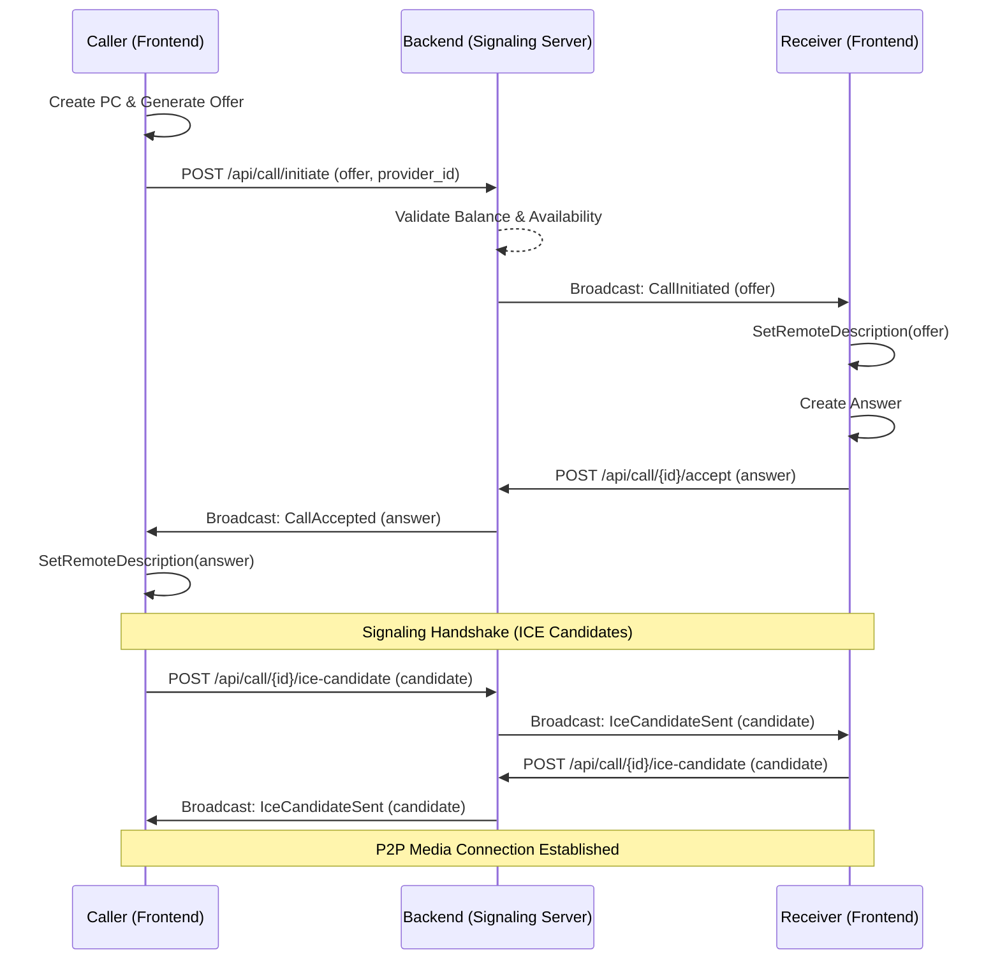

# Final Frontend Integration Guide: Signaling & Chat

This guide provides the complete documentation for integrating the real-time calling and chat features of the Astrology Backend.

## 1. Real-Time Infrastructure (WebSockets)

- **Broadcasting Engine**: Laravel Reverb (Pusher-compatible).
- **Private Channel**: `user.{id}` (Requires Bearer Token for subscription).
- **Presence Channel**: `presence-room` (Shows who is online globally).

### Event Structure (Subscription)
All signaling events for a user will arrive on their private channel: `user.{userId}`.

| Event Class | Payload Description | Purpose |
| :--- | :--- | :--- |
| `App\Events\CallInitiated` | `session`, `caller_info`, `offer` | Notifies the receiver of an incoming call offer. |
| `App\Events\CallAccepted` | `session`, `answer` | Notifies the caller that the receiver has accepted and provided an answer. |
| `App\Events\CallEnded` | `session`, `ended_by` | Notifies that the other party has ended/rejected the call. |
| `App\Events\MessageSent` | `message` | Delivers a real-time message from the other party. |
| `App\Events\IceCandidateSent` | `session`, `candidate`, `receiver_id`| Exchanges network connectivity information. |

---

## 2. Signaling Sequence Diagram



---

## 3. How to Generate Offer & Answer (WebRTC)

The `offer` and `answer` fields in the API are the **SDP (Session Description Protocol)** strings generated by the device's WebRTC engine. 

### Step 1: Generate Offer (Caller)
The caller must create an offer before calling `POST /api/call/initiate`.

**Flutter (flutter_webrtc):**
```dart
RTCPeerConnection pc = await createPeerConnection(configuration);
RTCSessionDescription offer = await pc.createOffer();
await pc.setLocalDescription(offer);

// This 'offer.sdp' is what you send to the backend
String sdpString = offer.sdp; 
```

**React (simple-peer / web-rtc):**
```javascript
const pc = new RTCPeerConnection(config);
const offer = await pc.createOffer();
await pc.setLocalDescription(offer);

// Send offer.sdp to POST /api/call/initiate
const sdpString = offer.sdp;
```

---

## 4. Real-Time Chat Integration

### Sending a message
```json
POST /api/chat/{sessionId}/message
{
    "message": "Hello!",
    "type": "text"
}
```
*Note: `receiver_id` is automatically determined by the backend based on the session participants.*

### Listening for messages
Subscribe to `private-user.{id}` and listen for `App\Events\MessageSent`.

---

## 5. Presence Management
To maintain accurate "Online/Busy" status, call the pulse endpoint every 30-45 seconds while the app is active.

```json
POST /api/presence/pulse
```

---

## 6. Security & Error Handling
- **403 Forbidden**: Occurs if a user tries to signal on a session they don't belong to.
- **Ringing Timeout**: If not accepted within 60 seconds, the backend automatically ends the session. Listen for `CallEnded` with `ended_by: null`.

---

## 7. Apache Deployment Tips (Frontend Developer)
- If calling the API from a different domain, ensure **CORS** is configured.
- Ensure all API calls use `https`. Signaling will fail on `http` in modern browsers/mobile OS.
