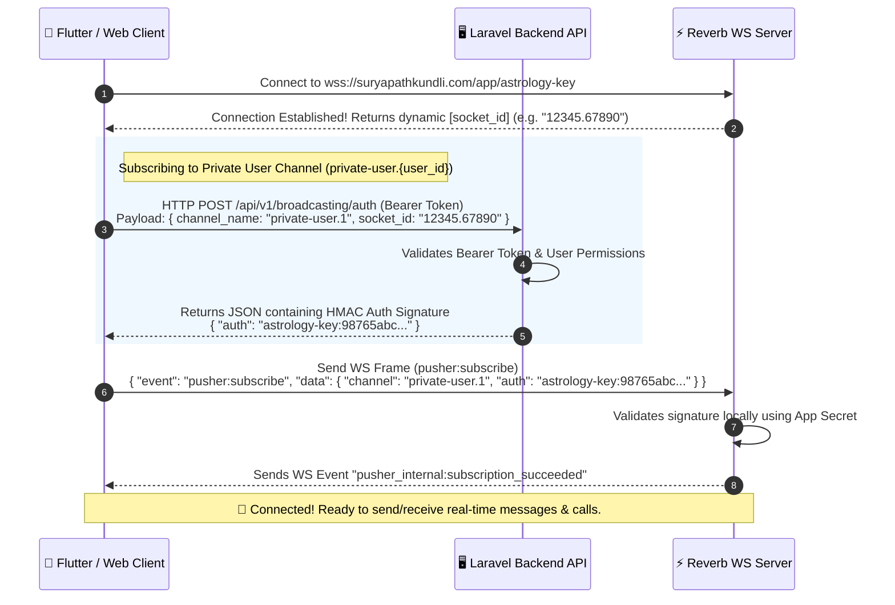

# SURYAPATH KUNDLI (ASTOLOGY) — REVERB LIVE CHAT & WEBSOCKETS DOCUMENTATION
This is the complete **A to Z Developer Reference Manual** for integrating the real-time live chat system powered by **Laravel Reverb (Pusher Protocol)** on the Surypath Kundli / Astrology platform.

---

## 📡 SECTION 1: WEBSOCKET ARCHITECTURE & CONNECTIVITY

The real-time communication tier is powered by **Laravel Reverb**, a high-performance WebSockets server that adheres strictly to the standard **Pusher Protocol**. 

Any official Pusher SDK (like `pusher-js` for Web, `pusher_client` for Flutter, or standard WebSocket client libraries) will connect out-of-the-box.

### 🔌 WebSocket Connection URLs

#### 1. Local Development Settings (from `.env`)
*   **Host**: `127.0.0.1`
*   **Port**: `8080`
*   **Protocol Scheme**: `ws` (non-secure)
*   **Reverb App Key**: `astrology-key`
*   **WS URL**: 
    ```text
    ws://127.0.0.1:8080/app/astrology-key?protocol=7&client=js&version=8.4.0-rc2&flash=false
    ```

#### 2. Live Production Settings
*   **Host**: `suryapathkundli.com`
*   **Port**: `443`
*   **Protocol Scheme**: `wss` (secure SSL)
*   **Reverb App Key**: `astrology-key`
*   **WS URL**: 
    ```text
    wss://suryapathkundli.com/app/astrology-key?protocol=7&client=js&version=8.4.0-rc2&flash=false
    ```
*   **Additional Handshake Header Required**:
    *   `Origin`: `https://suryapathkundli.com`

---

## 🔑 SECTION 2: WEBSOCKET AUTHENTICATION FLOW (HMAC)

Since private and presence channels handle sensitive chat data, clients cannot subscribe to them anonymously. Laravel Reverb secures these subscriptions via an HMAC signature generated by the backend.

### 🔄 The Handshake Sequence Diagram



### 🛰️ Broadcasting Authorization HTTP Endpoint
Standard Pusher SDKs will call this endpoint automatically if properly configured.

*   **URL**: `https://suryapathkundli.com/api/v1/broadcasting/auth`
*   **Method**: `POST`
*   **Headers**:
    ```http
    Authorization: Bearer <USER_AUTH_TOKEN>
    Accept: application/json
    Content-Type: application/x-www-form-urlencoded
    ```
*   **Request Payload (Body)**:
    | Key | Type | Description | Example |
    | :--- | :--- | :--- | :--- |
    | `channel_name` | `string` | The channel you want to join. Must match routing. | `private-user.1` |
    | `socket_id` | `string` | The unique ID received from Reverb upon connection. | `12345.67890` |

*   **Response Payload (`200 OK`)**:
    ```json
    {
        "auth": "astrology-key:98765abcdef123456789abcdef123456789abcde"
    }
    ```

---

## 🔒 SECTION 3: CORE CHANNELS REFERENCE

Clients must subscribe to these channels to listen for live updates.

| Channel Name | Channel Type | Purpose | Subscribed By | Authorization Rule |
| :--- | :--- | :--- | :--- | :--- |
| `private-user.{user_id}` | **Private** | Receives all user-specific alerts, chat requests, calls, WebRTC signaling, and messages. | Both Astrologers & Customers (on their respective user IDs). | Logged-in user's `id` must match `{user_id}`. |
| `presence-room` | **Presence** | Tracks global online/offline presence updates and lists active room members. | All online users. | Must be authenticated via standard Sanctum API. |

*   *Note: In code, Laravel defines private routes as `user.{id}` in `routes/channels.php`. Under the hood, Laravel Broadcast maps the private subscription automatically. On the client side/wire protocol, always subscribe using the `private-user.{id}` channel name.*

---

## 🚀 SECTION 4: A TO Z CHAT LIFECYCLE REST APIS

All endpoints are prefixed with `/api/v1` and protected by the `auth:sanctum` middleware.

```
                  [ LIVE CHAT FLOW LIFECYCLE ]
                  
   [User]                          [Astrologer]
     │                                  │
     │── 1. initiate (POST) ───────────>│ (Triggers "ChatInitiated" WS event)
     │                                  │
     │<── 2. accept (POST) ─────────────│ (Triggers "ChatAccepted" WS event)
     │                                  │
     │── 3. message (POST) ────────────>│ (Triggers "MessageSent" WS event)
     │                                  │
     │<── 4. sync-status (POST) ────────│ (Triggers "MessageStatusUpdated" WS)
     │                                  │
     │── 5. end (POST) ────────────────>│ (Triggers "ChatEnded" WS event)
```

---

### 1. Initiate Chat Session (User Ringing)
Users call this endpoint to start a chat request with an astrologer. The system checks if the astrologer is online, if the user has wallet balance for at least 5 minutes of chat, and dispatches a 60-second ringing timeout job.

*   **Method**: `POST`
*   **URL**: `/api/v1/chat/initiate`
*   **Headers**:
    ```http
    Authorization: Bearer <USER_TOKEN>
    Accept: application/json
    ```
*   **Request Payload**:
    ```json
    {
        "provider_id": 1,
        "question": "Mera career kaisa rahega?"
    }
    ```
    *Note: `question` is an optional string field used to describe the user's inquiry.*
*   **Response Payload (`200 OK`)**:
    ```json
    {
        "success": true,
        "message": "Chat initiated successfully",
        "data": {
            "session": {
                "id": 50,
                "consumer_id": 20,
                "provider_id": 1,
                "status": "initiated",
                "rate_per_minute": 15,
                "question": "Mera career kaisa rahega?",
                "created_at": "2026-05-30T12:00:00.000000Z",
                "updated_at": "2026-05-30T12:00:00.000000Z"
            }
        }
    }
    ```

---

### 2. Accept Chat Request (Astrologer Answers)
The Astrologer calls this endpoint to pick up and accept the ringing chat. This transitions the status to `ongoing`, starts the billing ticker, and flags both participants as `is_busy = 1`.

#### 🤖 Automated Flows Triggered Upon Acceptance
1. **User Profile Sharing**: The system automatically compiles a snapshot of the consumer's latest birth details (Name, Date of Birth, Time of Birth, Place of Birth, Gender, Relationship Status, Occupation, Question) and saves it as a `system` message in the database. This is immediately broadcasted via `MessageSent` to the astrologer's channel.
2. **Personalized Greeting**: If the astrologer has an active default message template, the system personalizes it using placeholder substitutions (e.g., `{{user_name}}`, `{{astrologer_name}}`, `{{date_of_birth}}`, `{{time_of_birth}}`, `{{place_of_birth}}`, `{{session_id}}`), saves it as a `text` message, and broadcasts it via `MessageSent` to the user's channel.

*   **Method**: `POST`
*   **URL**: `/api/v1/chat/{sessionId}/accept`
*   **Headers**:
    ```http
    Authorization: Bearer <ASTROLOGER_TOKEN>
    Accept: application/json
    ```
*   **Response Payload (`200 OK`)**:
    ```json
    {
        "success": true,
        "message": "Chat accepted successfully",
        "data": {
            "session": {
                "id": 50,
                "consumer_id": 20,
                "provider_id": 1,
                "status": "ongoing",
                "rate_per_minute": 15,
                "started_at": "2026-05-30T12:00:15.000000Z",
                "last_billed_at": "2026-05-30T12:00:15.000000Z",
                "created_at": "2026-05-30T12:00:00.000000Z",
                "updated_at": "2026-05-30T12:00:15.000000Z",
                "consumer": {
                    "id": 20,
                    "name": "Aniket Kumar"
                },
                "provider": {
                    "id": 1,
                    "name": "Aacharya Suresh Shastri",
                    "astrologer": {
                        "chat_rate_per_minute": 15
                    }
                }
            }
        }
    }
    ```

---

### 3. Reject Chat Request (Astrologer Declines)
The Astrologer calls this to reject an initiated chat request, ending the session.

*   **Method**: `POST`
*   **URL**: `/api/v1/chat/{sessionId}/reject`
*   **Headers**:
    ```http
    Authorization: Bearer <ASTROLOGER_TOKEN>
    Accept: application/json
    ```
*   **Response Payload (`200 OK`)**:
    ```json
    {
        "success": true,
        "message": "Chat rejected",
        "data": null
    }
    ```

---

### 4. Cancel/Dismiss Chat Request (Consumer side)
The User (Consumer) calls this endpoint to cancel or dismiss an active ringing request (`status = 'initiated'`) before the astrologer accepts it. The API shifts the status to `'rejected'`, resets the players' availability, and fires the `ChatDismissed` real-time WebSocket event to dismiss the incoming call ringing view on the astrologer's screen. 

*   *Note: If the consumer went offline or closed their app abruptly, the presence system automatically fires this cancellation logic on connection lost to save the astrologer's time.*

*   **Method**: `POST`
*   **URL**: `/api/v1/chat/{sessionId}/cancel`
*   **Headers**:
    ```http
    Authorization: Bearer <USER_TOKEN>
    Accept: application/json
    ```
*   **Response Payload (`200 OK`)**:
    ```json
    {
        "success": true,
        "message": "Chat cancelled successfully",
        "data": {
            "session": {
                "id": 50,
                "consumer_id": 20,
                "provider_id": 1,
                "status": "rejected",
                "rate_per_minute": 15,
                "ended_at": "2026-05-30T12:00:25.000000Z",
                "created_at": "2026-05-30T12:00:00.000000Z",
                "updated_at": "2026-05-30T12:00:25.000000Z"
            }
        }
    }
    ```

---

### 5. End Ongoing Chat Session (By User or Astrologer)
Either participant can call this to end the chat. The system stops the billing, calculates final costs (rounding up to the nearest minute), deducts the consumer's wallet balance, credits the provider, and resets the `is_busy` flags to `0` for both.

*   **Method**: `POST`
*   **URL**: `/api/v1/chat/{sessionId}/end`
*   **Headers**:
    ```http
    Authorization: Bearer <USER_OR_ASTROLOGER_TOKEN>
    Accept: application/json
    ```
*   **Response Payload (`200 OK`)**:
    ```json
    {
        "status": "success",
        "message": "Chat ended successfully",
        "data": {
            "session": {
                "id": 50,
                "consumer_id": 20,
                "provider_id": 1,
                "status": "completed",
                "rate_per_minute": 15,
                "duration_seconds": 125,
                "total_cost": 45,
                "started_at": "2026-05-30T12:00:15.000000Z",
                "ended_at": "2026-05-30T12:02:20.000000Z",
                "created_at": "2026-05-30T12:00:00.000000Z",
                "updated_at": "2026-05-30T12:02:20.000000Z"
            },
            "billing": {
                "duration_seconds": 125,
                "user_details": {
                    "duration_seconds": 125,
                    "amount_deducted": 45.0
                },
                "astrologer_details": {
                    "duration_seconds": 125,
                    "amount_added": 45.0
                }
            }
        }
    }
    ```

---

### 6. Upload Chat Attachment
Allows users and astrologers to upload chat files (images, PDFs, documents, audio, videos, etc.) to the server. The API stores the file on the public disk under `chat-attachments/{userId}` and returns its full public URL. This returned URL can then be passed to the **Send Message** API inside the `attachment_url` field.

*   **Method**: `POST`
*   **URL**: `/api/v1/chat/upload-attachment`
*   **Headers**:
    ```http
    Authorization: Bearer <USER_OR_ASTROLOGER_TOKEN>
    Accept: application/json
    Content-Type: multipart/form-data
    ```
*   **Request Payload (multipart/form-data)**:
    | Key | Type | Description |
    | :--- | :--- | :--- |
    | `file` | `file` | The actual file attachment to be uploaded (Max size: 10MB). |

*   **Response Payload (`201 Created`)**:
    ```json
    {
        "success": true,
        "message": "File uploaded successfully",
        "data": {
            "file_path": "chat-attachments/20/1715091234_20_file.png",
            "attachment_url": "https://suryapathkundli.com/storage/chat-attachments/20/1715091234_20_file.png"
        }
    }
    ```

---

### 7. Send Message (Ongoing Chatting)
Sends a message within an active chat session. Supports `text`, `image` attachments, and `system` message types.

*   **Method**: `POST`
*   **URL**: `/api/v1/chat/{sessionId}/message`
*   **Headers**:
    ```http
    Authorization: Bearer <USER_TOKEN_OF_SENDER>
    Accept: application/json
    ```
*   **Request Payload**:
    ```json
    {
        "message": "Pranam Guruji! Mera career kaisa rahega?",
        "attachment_url": "https://suryapathkundli.com/storage/kundli_temp.png",
        "type": "text"
    }
    ```
    *Note: `type` can be one of: `text`, `image`, `system`.*

*   **Response Payload (`200 OK`)**:
    ```json
    {
        "success": true,
        "message": "Message sent",
        "data": {
            "message": {
                "id": 255,
                "chat_session_id": "50",
                "sender_id": 20,
                "receiver_id": 1,
                "message": "Pranam Guruji! Mera career kaisa rahega?",
                "attachment_url": "https://suryapathkundli.com/storage/kundli_temp.png",
                "type": "text",
                "is_read": false,
                "created_at": "2026-05-30T12:01:10.000000Z",
                "updated_at": "2026-05-30T12:01:10.000000Z"
            }
        }
    }
    ```

---

### 8. Get Paginated Message History
Retrieves previous messages in a chat session.

*   **Method**: `GET`
*   **URL**: `/api/v1/chat/{sessionId}/messages`
*   **Headers**:
    ```http
    Authorization: Bearer <USER_OR_ASTROLOGER_TOKEN>
    Accept: application/json
    ```
*   **Response Payload (`200 OK`)**:
    ```json
    {
        "success": true,
        "message": "Messages retrieved",
        "data": {
            "current_page": 1,
            "data": [
                {
                    "id": 255,
                    "chat_session_id": 50,
                    "sender_id": 20,
                    "receiver_id": 1,
                    "message": "Pranam Guruji! Mera career kaisa rahega?",
                    "attachment_url": "https://suryapathkundli.com/storage/kundli_temp.png",
                    "type": "text",
                    "is_read": false,
                    "created_at": "2026-05-30T12:01:10.000000Z"
                }
            ],
            "first_page_url": "https://suryapathkundli.com/api/v1/chat/50/messages?page=1",
            "next_page_url": null,
            "path": "https://suryapathkundli.com/api/v1/chat/50/messages",
            "per_page": 30,
            "to": 1,
            "total": 1
        }
    }
    ```

---

### 9. Mark Messages as Read
Mark all incoming messages in the session as read (`is_read = true`, `is_delivered = true`).

*   **Method**: `POST`
*   **URL**: `/api/v1/chat/{sessionId}/read`
*   **Headers**:
    ```http
    Authorization: Bearer <USER_OR_ASTROLOGER_TOKEN>
    Accept: application/json
    ```
*   **Response Payload (`200 OK`)**:
    ```json
    {
        "success": true,
        "message": "Messages marked as read",
        "data": null
    }
    ```

---

### 10. Sync Messages Status (Delivered vs Seen)
Manually synchronize status for specific messages using their unique database IDs.

*   **Method**: `POST`
*   **URL**: `/api/v1/chat/{sessionId}/sync-status`
*   **Headers**:
    ```http
    Authorization: Bearer <USER_OR_ASTROLOGER_TOKEN>
    Accept: application/json
    ```
*   **Request Payload**:
    ```json
    {
        "status": "seen",
        "message_ids": [255, 256, 257]
    }
    ```
    *Note: `status` can be either `delivered` or `seen`.*

*   **Response Payload (`200 OK`)**:
    ```json
    {
        "success": true,
        "message": "Status updated",
        "data": null
    }
    ```

---

### 11. Get Current Active Session (If Any)
Queries and returns the current active chat session (status is either `initiated` or `ongoing`) for the authenticated user. If no active session exists, it returns `null` inside the `session` object. This is highly recommended to call when the app launches or boots, so you can dynamically resume the ongoing chat ringing/messaging screen.

*   **Method**: `GET`
*   **URL**: `/api/v1/chat/current-session`
*   **Headers**:
    ```http
    Authorization: Bearer <USER_OR_ASTROLOGER_TOKEN>
    Accept: application/json
    ```
*   **Response Payload — Active Session Exists (`200 OK`)**:
    ```json
    {
        "success": true,
        "message": "Current active session retrieved successfully",
        "data": {
            "session": {
                "id": 50,
                "consumer_id": 20,
                "provider_id": 1,
                "status": "ongoing",
                "rate_per_minute": 15,
                "started_at": "2026-05-30T12:00:15.000000Z",
                "created_at": "2026-05-30T12:00:00.000000Z",
                "updated_at": "2026-05-30T12:00:15.000000Z",
                "consumer": {
                    "id": 20,
                    "name": "Aniket Kumar"
                },
                "provider": {
                    "id": 1,
                    "name": "Aacharya Suresh Shastri",
                    "astrologer": {
                        "chat_rate_per_minute": 15
                    }
                }
            }
        }
    }
    ```
*   **Response Payload — No Active Session (`200 OK`)**:
    ```json
    {
        "success": true,
        "message": "Current active session retrieved successfully",
        "data": {
            "session": null
        }
    }
    ```

---

### 12. Get User's Active & Past Chat Sessions (Customer side)
Retrieves all historical and active sessions where the authenticated user participated as the customer (`consumer_id`). Eager loads the astrologer's profile details, the latest message preview, and the count of unread messages.

*   **Method**: `GET`
*   **URL**: `/api/v1/chat/sessions/user`
*   **Headers**:
    ```http
    Authorization: Bearer <USER_TOKEN>
    Accept: application/json
    ```
*   **Response Payload (`200 OK`)**:
    ```json
    {
        "success": true,
        "message": "User sessions retrieved successfully",
        "data": {
            "current_page": 1,
            "data": [
                {
                    "id": 50,
                    "consumer_id": 20,
                    "provider_id": 1,
                    "status": "completed",
                    "rate_per_minute": 15,
                    "duration_seconds": 120,
                    "total_cost": 30,
                    "created_at": "2026-05-30T12:00:00.000000Z",
                    "unread_count": 1,
                    "provider": {
                        "id": 1,
                        "name": "Aacharya Suresh Shastri",
                        "astrologer": {
                            "chat_rate_per_minute": 15
                        }
                    },
                    "latest_message": {
                        "id": 255,
                        "chat_session_id": 50,
                        "sender_id": 1,
                        "receiver_id": 20,
                        "message": "Pranam Guruji! Mera career kaisa rahega?",
                        "type": "text",
                        "created_at": "2026-05-30T12:01:10.000000Z"
                    }
                }
            ]
        }
    }
    ```

---

### 13. Get Astrologer's Active & Past Chat Sessions (Astrologer side)
Retrieves all historical and active sessions where the authenticated user participated as the astrologer (`provider_id`). Eager loads the customer's profile details, the latest message preview, and the count of unread messages.

*   **Method**: `GET`
*   **URL**: `/api/v1/chat/sessions/astrologer`
*   **Headers**:
    ```http
    Authorization: Bearer <ASTROLOGER_TOKEN>
    Accept: application/json
    ```
*   **Response Payload (`200 OK`)**:
    ```json
    {
        "success": true,
        "message": "Astrologer sessions retrieved successfully",
        "data": {
            "current_page": 1,
            "data": [
                {
                    "id": 50,
                    "consumer_id": 20,
                    "provider_id": 1,
                    "status": "completed",
                    "rate_per_minute": 15,
                    "duration_seconds": 120,
                    "total_cost": 30,
                    "created_at": "2026-05-30T12:00:00.000000Z",
                    "unread_count": 0,
                    "consumer": {
                        "id": 20,
                        "name": "Aniket Kumar"
                    },
                    "latest_message": {
                        "id": 255,
                        "chat_session_id": 50,
                        "sender_id": 1,
                        "receiver_id": 20,
                        "message": "Pranam Guruji! Mera career kaisa rahega?",
                        "type": "text",
                        "created_at": "2026-05-30T12:01:10.000000Z"
                    }
                }
            ]
        }
    }
    ```

---

### 14. Get Current Accepted Chat Session
Retrieves the currently accepted/active chat session for the authenticated logged-in user (consumer or astrologer/provider). If multiple ongoing sessions exist, it returns the latest one based on `accepted_at` (or `created_at` as fallback). If no active session exists, it returns `null` inside the `data` payload.

*   **Method**: `GET`
*   **URL**: `/api/v1/chat/sessions/current`
*   **Headers**:
    ```http
    Authorization: Bearer <USER_OR_ASTROLOGER_TOKEN>
    Accept: application/json
    ```
*   **Response Payload — Current Session Found (`200 OK`)**:
    ```json
    {
        "success": true,
        "status": "success",
        "message": "Current chat session retrieved successfully",
        "data": {
            "id": 50,
            "consumer_id": 20,
            "provider_id": 1,
            "status": "ongoing",
            "rate_per_minute": 15,
            "duration_seconds": 0,
            "total_cost": 0,
            "created_at": "2026-05-30T12:00:00.000000Z",
            "accepted_at": "2026-05-30T12:00:25.000000Z",
            "unread_count": 1,
            "provider": {
                "id": 1,
                "name": "Aacharya Suresh Shastri",
                "astrologer": {
                    "chat_rate_per_minute": 15
                }
            },
            "consumer": {
                "id": 20,
                "name": "Aniket Kumar"
            },
            "latest_message": {
                "id": 255,
                "chat_session_id": 50,
                "sender_id": 1,
                "receiver_id": 20,
                "message": "Pranam Guruji! Mera career kaisa rahega?",
                "type": "text",
                "created_at": "2026-05-30T12:01:10.000000Z"
            }
        }
    }
    ```
*   **Response Payload — No Current Session Found (`200 OK`)**:
    ```json
    {
        "success": true,
        "status": "success",
        "message": "No current chat session found",
        "data": null
    }
    ```

---

### 15. Get Paginated Message History (Session Detail with Security Guards)
Retrieves previous messages in a chat session. This endpoint enforces strict ownership checks: the authenticated user MUST be either the `consumer_id` or the `provider_id` of the session, otherwise a `403 Forbidden` response is returned.

*   **Method**: `GET`
*   **URL**: `/api/v1/chat/{sessionId}/messages`
*   **Headers**:
    ```http
    Authorization: Bearer <USER_OR_ASTROLOGER_TOKEN>
    Accept: application/json
    ```
*   **Response Payload (`200 OK`)**:
    ```json
    {
        "success": true,
        "message": "Messages retrieved",
        "data": {
            "current_page": 1,
            "data": [
                {
                    "id": 255,
                    "chat_session_id": 50,
                    "sender_id": 20,
                    "receiver_id": 1,
                    "message": "Pranam Guruji! Mera career kaisa rahega?",
                    "type": "text",
                    "is_read": false,
                    "created_at": "2026-05-30T12:01:10.000000Z"
                }
            ]
        }
    }
    ```
*   **Response Payload (`403 Forbidden`)**:
    ```json
    {
        "success": false,
        "message": "You are not authorized to access this chat history."
    }
    ```

---

## ⚡ SECTION 5: REAL-TIME WEBSOCKET EVENTS (PAYLOADS & CHANNELS)

These events are broadcasted over Reverb. When the backend fires an event, Reverb pushes it to the authorized private user channel instantly.

---

### 🔔 1. `ChatInitiated`
*   **Broadcasts to**: `private-user.{provider_id}` (Astrologer's Channel)
*   **Fired When**: User clicks "Initiate Chat" in-app. Rings the Astrologer's screen.
*   **JSON Event Payload**:
    ```json
    {
        "event": "ChatInitiated",
        "channel": "private-user.1",
        "data": {
            "session": {
                "id": 50,
                "consumer_id": 20,
                "provider_id": 1,
                "status": "initiated",
                "rate_per_minute": 15,
                "created_at": "2026-05-30T12:00:00.000000Z"
            },
            "senderData": {
                "id": 20,
                "name": "Aniket Kumar",
                "profile_photo": "https://suryapathkundli.com/storage/profile_20.jpg",
                "is_online": true
            }
        }
    }
    ```

---

### 🔔 2. `ChatAccepted`
*   **Broadcasts to**: `private-user.{consumer_id}` (User's Channel)
*   **Fired When**: Astrologer accepts the chat. Transitions the consumer's calling screen to the active chatting UI.
*   **JSON Event Payload**:
    ```json
    {
        "event": "ChatAccepted",
        "channel": "private-user.20",
        "data": {
            "session": {
                "id": 50,
                "consumer_id": 20,
                "provider_id": 1,
                "status": "ongoing",
                "started_at": "2026-05-30T12:00:15.000000Z",
                "rate_per_minute": 15
            },
            "providerData": {
                "id": 1,
                "name": "Aacharya Suresh Shastri",
                "profile_photo": "https://suryapathkundli.com/storage/astro_1.jpg",
                "astrologer": {
                    "chat_rate_per_minute": 15
                }
            }
        }
    }
    ```

---

### 🔔 3. `ChatEnded`
*   **Broadcasts to**: `private-user.{receiverId}` (The other participant's channel)
*   **Fired When**: The ongoing chat session is ended or completed by either the astrologer or the consumer.
*   **JSON Event Payload**:
    ```json
    {
        "event": "ChatEnded",
        "channel": "private-user.20",
        "data": {
            "session": {
                "id": 50,
                "status": "completed",
                "duration_seconds": 120,
                "total_cost": 30,
                "ended_at": "2026-05-30T12:02:20.000000Z"
            },
            "endedById": 1,
            "billing": {
                "duration_seconds": 120,
                "user_details": {
                    "duration_seconds": 120,
                    "amount_deducted": 30.0
                },
                "astrologer_details": {
                    "duration_seconds": 120,
                    "amount_added": 30.0
                }
            }
        }
    }
    ```

---

### 🔔 4. `ChatDismissed`
*   **Broadcasts to**: `private-user.{receiverId}` (or both private channels if dismissed by system timeout)
*   **Fired When**: An initiated chat request is explicitly cancelled by the consumer, automatically timed out by the system, or cancelled due to a participant disconnecting or going offline. This is the exact event to listen to for hiding the astrologer's accept/reject dialog box.
*   **JSON Event Payload**:
    ```json
    {
        "event": "ChatDismissed",
        "channel": "private-user.1",
        "data": {
            "session": {
                "id": 50,
                "consumer_id": 20,
                "provider_id": 1,
                "status": "rejected",
                "ended_at": "2026-05-30T12:00:25.000000Z"
            },
            "dismissedById": 20
        }
    }
    ```
    *Note: `dismissedById` will be `null` if the cancellation/dismissal was automatically triggered by the system timeout.*

---

### 🔔 5. `MessageSent`
*   **Broadcasts to**: `private-user.{receiverId}` (The recipient's private channel)
*   **Fired When**: A new message is successfully saved in the database via the API.
*   **JSON Event Payload**:
    ```json
    {
        "event": "MessageSent",
        "channel": "private-user.1",
        "data": {
            "messageData": {
                "id": 255,
                "chat_session_id": 50,
                "sender_id": 20,
                "receiver_id": 1,
                "message": "Pranam Guruji! Mera career kaisa rahega?",
                "attachment_url": "https://suryapathkundli.com/storage/kundli_temp.png",
                "type": "text",
                "is_read": false,
                "created_at": "2026-05-30T12:01:10.000000Z"
            }
        }
    }
    ```

---

### 🔔 6. `MessageStatusUpdated`
*   **Broadcasts to**: `private-user.private-user.{receiverId}` (Wait! The backend broadcasts to the exact string matching `private-user.{receiverId}`)
*   **Fired When**: The recipient marks messages as read or syncs delivery status.
*   **JSON Event Payload**:
    ```json
    {
        "event": "MessageStatusUpdated",
        "channel": "private-user.private-user.20",
        "data": {
            "message_ids": [255, 256],
            "status": "seen",
            "session_id": 50
        }
    }
    ```
    *Note: Notice that in `MessageStatusUpdated.php`, the channel is configured as `new PrivateChannel('private-user.' . $this->receiverId)`. Under the hood, Laravel prepends `private-`, resulting in `private-user.private-user.{id}`. Clients should listen to this exact channel for status updates.*

---

## 🟢 SECTION 6: PRESENCE & PINGING (HEARTBEAT)

To maintain real-time online status lists and prevent connections from dropping due to inactivity timeouts, implement these presence features.

### 🌐 Presence Channel: `presence-room`
All active users should subscribe to the presence channel to track global online rosters.

```json
{
    "event": "pusher:subscribe",
    "data": {
        "channel": "presence-room",
        "auth": "astrology-key:98765abc..."
    }
}
```

#### 📡 `PresenceUpdated` Event
Broadcast globally on `presence-room` whenever a user pulses online/offline.
```json
{
    "event": "PresenceUpdated",
    "channel": "presence-presence-room",
    "data": {
        "presenceData": {
            "id": 20,
            "name": "Aniket Kumar",
            "profile_photo": "https://suryapathkundli.com/storage/profile_20.jpg",
            "is_online": true,
            "is_busy": false,
            "user_type": "consumer",
            "last_seen_at": "2026-05-30T12:05:00.000000Z"
        }
    }
}
```

---

### 💓 Heartbeat / Keep Alive (Testing & Raw WebSockets)
Laravel Reverb automatically drops connections after **30 seconds** of inactivity to save resources. 
*   To keep the connection alive indefinitely, the client must send a `ping` frame every **20 seconds**.

*   **Client Sends**:
    ```json
    {
        "event": "pusher:ping"
    }
    ```
*   **Reverb Server Replies**:
    ```json
    {
        "event": "pusher:pong"
    }
    ```

---

## 💡 SECTION 7: DEVELOPER IMPLEMENTATION RULES & BEST PRACTICES

### ❌ What NOT to do
1.  **Do NOT do manual 3-step bindings (Connect ➔ API Auth ➔ Send WS subscribe)** in your application code. Use an official SDK. The SDK handles the token authorization and hands it directly to Reverb without developer overhead.
2.  **Do NOT send raw chat messages over WebSocket frames.** WebSocket events are purely read-only down-link signals. Messages must be sent via the `POST /api/v1/chat/{id}/message` HTTP endpoint to ensure database persistence, media storage, spam check, and transactional reliability.

### ✅ What to do (Best Practices)
1.  **Configure automatic reconnection** inside your client options so that the user's connection resumes automatically when toggling between mobile network towers.
2.  **Graceful Ringing Timeout**: Handle the 60-second unanswered ringing locally on the client to stop the ringing audio, while relying on the backend job `CleanupMissedSessionJob` as a failsafe.
3.  **Wallet Lock Gate**: Prevent starting chats if the consumer's wallet is less than `chat_rate_per_minute * 5` to secure astrologers' billable time.

---

## 💰 SECTION 8: WALLET TRANSACTION RECORDS & ATOMIC BILLING

To maintain strict financial compliance, all paid consultations (chats, calls, etc.) are billed atomically. This section outlines how wallet deductions, credits, and transaction logging behave in the backend.

### 🔒 1. Atomic Transaction & Locking Flow
Every billing update—including real-time billing ticks and session termination billing—is wrapped in an atomic database transaction using row-level locking (`lockForUpdate` in Laravel).
*   **Locked Rows**: The `chat_sessions`/`call_sessions` row, the `consumer` user wallet, and the `provider` user wallet are locked to prevent race conditions, duplicate billing ticks, double deductions, or duplicate credits.
*   **Atomic Rollback**: If any of the following steps fail, the entire transaction is rolled back:
    1. Deducting the consumer's wallet.
    2. Crediting the provider's wallet.
    3. Creating the consumer's debit transaction record.
    4. Creating the provider's credit transaction record.
    5. Updating the session's total billed cost and billing timestamp.

### 📝 2. Wallet Transaction Log Schema & Details

All successful billing operations result in a transaction log with `status = 'completed'` in the `wallet_transactions` table.

#### A. User Side (Debit Transaction)
*   **Transaction Type**: `debit`
*   **Status**: `completed`
*   **Description**: Resolved automatically to `"Chat session with Astrologer <Name>"` or `"Call session with Astrologer <Name>"`.
*   **Reference**: `reference_type` (`App\Models\ChatSession` or `App\Models\CallSession`) and `reference_id` (session database ID).
*   **Balances**: Includes `balance_before` and `balance_after` to preserve full audit trails.
*   **Meta Payload**:
    ```json
    {
        "type": "chat",
        "astrologer_id": 1,
        "astrologer_name": "Aacharya Suresh Shastri",
        "session_id": 50,
        "session_reference": "Chat session reference #50"
    }
    ```

#### B. Astrologer Side (Credit Transaction)
*   **Transaction Type**: `credit`
*   **Status**: `completed`
*   **Description**: Resolved automatically to `"Chat consultation with User <Name>"` or `"Call consultation with User <Name>"`.
*   **Reference**: Same `reference_type` and `reference_id` to link both records.
*   **Balances**: Includes `balance_before` and `balance_after`.
*   **Meta Payload**:
    ```json
    {
        "type": "chat",
        "user_id": 20,
        "user_name": "Aniket Kumar",
        "session_id": 50,
        "session_reference": "Chat session reference #50"
    }
    ```

### 📉 3. Wallet Balance Exhaustion / Session Ending
When a chat or call session ends, the remaining unbilled balance is calculated.
*   If the user has insufficient balance to cover the calculated final unbilled amount, the deduction is capped at the user's remaining wallet balance:
    ```php
    $chargeAmount = min($unbilledBalance, $consumerWallet->balance);
    ```
*   The system deducts `$chargeAmount` from the user, credits the same to the astrologer, logs the completed transactions, updates the session's total cost to the actual amount charged, and marks the session as `completed`. This prevents sessions from getting stuck in an `ongoing` status when a user's wallet is completely drained.

---

## ⏳ SECTION 9: ASTROLOGER BUSY STATUS & UNIFIED ORDER HISTORY / WAITING LIST

To provide complete transparency to consumers and astrologers, the system dynamically calculates the astrologer's availability and supports a waiting queue list if they are busy in an active session.

### 🕒 1. Real-time Dynamic Busy Status Check
The astrologer's `is_busy` status is calculated dynamically from the database to avoid stale flag conditions:
- **Busy condition**: If the astrologer has an active `ChatSession` (status in `['accepted', 'ongoing']`) OR an active `CallSession` (status in `['ringing', 'accepted', 'ongoing']`).
- **Profile & Listing APIs**: The user profile and listing APIs dynamically fetch and inject this calculated status into the `is_busy` field of the astrologer's response payload.

### 📋 2. Waiting List Queuing Flow
If a user initiates a chat or call session, and the astrologer is dynamically busy but online:
1. The request is created in the database with `status = 'waiting'`.
2. The user sees a clear status: `"Astrologer is currently busy. Your request is in the waiting list."`
3. The queue priority/position is calculated dynamically by counting older `waiting` sessions for that astrologer.
4. When the astrologer accepts a waiting session, it transitions to `'ongoing'`.
5. Concurrency checks with row-level locks prevent an astrologer from accepting multiple concurrent active calls or chats.

### 📥 3. Unified Astrologer Order History / Waiting List API
Provides a single endpoint for authenticated astrologers to view history and waiting lists.
- **Endpoint**: `GET /api/v1/astrologer/orders`
- **Method**: `GET`
- **Headers**:
    ```http
    Authorization: Bearer <ASTROLOGER_TOKEN>
    Accept: application/json
    ```
- **Query Parameters**:
  - `status` (Optional): Filter by `waiting`, `pending` (initiated), `completed`, `rejected` (cancelled/rejected).
  - `type` (Optional): Filter by `chat` or `call`.
  - `per_page` (Optional): Number of records per page (default: 15).
  - `page` (Optional): Paginated page index (default: 1).
- **Sorting Logic**:
  - For waiting list (`status = waiting`), results are sorted oldest first (`created_at ASC`) to maintain FIFO queue priority.
  - For history/other lists, results are sorted newest first (`created_at DESC`).
- **Response Payload (`200 OK`)**:
    ```json
    {
        "status": "success",
        "message": "Orders retrieved successfully.",
        "data": {
            "orders": [
                {
                    "session_id": 51,
                    "order_id": 51,
                    "user_id": 20,
                    "user_name": "Aniket Kumar",
                    "user_profile_image": "https://suryapathkundli.com/storage/profile_20.jpg",
                    "request_type": "chat",
                    "status": "waiting",
                    "requested_at": "2026-05-30T12:05:00.000000Z",
                    "started_at": null,
                    "ended_at": null,
                    "duration_seconds": 0,
                    "amount": 0.0,
                    "rate_per_minute": 10.0,
                    "payment_status": "pending",
                    "last_message": null,
                    "queue_position": 1
                }
            ],
            "pagination": {
                "total": 1,
                "per_page": 15,
                "current_page": 1,
                "last_page": 1
            }
        }
    }
}

---

## 📝 SECTION 10: ASTROLOGER DEFAULT MESSAGE TEMPLATES (CRUD)

Astrologers can manage pre-configured greeting/welcome message templates. These templates can include dynamic placeholders that are automatically filled with the consumer's details when a chat request is accepted.

### 🔄 Supported Dynamic Placeholders
*   `{{user_name}}`: Consumer's name (e.g. "Aniket Kumar").
*   `{{astrologer_name}}`: Astrologer's name (e.g. "Aacharya Suresh Shastri").
*   `{{date_of_birth}}`: Consumer's date of birth in `YYYY-MM-DD` format.
*   `{{time_of_birth}}`: Consumer's time of birth in `HH:MM` format.
*   `{{place_of_birth}}`: Consumer's place of birth.
*   `{{session_id}}`: The dynamic ID of the active chat session.

---

### 1. Get All Message Templates
Retrieves all default message templates created by the authenticated astrologer.
*   **Method**: `GET`
*   **URL**: `/api/v1/astrologer/default-messages`
*   **Headers**:
    ```http
    Authorization: Bearer <ASTROLOGER_TOKEN>
    Accept: application/json
    ```
*   **Response Payload (`200 OK`)**:
    ```json
    {
        "success": true,
        "message": "Default messages retrieved successfully.",
        "data": [
            {
                "id": 1,
                "astrologer_id": 1,
                "title": "Standard Welcome",
                "content": "Namaste {{user_name}}! Welcome to Suryapath Kundli. How can I help you today?",
                "is_default": true,
                "created_at": "2026-06-02T12:00:00.000000Z",
                "updated_at": "2026-06-02T12:00:00.000000Z"
            }
        ]
    }
    ```

---

### 2. Get Active Message Template
Retrieves the template currently set as the active default for the authenticated astrologer.
*   **Method**: `GET`
*   **URL**: `/api/v1/astrologer/default-messages/active`
*   **Headers**:
    ```http
    Authorization: Bearer <ASTROLOGER_TOKEN>
    Accept: application/json
    ```
*   **Response Payload (`200 OK`)**:
    ```json
    {
        "success": true,
        "message": "Active default message retrieved successfully.",
        "data": {
            "id": 1,
            "astrologer_id": 1,
            "title": "Standard Welcome",
            "content": "Namaste {{user_name}}! Welcome to Suryapath Kundli. How can I help you today?",
            "is_default": true,
            "created_at": "2026-06-02T12:00:00.000000Z",
            "updated_at": "2026-06-02T12:00:00.000000Z"
        }
    }
    ```

---

### 3. Create Message Template
Creates a new message template. Setting `is_default` to `true` will atomically mark this template as the default and deactivate all other templates for this astrologer.
*   **Method**: `POST`
*   **URL**: `/api/v1/astrologer/default-messages`
*   **Headers**:
    ```http
    Authorization: Bearer <ASTROLOGER_TOKEN>
    Accept: application/json
    ```
*   **Request Payload**:
    ```json
    {
        "title": "Standard Welcome",
        "content": "Namaste {{user_name}}! Welcome to Suryapath Kundli. How can I help you today?",
        "is_default": true
    }
    ```
*   **Response Payload (`201 Created`)**:
    ```json
    {
        "success": true,
        "message": "Default message created successfully.",
        "data": {
            "id": 1,
            "astrologer_id": 1,
            "title": "Standard Welcome",
            "content": "Namaste {{user_name}}! Welcome to Suryapath Kundli. How can I help you today?",
            "is_default": true,
            "created_at": "2026-06-02T12:00:00.000000Z",
            "updated_at": "2026-06-02T12:00:00.000000Z"
        }
    }
    ```

---

### 4. Update Message Template
Updates an existing template by ID.
*   **Method**: `PUT`
*   **URL**: `/api/v1/astrologer/default-messages/{id}`
*   **Headers**:
    ```http
    Authorization: Bearer <ASTROLOGER_TOKEN>
    Accept: application/json
    ```
*   **Request Payload**:
    ```json
    {
        "title": "Updated Welcome",
        "content": "Pranam {{user_name}}! Let me help you with your concern. Session reference is {{session_id}}.",
        "is_default": true
    }
    ```
*   **Response Payload (`200 OK`)**:
    ```json
    {
        "success": true,
        "message": "Default message updated successfully.",
        "data": {
            "id": 1,
            "astrologer_id": 1,
            "title": "Updated Welcome",
            "content": "Pranam {{user_name}}! Let me help you with your concern. Session reference is {{session_id}}.",
            "is_default": true,
            "created_at": "2026-06-02T12:00:00.000000Z",
            "updated_at": "2026-06-02T12:15:00.000000Z"
        }
    }
    ```

---

### 5. Set Active Default Template
Atomically sets the specified template as the active default for the authenticated astrologer and deactivates all others.
*   **Method**: `POST`
*   **URL**: `/api/v1/astrologer/default-messages/{id}/set-default`
*   **Headers**:
    ```http
    Authorization: Bearer <ASTROLOGER_TOKEN>
    Accept: application/json
    ```
*   **Response Payload (`200 OK`)**:
    ```json
    {
        "success": true,
        "message": "Message template set as active default.",
        "data": {
            "id": 1,
            "astrologer_id": 1,
            "title": "Updated Welcome",
            "content": "Pranam {{user_name}}! Let me help you with your concern. Session reference is {{session_id}}.",
            "is_default": true,
            "created_at": "2026-06-02T12:00:00.000000Z",
            "updated_at": "2026-06-02T12:20:00.000000Z"
        }
    }
    ```

---

### 6. Delete Message Template
Deletes a template by ID.
*   **Method**: `DELETE`
*   **URL**: `/api/v1/astrologer/default-messages/{id}`
*   **Headers**:
    ```http
    Authorization: Bearer <ASTROLOGER_TOKEN>
    Accept: application/json
    ```
*   **Response Payload (`200 OK`)**:
    ```json
    {
        "success": true,
        "message": "Default message deleted successfully.",
        "data": null
    }
    ```

---

## 👤 SECTION 11: USER PROFILE & BIRTH DETAILS

To ensure accurate system messages during chat/call acceptance, consumers must provide complete profile and birth details.

### 🔄 Update User Profile Endpoint
Updates or sets the consumer's profile and birth details.
*   **Method**: `PUT`
*   **URL**: `/api/v1/user/profileInAppUpdate`
*   **Headers**:
    ```http
    Authorization: Bearer <USER_TOKEN>
    Accept: application/json
    ```
*   **Request Payload**:
    ```json
    {
        "name": "Aniket Kumar",
        "gender": "male",
        "date_of_birth": "1998-05-15",
        "time_of_birth": "14:30",
        "place_of_birth": "New Delhi, India",
        "relationship_status": "Single",
        "occupation": "Software Engineer",
        "languages": ["English", "Hindi"]
    }
    ```
*   **Validation Constraints**:
    *   `name`: Required, string, max 255.
    *   `gender`: Required, must be `male` or `female`.
    *   `date_of_birth`: Required, must be a valid date in the past.
    *   `time_of_birth`: Required, must be in `HH:MM` format (24-hour style).
    *   `place_of_birth`: Required, string, max 255.
    *   `relationship_status`: Optional, string, max 255.
    *   `occupation`: Optional, string, max 255.
    *   `languages`: Required, array. Allowed values: `English`, `Hindi`, `Tamil`, `Bengali`, `Telugu`, `Marathi`.

---

## 📞 SECTION 12: CALL LIFECYCLE REST APIs

All endpoints are prefixed with `/api/v1/call` and protected by `auth:sanctum` middleware.

```
              [ LIVE CALL FLOW LIFECYCLE ]

 [User]                                [Astrologer]
   │                                        │
   │── 1. initiate (POST) ─────────────────>│ (Triggers "CallInitiated" WS event with offer SDP)
   │                                        │
   │         ┌── Astrologer rejects ────────│ (Triggers "CallDismissed" WS event, reason="rejected")
   │         │                              │
   │         └── Astrologer accepts ────────│ (Triggers "CallAccepted" WS event with answer SDP)
   │                                        │
   │<──── 2. ICE exchange ─────────────────>│ (Bi-directional "IceCandidateSent" WS events)
   │                                        │
   │── 3. end (POST) ──────────────────────>│ (Triggers "CallEnded" WS event, billing calculated)
   │
   │  [OR] User may cancel before accept:
   │── cancel (POST) ─────────────────────>│ (Triggers "CallDismissed" WS event, reason="cancelled")
```

---

### 1. Initiate Call (User Dials Astrologer)

Creates a call session and delivers the SDP offer to the astrologer via WebSocket.
- Validates wallet balance (minimum 5 minutes required).
- If astrologer is offline → **Error 400**.
- If astrologer is available → session status = `initiated`.
- If astrologer is busy → session status = `waiting` (queued).
- A 60-second timeout job is dispatched; if unanswered, session becomes `missed`.

*   **Method**: `POST`
*   **URL**: `/api/v1/call/initiate`
*   **Throttle**: 10 requests per minute per user
*   **Headers**:
    ```http
    Authorization: Bearer <USER_TOKEN>
    Accept: application/json
    ```
*   **Request Payload**:
    ```json
    {
        "provider_id": 1,
        "offer": "<WebRTC SDP Offer String>"
    }
    ```
*   **Response Payload (`200 OK`) — Direct Ring**:
    ```json
    {
        "success": true,
        "message": "Call initiated successfully",
        "data": {
            "session": {
                "id": 55,
                "consumer_id": 20,
                "provider_id": 1,
                "status": "initiated",
                "rate_per_minute": 15,
                "created_at": "2026-06-02T08:00:00.000000Z"
            }
        }
    }
    ```
*   **Response Payload (`200 OK`) — Astrologer Busy (Queued)**:
    ```json
    {
        "success": true,
        "message": "Call initiated successfully",
        "data": {
            "session": {
                "id": 56,
                "consumer_id": 20,
                "provider_id": 1,
                "status": "waiting",
                "rate_per_minute": 15,
                "created_at": "2026-06-02T08:00:00.000000Z"
            }
        }
    }
    ```

---

### 2. Accept Call (Astrologer Answers)

Astrologer accepts the incoming call and sends the WebRTC SDP answer. This transitions the session to `ongoing`, marks both participants as busy, and starts the billing ticker (first tick after 1 minute).

*   **Method**: `POST`
*   **URL**: `/api/v1/call/{sessionId}/accept`
*   **Headers**:
    ```http
    Authorization: Bearer <ASTROLOGER_TOKEN>
    Accept: application/json
    ```
*   **Request Payload**:
    ```json
    {
        "answer": "<WebRTC SDP Answer String>"
    }
    ```
*   **Response Payload (`200 OK`)**:
    ```json
    {
        "success": true,
        "message": "Call accepted successfully",
        "data": {
            "session": {
                "id": 55,
                "consumer_id": 20,
                "provider_id": 1,
                "status": "ongoing",
                "rate_per_minute": 15,
                "started_at": "2026-06-02T08:00:10.000000Z",
                "last_billed_at": "2026-06-02T08:00:10.000000Z",
                "answer": "<WebRTC SDP Answer String>"
            }
        }
    }
    ```

---

### 3. Reject Call (Astrologer Refuses)

Astrologer rejects the ringing call. Session status becomes `rejected`.
Fires `CallDismissed` event (with `reason = "rejected"`) to both channels.

*   **Method**: `POST`
*   **URL**: `/api/v1/call/{sessionId}/reject`
*   **Headers**:
    ```http
    Authorization: Bearer <ASTROLOGER_TOKEN>
    Accept: application/json
    ```
*   **Response Payload (`200 OK`)**:
    ```json
    {
        "success": true,
        "message": "Call rejected",
        "data": null
    }
    ```

---

### 4. Cancel Call (User Withdraws Before Acceptance)

The user cancels their own outgoing call request before the astrologer answers. Session status becomes `cancelled`.
Fires `CallDismissed` event (with `reason = "cancelled"`) to both channels — dismisses the astrologer's ringing screen.

> **Important**: This endpoint is only available to the `consumer` (user who initiated the call). Astrologers must use `reject`.

*   **Method**: `POST`
*   **URL**: `/api/v1/call/{sessionId}/cancel`
*   **Headers**:
    ```http
    Authorization: Bearer <USER_TOKEN>
    Accept: application/json
    ```
*   **Response Payload (`200 OK`)**:
    ```json
    {
        "success": true,
        "message": "Call cancelled successfully",
        "data": null
    }
    ```
*   **Response Payload (`400 Bad Request`) — Cannot Cancel Ongoing Call**:
    ```json
    {
        "success": false,
        "message": "Only pending or waiting calls can be cancelled."
    }
    ```

---

### 5. End Call (Either Participant)

Either the user or the astrologer can end the active call. The system:
1. Calculates total duration in seconds.
2. Determines unbilled cost (total - already billed via tick jobs).
3. Deducts the consumer wallet and credits the astrologer wallet.
4. Marks session `completed` and resets both participants' busy status.

*   **Method**: `POST`
*   **URL**: `/api/v1/call/{sessionId}/end`
*   **Headers**:
    ```http
    Authorization: Bearer <USER_OR_ASTROLOGER_TOKEN>
    Accept: application/json
    ```
*   **Response Payload (`200 OK`)**:
    ```json
    {
        "success": true,
        "message": "Call ended successfully",
        "data": {
            "session": {
                "id": 55,
                "consumer_id": 20,
                "provider_id": 1,
                "status": "completed",
                "duration_seconds": 185,
                "total_cost": 45,
                "rate_per_minute": 15,
                "started_at": "2026-06-02T08:00:10.000000Z",
                "ended_at": "2026-06-02T08:03:15.000000Z"
            }
        }
    }
    ```

---

### 6. Send ICE Candidate (WebRTC Signaling)

Relays a WebRTC ICE candidate to the other participant. Only actual session participants may call this endpoint.

*   **Method**: `POST`
*   **URL**: `/api/v1/call/{sessionId}/ice-candidate`
*   **Headers**:
    ```http
    Authorization: Bearer <USER_OR_ASTROLOGER_TOKEN>
    Accept: application/json
    ```
*   **Request Payload**:
    ```json
    {
        "candidate": "<WebRTC ICE Candidate String>"
    }
    ```
*   **Response Payload (`200 OK`)**:
    ```json
    {
        "success": true,
        "message": "Candidate sent",
        "data": null
    }
    ```
*   **Response Payload (`403 Forbidden`)** — Non-participant attempt:
    ```json
    {
        "success": false,
        "message": "Unauthorized participation in this session"
    }
    ```

---

### 7. Get Current Active Call Session

Returns the active call session (if any) for the authenticated user. Use this on app launch or reconnect to detect and resume an in-progress call.

*   **Method**: `GET`
*   **URL**: `/api/v1/call/current-session`
*   **Headers**:
    ```http
    Authorization: Bearer <USER_OR_ASTROLOGER_TOKEN>
    Accept: application/json
    ```
*   **Response Payload — Active Session (`200 OK`)**:
    ```json
    {
        "success": true,
        "message": "Current active call session retrieved successfully",
        "data": {
            "session": {
                "id": 55,
                "consumer_id": 20,
                "provider_id": 1,
                "status": "ongoing",
                "rate_per_minute": 15,
                "started_at": "2026-06-02T08:00:10.000000Z",
                "consumer": { "id": 20, "name": "Aniket Kumar" },
                "provider": {
                    "id": 1,
                    "name": "Aacharya Suresh Shastri",
                    "astrologer": { "call_rate_per_minute": 15 }
                }
            }
        }
    }
    ```
*   **Response Payload — No Active Session (`200 OK`)**:
    ```json
    {
        "success": true,
        "message": "Current active call session retrieved successfully",
        "data": { "session": null }
    }
    ```

---

### 8. Get User's Call History (Consumer Side)

*   **Method**: `GET`
*   **URL**: `/api/v1/call/sessions/user`
*   **Query Params**: `per_page` (default: 15, max: 50)
*   **Headers**:
    ```http
    Authorization: Bearer <USER_TOKEN>
    Accept: application/json
    ```
*   **Response Payload (`200 OK`)**:
    ```json
    {
        "success": true,
        "message": "Call sessions retrieved successfully",
        "data": {
            "current_page": 1,
            "data": [
                {
                    "id": 55,
                    "consumer_id": 20,
                    "provider_id": 1,
                    "status": "completed",
                    "duration_seconds": 185,
                    "total_cost": 45,
                    "rate_per_minute": 15,
                    "started_at": "2026-06-02T08:00:10.000000Z",
                    "ended_at": "2026-06-02T08:03:15.000000Z",
                    "provider": {
                        "id": 1,
                        "name": "Aacharya Suresh Shastri",
                        "astrologer": { "call_rate_per_minute": 15 }
                    }
                }
            ],
            "per_page": 15,
            "total": 1
        }
    }
    ```

---

### 9. Get Astrologer's Call History (Provider Side)

*   **Method**: `GET`
*   **URL**: `/api/v1/call/sessions/astrologer`
*   **Query Params**: `per_page` (default: 15, max: 50)
*   **Headers**:
    ```http
    Authorization: Bearer <ASTROLOGER_TOKEN>
    Accept: application/json
    ```
*   **Response Payload (`200 OK`)**:
    ```json
    {
        "success": true,
        "message": "Call sessions retrieved successfully",
        "data": {
            "current_page": 1,
            "data": [
                {
                    "id": 55,
                    "consumer_id": 20,
                    "provider_id": 1,
                    "status": "completed",
                    "duration_seconds": 185,
                    "total_cost": 45,
                    "rate_per_minute": 15,
                    "consumer": {
                        "id": 20,
                        "name": "Aniket Kumar",
                        "profile_photo": "https://suryapathkundli.com/storage/user_20.jpg"
                    }
                }
            ],
            "per_page": 15,
            "total": 1
        }
    }
    ```

---

## ⚡ SECTION 13: CALL WEBSOCKET EVENTS (PAYLOADS & CHANNELS)

These events are broadcasted over Reverb on the `private-user.{id}` channel when call state changes.

---

### 🔔 1. `CallInitiated`
*   **Broadcasts to**: `private-user.{provider_id}` (Astrologer's Channel)
*   **Fired When**: User initiates a call.
*   **JSON Event Payload**:
    ```json
    {
        "event": "CallInitiated",
        "channel": "private-user.1",
        "data": {
            "session": {
                "id": 55,
                "consumer_id": 20,
                "provider_id": 1,
                "status": "initiated",
                "rate_per_minute": 15,
                "created_at": "2026-06-02T08:00:00.000000Z"
            },
            "callerData": {
                "id": 20,
                "name": "Aniket Kumar",
                "profile_photo": "https://suryapathkundli.com/storage/user_20.jpg",
                "offer": "<WebRTC SDP Offer String>"
            }
        }
    }
    ```
    > *Note: `status` will be `"initiated"` for a direct ring or `"waiting"` if the astrologer is currently busy with another session.*

---

### 🔔 2. `CallAccepted`
*   **Broadcasts to**: `private-user.{consumer_id}` (User's Channel)
*   **Fired When**: Astrologer accepts the incoming call.
*   **JSON Event Payload**:
    ```json
    {
        "event": "CallAccepted",
        "channel": "private-user.20",
        "data": {
            "session": {
                "id": 55,
                "consumer_id": 20,
                "provider_id": 1,
                "status": "ongoing",
                "rate_per_minute": 15,
                "started_at": "2026-06-02T08:00:10.000000Z",
                "answer": "<WebRTC SDP Answer String>"
            }
        }
    }
    ```

---

### 🔔 3. `CallDismissed`
*   **Broadcasts to**: **BOTH** `private-user.{consumer_id}` AND `private-user.{provider_id}`
*   **Fired When**:
    -   Astrologer **rejects** the call (`reason = "rejected"`)
    -   User **cancels** the call before acceptance (`reason = "cancelled"`)
    -   System **timeout** — call unanswered in 60s (`reason = "timeout"`)
    -   Either party goes **offline** during ringing (`reason = "cancelled"`)
*   **JSON Event Payload**:
    ```json
    {
        "event": "CallDismissed",
        "channel": "private-user.20",
        "data": {
            "session": {
                "id": 55,
                "consumer_id": 20,
                "provider_id": 1,
                "status": "rejected",
                "ended_at": "2026-06-02T08:00:20.000000Z"
            },
            "dismissedById": 1,
            "reason": "rejected"
        }
    }
    ```
    > *Note: `dismissedById` will be `null` when the system automatically times out the session.*

    **Possible `reason` values**:
    | Value | Meaning |
    |-------|---------|
    | `"rejected"` | Astrologer explicitly rejected the call |
    | `"cancelled"` | User cancelled their own call request |
    | `"timeout"` | System: call unanswered for 60 seconds (missed) |

---

### 🔔 4. `CallEnded`
*   **Broadcasts to**: `private-user.{the OTHER participant}` (the one who did not call `/end`)
*   **Fired When**: An active ongoing call is ended by either participant.
*   **JSON Event Payload**:
    ```json
    {
        "event": "CallEnded",
        "channel": "private-user.1",
        "data": {
            "session": {
                "id": 55,
                "consumer_id": 20,
                "provider_id": 1,
                "status": "completed",
                "duration_seconds": 185,
                "total_cost": 45,
                "ended_at": "2026-06-02T08:03:15.000000Z"
            },
            "endedById": 20
        }
    }
    ```

---

### 🔔 5. `IceCandidateSent`
*   **Broadcasts to**: `private-user.{receiver_id}` (the other participant)
*   **Fired When**: Either participant sends an ICE candidate for WebRTC peer connection.
*   **JSON Event Payload**:
    ```json
    {
        "event": "IceCandidateSent",
        "channel": "private-user.1",
        "data": {
            "session": {
                "id": 55,
                "consumer_id": 20,
                "provider_id": 1,
                "status": "ongoing"
            },
            "candidate": "<WebRTC ICE Candidate String>",
            "receiverId": 1
        }
    }
    ```

---

### 📊 Call Session Status Values Reference

| Status | Meaning | Next State(s) |
|--------|---------|---------------|
| `initiated` | User dialed; astrologer's phone ringing | `ongoing` (accept), `rejected` (reject), `cancelled` (cancel/offline), `missed` (timeout) |
| `ringing` | Deprecated — use `initiated` | — |
| `waiting` | Astrologer busy; user in queue | `ongoing` (accept when free), `rejected` (reject), `cancelled` (cancel) |
| `accepted` | Reserved for future RTC handshake state | — |
| `ongoing` | Active call; billing running per minute | `completed` (end call) |
| `completed` | Call ended normally; billing finalized | Terminal |
| `rejected` | Astrologer rejected the call | Terminal |
| `cancelled` | User cancelled before acceptance | Terminal |
| `missed` | 60-second timeout, no answer | Terminal |
| `failed` | Technical failure | Terminal |

