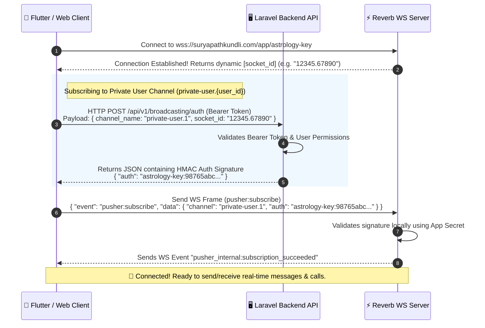

# SURYAPATH KUNDLI (ASTOLOGY) — REVERB LIVE CHAT & WEBSOCKETS DOCUMENTATION
This is the complete **A to Z Developer Reference Manual** for integrating the real-time live chat system powered by **Laravel Reverb (Pusher Protocol)** on the Surypath Kundli / Astrology platform.

---

## 📡 SECTION 1: WEBSOCKET ARCHITECTURE & CONNECTIVITY

The real-time communication tier is powered by **Laravel Reverb**, a high-performance WebSockets server that adheres strictly to the standard **Pusher Protocol**. 

Any official Pusher SDK (like `pusher-js` for Web, `pusher_client` for Flutter, or standard WebSocket client libraries) will connect out-of-the-box.

### 🔌 WebSocket Connection URLs

#### 1. Local Development Settings (from `.env`)
*   **Host**: `127.0.0.1`
*   **Port**: `8080`
*   **Protocol Scheme**: `ws` (non-secure)
*   **Reverb App Key**: `astrology-key`
*   **WS URL**: 
    ```text
    ws://127.0.0.1:8080/app/astrology-key?protocol=7&client=js&version=8.4.0-rc2&flash=false
    ```

#### 2. Live Production Settings
*   **Host**: `suryapathkundli.com`
*   **Port**: `443`
*   **Protocol Scheme**: `wss` (secure SSL)
*   **Reverb App Key**: `astrology-key`
*   **WS URL**: 
    ```text
    wss://suryapathkundli.com/app/astrology-key?protocol=7&client=js&version=8.4.0-rc2&flash=false
    ```
*   **Additional Handshake Header Required**:
    *   `Origin`: `https://suryapathkundli.com`

---

## 🔑 SECTION 2: WEBSOCKET AUTHENTICATION FLOW (HMAC)

Since private and presence channels handle sensitive chat data, clients cannot subscribe to them anonymously. Laravel Reverb secures these subscriptions via an HMAC signature generated by the backend.

### 🔄 The Handshake Sequence Diagram



### 🛰️ Broadcasting Authorization HTTP Endpoint
Standard Pusher SDKs will call this endpoint automatically if properly configured.

*   **URL**: `https://suryapathkundli.com/api/v1/broadcasting/auth`
*   **Method**: `POST`
*   **Headers**:
    ```http
    Authorization: Bearer <USER_AUTH_TOKEN>
    Accept: application/json
    Content-Type: application/x-www-form-urlencoded
    ```
*   **Request Payload (Body)**:
    | Key | Type | Description | Example |
    | :--- | :--- | :--- | :--- |
    | `channel_name` | `string` | The channel you want to join. Must match routing. | `private-user.1` |
    | `socket_id` | `string` | The unique ID received from Reverb upon connection. | `12345.67890` |

*   **Response Payload (`200 OK`)**:
    ```json
    {
        "auth": "astrology-key:98765abcdef123456789abcdef123456789abcde"
    }
    ```

---

## 🔒 SECTION 3: CORE CHANNELS REFERENCE

Clients must subscribe to these channels to listen for live updates.

| Channel Name | Channel Type | Purpose | Subscribed By | Authorization Rule |
| :--- | :--- | :--- | :--- | :--- |
| `private-user.{user_id}` | **Private** | Receives all user-specific alerts, chat requests, calls, WebRTC signaling, and messages. | Both Astrologers & Customers (on their respective user IDs). | Logged-in user's `id` must match `{user_id}`. |
| `presence-room` | **Presence** | Tracks global online/offline presence updates and lists active room members. | All online users. | Must be authenticated via standard Sanctum API. |

*   *Note: In code, Laravel defines private routes as `user.{id}` in `routes/channels.php`. Under the hood, Laravel Broadcast maps the private subscription automatically. On the client side/wire protocol, always subscribe using the `private-user.{id}` channel name.*

---

## 🚀 SECTION 4: A TO Z CHAT LIFECYCLE REST APIS

All endpoints are prefixed with `/api/v1` and protected by the `auth:sanctum` middleware.

```
                  [ LIVE CHAT FLOW LIFECYCLE ]
                  
   [User]                          [Astrologer]
     │                                  │
     │── 1. initiate (POST) ───────────>│ (Triggers "ChatInitiated" WS event)
     │                                  │
     │<── 2. accept (POST) ─────────────│ (Triggers "ChatAccepted" WS event)
     │                                  │
     │── 3. message (POST) ────────────>│ (Triggers "MessageSent" WS event)
     │                                  │
     │<── 4. sync-status (POST) ────────│ (Triggers "MessageStatusUpdated" WS)
     │                                  │
     │── 5. end (POST) ────────────────>│ (Triggers "ChatEnded" WS event)
```

---

### 1. Initiate Chat Session (User Ringing)
Users call this endpoint to start a chat request with an astrologer. The system checks if the astrologer is online, if the user has wallet balance for at least 5 minutes of chat, and dispatches a 60-second ringing timeout job.

*   **Method**: `POST`
*   **URL**: `/api/v1/chat/initiate`
*   **Headers**:
    ```http
    Authorization: Bearer <USER_TOKEN>
    Accept: application/json
    ```
*   **Request Payload**:
    ```json
    {
        "provider_id": 1
    }
    ```
*   **Response Payload (`200 OK`)**:
    ```json
    {
        "success": true,
        "message": "Chat initiated successfully",
        "data": {
            "session": {
                "id": 50,
                "consumer_id": 20,
                "provider_id": 1,
                "status": "initiated",
                "rate_per_minute": 15,
                "created_at": "2026-05-30T12:00:00.000000Z",
                "updated_at": "2026-05-30T12:00:00.000000Z"
            }
        }
    }
    ```

---

### 2. Accept Chat Request (Astrologer Answers)
The Astrologer calls this endpoint to pick up and accept the ringing chat. This transitions the status to `ongoing`, starts the billing ticker, and flags both participants as `is_busy = 1`.

*   **Method**: `POST`
*   **URL**: `/api/v1/chat/{sessionId}/accept`
*   **Headers**:
    ```http
    Authorization: Bearer <ASTROLOGER_TOKEN>
    Accept: application/json
    ```
*   **Response Payload (`200 OK`)**:
    ```json
    {
        "success": true,
        "message": "Chat accepted successfully",
        "data": {
            "session": {
                "id": 50,
                "consumer_id": 20,
                "provider_id": 1,
                "status": "ongoing",
                "rate_per_minute": 15,
                "started_at": "2026-05-30T12:00:15.000000Z",
                "last_billed_at": "2026-05-30T12:00:15.000000Z",
                "created_at": "2026-05-30T12:00:00.000000Z",
                "updated_at": "2026-05-30T12:00:15.000000Z",
                "consumer": {
                    "id": 20,
                    "name": "Aniket Kumar"
                },
                "provider": {
                    "id": 1,
                    "name": "Aacharya Suresh Shastri",
                    "astrologer": {
                        "chat_rate_per_minute": 15
                    }
                }
            }
        }
    }
    ```

---

### 3. Reject Chat Request (Astrologer Declines)
The Astrologer calls this to reject an initiated chat request, ending the session.

*   **Method**: `POST`
*   **URL**: `/api/v1/chat/{sessionId}/reject`
*   **Headers**:
    ```http
    Authorization: Bearer <ASTROLOGER_TOKEN>
    Accept: application/json
    ```
*   **Response Payload (`200 OK`)**:
    ```json
    {
        "success": true,
        "message": "Chat rejected",
        "data": null
    }
    ```

---

### 4. Cancel/Dismiss Chat Request (Consumer side)
The User (Consumer) calls this endpoint to cancel or dismiss an active ringing request (`status = 'initiated'`) before the astrologer accepts it. The API shifts the status to `'rejected'`, resets the players' availability, and fires the `ChatDismissed` real-time WebSocket event to dismiss the incoming call ringing view on the astrologer's screen. 

*   *Note: If the consumer went offline or closed their app abruptly, the presence system automatically fires this cancellation logic on connection lost to save the astrologer's time.*

*   **Method**: `POST`
*   **URL**: `/api/v1/chat/{sessionId}/cancel`
*   **Headers**:
    ```http
    Authorization: Bearer <USER_TOKEN>
    Accept: application/json
    ```
*   **Response Payload (`200 OK`)**:
    ```json
    {
        "success": true,
        "message": "Chat cancelled successfully",
        "data": {
            "session": {
                "id": 50,
                "consumer_id": 20,
                "provider_id": 1,
                "status": "rejected",
                "rate_per_minute": 15,
                "ended_at": "2026-05-30T12:00:25.000000Z",
                "created_at": "2026-05-30T12:00:00.000000Z",
                "updated_at": "2026-05-30T12:00:25.000000Z"
            }
        }
    }
    ```

---

### 5. End Ongoing Chat Session (By User or Astrologer)
Either participant can call this to end the chat. The system stops the billing, calculates final costs (rounding up to the nearest minute), deducts the consumer's wallet balance, credits the provider, and resets the `is_busy` flags to `0` for both.

*   **Method**: `POST`
*   **URL**: `/api/v1/chat/{sessionId}/end`
*   **Headers**:
    ```http
    Authorization: Bearer <USER_OR_ASTROLOGER_TOKEN>
    Accept: application/json
    ```
*   **Response Payload (`200 OK`)**:
    ```json
    {
        "status": "success",
        "message": "Chat ended successfully",
        "data": {
            "session": {
                "id": 50,
                "consumer_id": 20,
                "provider_id": 1,
                "status": "completed",
                "rate_per_minute": 15,
                "duration_seconds": 125,
                "total_cost": 45,
                "started_at": "2026-05-30T12:00:15.000000Z",
                "ended_at": "2026-05-30T12:02:20.000000Z",
                "created_at": "2026-05-30T12:00:00.000000Z",
                "updated_at": "2026-05-30T12:02:20.000000Z"
            },
            "billing": {
                "duration_seconds": 125,
                "user_details": {
                    "duration_seconds": 125,
                    "amount_deducted": 45.0
                },
                "astrologer_details": {
                    "duration_seconds": 125,
                    "amount_added": 45.0
                }
            }
        }
    }
    ```

---

### 6. Upload Chat Attachment
Allows users and astrologers to upload chat files (images, PDFs, documents, audio, videos, etc.) to the server. The API stores the file on the public disk under `chat-attachments/{userId}` and returns its full public URL. This returned URL can then be passed to the **Send Message** API inside the `attachment_url` field.

*   **Method**: `POST`
*   **URL**: `/api/v1/chat/upload-attachment`
*   **Headers**:
    ```http
    Authorization: Bearer <USER_OR_ASTROLOGER_TOKEN>
    Accept: application/json
    Content-Type: multipart/form-data
    ```
*   **Request Payload (multipart/form-data)**:
    | Key | Type | Description |
    | :--- | :--- | :--- |
    | `file` | `file` | The actual file attachment to be uploaded (Max size: 10MB). |

*   **Response Payload (`201 Created`)**:
    ```json
    {
        "success": true,
        "message": "File uploaded successfully",
        "data": {
            "file_path": "chat-attachments/20/1715091234_20_file.png",
            "attachment_url": "https://suryapathkundli.com/storage/chat-attachments/20/1715091234_20_file.png"
        }
    }
    ```

---

### 7. Send Message (Ongoing Chatting)
Sends a message within an active chat session. Supports `text`, `image` attachments, and `system` message types.

*   **Method**: `POST`
*   **URL**: `/api/v1/chat/{sessionId}/message`
*   **Headers**:
    ```http
    Authorization: Bearer <USER_TOKEN_OF_SENDER>
    Accept: application/json
    ```
*   **Request Payload**:
    ```json
    {
        "message": "Pranam Guruji! Mera career kaisa rahega?",
        "attachment_url": "https://suryapathkundli.com/storage/kundli_temp.png",
        "type": "text"
    }
    ```
    *Note: `type` can be one of: `text`, `image`, `system`.*

*   **Response Payload (`200 OK`)**:
    ```json
    {
        "success": true,
        "message": "Message sent",
        "data": {
            "message": {
                "id": 255,
                "chat_session_id": "50",
                "sender_id": 20,
                "receiver_id": 1,
                "message": "Pranam Guruji! Mera career kaisa rahega?",
                "attachment_url": "https://suryapathkundli.com/storage/kundli_temp.png",
                "type": "text",
                "is_read": false,
                "created_at": "2026-05-30T12:01:10.000000Z",
                "updated_at": "2026-05-30T12:01:10.000000Z"
            }
        }
    }
    ```

---

### 8. Get Paginated Message History
Retrieves previous messages in a chat session.

*   **Method**: `GET`
*   **URL**: `/api/v1/chat/{sessionId}/messages`
*   **Headers**:
    ```http
    Authorization: Bearer <USER_OR_ASTROLOGER_TOKEN>
    Accept: application/json
    ```
*   **Response Payload (`200 OK`)**:
    ```json
    {
        "success": true,
        "message": "Messages retrieved",
        "data": {
            "current_page": 1,
            "data": [
                {
                    "id": 255,
                    "chat_session_id": 50,
                    "sender_id": 20,
                    "receiver_id": 1,
                    "message": "Pranam Guruji! Mera career kaisa rahega?",
                    "attachment_url": "https://suryapathkundli.com/storage/kundli_temp.png",
                    "type": "text",
                    "is_read": false,
                    "created_at": "2026-05-30T12:01:10.000000Z"
                }
            ],
            "first_page_url": "https://suryapathkundli.com/api/v1/chat/50/messages?page=1",
            "next_page_url": null,
            "path": "https://suryapathkundli.com/api/v1/chat/50/messages",
            "per_page": 30,
            "to": 1,
            "total": 1
        }
    }
    ```

---

### 9. Mark Messages as Read
Mark all incoming messages in the session as read (`is_read = true`, `is_delivered = true`).

*   **Method**: `POST`
*   **URL**: `/api/v1/chat/{sessionId}/read`
*   **Headers**:
    ```http
    Authorization: Bearer <USER_OR_ASTROLOGER_TOKEN>
    Accept: application/json
    ```
*   **Response Payload (`200 OK`)**:
    ```json
    {
        "success": true,
        "message": "Messages marked as read",
        "data": null
    }
    ```

---

### 10. Sync Messages Status (Delivered vs Seen)
Manually synchronize status for specific messages using their unique database IDs.

*   **Method**: `POST`
*   **URL**: `/api/v1/chat/{sessionId}/sync-status`
*   **Headers**:
    ```http
    Authorization: Bearer <USER_OR_ASTROLOGER_TOKEN>
    Accept: application/json
    ```
*   **Request Payload**:
    ```json
    {
        "status": "seen",
        "message_ids": [255, 256, 257]
    }
    ```
    *Note: `status` can be either `delivered` or `seen`.*

*   **Response Payload (`200 OK`)**:
    ```json
    {
        "success": true,
        "message": "Status updated",
        "data": null
    }
    ```

---

### 11. Get Current Active Session (If Any)
Queries and returns the current active chat session (status is either `initiated` or `ongoing`) for the authenticated user. If no active session exists, it returns `null` inside the `session` object. This is highly recommended to call when the app launches or boots, so you can dynamically resume the ongoing chat ringing/messaging screen.

*   **Method**: `GET`
*   **URL**: `/api/v1/chat/current-session`
*   **Headers**:
    ```http
    Authorization: Bearer <USER_OR_ASTROLOGER_TOKEN>
    Accept: application/json
    ```
*   **Response Payload — Active Session Exists (`200 OK`)**:
    ```json
    {
        "success": true,
        "message": "Current active session retrieved successfully",
        "data": {
            "session": {
                "id": 50,
                "consumer_id": 20,
                "provider_id": 1,
                "status": "ongoing",
                "rate_per_minute": 15,
                "started_at": "2026-05-30T12:00:15.000000Z",
                "created_at": "2026-05-30T12:00:00.000000Z",
                "updated_at": "2026-05-30T12:00:15.000000Z",
                "consumer": {
                    "id": 20,
                    "name": "Aniket Kumar"
                },
                "provider": {
                    "id": 1,
                    "name": "Aacharya Suresh Shastri",
                    "astrologer": {
                        "chat_rate_per_minute": 15
                    }
                }
            }
        }
    }
    ```
*   **Response Payload — No Active Session (`200 OK`)**:
    ```json
    {
        "success": true,
        "message": "Current active session retrieved successfully",
        "data": {
            "session": null
        }
    }
    ```

---

### 12. Get User's Active & Past Chat Sessions (Customer side)
Retrieves all historical and active sessions where the authenticated user participated as the customer (`consumer_id`). Eager loads the astrologer's profile details, the latest message preview, and the count of unread messages.

*   **Method**: `GET`
*   **URL**: `/api/v1/chat/sessions/user`
*   **Headers**:
    ```http
    Authorization: Bearer <USER_TOKEN>
    Accept: application/json
    ```
*   **Response Payload (`200 OK`)**:
    ```json
    {
        "success": true,
        "message": "User sessions retrieved successfully",
        "data": {
            "current_page": 1,
            "data": [
                {
                    "id": 50,
                    "consumer_id": 20,
                    "provider_id": 1,
                    "status": "completed",
                    "rate_per_minute": 15,
                    "duration_seconds": 120,
                    "total_cost": 30,
                    "created_at": "2026-05-30T12:00:00.000000Z",
                    "unread_count": 1,
                    "provider": {
                        "id": 1,
                        "name": "Aacharya Suresh Shastri",
                        "astrologer": {
                            "chat_rate_per_minute": 15
                        }
                    },
                    "latest_message": {
                        "id": 255,
                        "chat_session_id": 50,
                        "sender_id": 1,
                        "receiver_id": 20,
                        "message": "Pranam Guruji! Mera career kaisa rahega?",
                        "type": "text",
                        "created_at": "2026-05-30T12:01:10.000000Z"
                    }
                }
            ]
        }
    }
    ```

---

### 13. Get Astrologer's Active & Past Chat Sessions (Astrologer side)
Retrieves all historical and active sessions where the authenticated user participated as the astrologer (`provider_id`). Eager loads the customer's profile details, the latest message preview, and the count of unread messages.

*   **Method**: `GET`
*   **URL**: `/api/v1/chat/sessions/astrologer`
*   **Headers**:
    ```http
    Authorization: Bearer <ASTROLOGER_TOKEN>
    Accept: application/json
    ```
*   **Response Payload (`200 OK`)**:
    ```json
    {
        "success": true,
        "message": "Astrologer sessions retrieved successfully",
        "data": {
            "current_page": 1,
            "data": [
                {
                    "id": 50,
                    "consumer_id": 20,
                    "provider_id": 1,
                    "status": "completed",
                    "rate_per_minute": 15,
                    "duration_seconds": 120,
                    "total_cost": 30,
                    "created_at": "2026-05-30T12:00:00.000000Z",
                    "unread_count": 0,
                    "consumer": {
                        "id": 20,
                        "name": "Aniket Kumar"
                    },
                    "latest_message": {
                        "id": 255,
                        "chat_session_id": 50,
                        "sender_id": 1,
                        "receiver_id": 20,
                        "message": "Pranam Guruji! Mera career kaisa rahega?",
                        "type": "text",
                        "created_at": "2026-05-30T12:01:10.000000Z"
                    }
                }
            ]
        }
    }
    ```

---

### 14. Get Paginated Message History (Session Detail with Security Guards)
Retrieves previous messages in a chat session. This endpoint enforces strict ownership checks: the authenticated user MUST be either the `consumer_id` or the `provider_id` of the session, otherwise a `403 Forbidden` response is returned.

*   **Method**: `GET`
*   **URL**: `/api/v1/chat/{sessionId}/messages`
*   **Headers**:
    ```http
    Authorization: Bearer <USER_OR_ASTROLOGER_TOKEN>
    Accept: application/json
    ```
*   **Response Payload (`200 OK`)**:
    ```json
    {
        "success": true,
        "message": "Messages retrieved",
        "data": {
            "current_page": 1,
            "data": [
                {
                    "id": 255,
                    "chat_session_id": 50,
                    "sender_id": 20,
                    "receiver_id": 1,
                    "message": "Pranam Guruji! Mera career kaisa rahega?",
                    "type": "text",
                    "is_read": false,
                    "created_at": "2026-05-30T12:01:10.000000Z"
                }
            ]
        }
    }
    ```
*   **Response Payload (`403 Forbidden`)**:
    ```json
    {
        "success": false,
        "message": "You are not authorized to access this chat history."
    }
    ```

---

## ⚡ SECTION 5: REAL-TIME WEBSOCKET EVENTS (PAYLOADS & CHANNELS)

These events are broadcasted over Reverb. When the backend fires an event, Reverb pushes it to the authorized private user channel instantly.

---

### 🔔 1. `ChatInitiated`
*   **Broadcasts to**: `private-user.{provider_id}` (Astrologer's Channel)
*   **Fired When**: User clicks "Initiate Chat" in-app. Rings the Astrologer's screen.
*   **JSON Event Payload**:
    ```json
    {
        "event": "ChatInitiated",
        "channel": "private-user.1",
        "data": {
            "session": {
                "id": 50,
                "consumer_id": 20,
                "provider_id": 1,
                "status": "initiated",
                "rate_per_minute": 15,
                "created_at": "2026-05-30T12:00:00.000000Z"
            },
            "senderData": {
                "id": 20,
                "name": "Aniket Kumar",
                "profile_photo": "https://suryapathkundli.com/storage/profile_20.jpg",
                "is_online": true
            }
        }
    }
    ```

---

### 🔔 2. `ChatAccepted`
*   **Broadcasts to**: `private-user.{consumer_id}` (User's Channel)
*   **Fired When**: Astrologer accepts the chat. Transitions the consumer's calling screen to the active chatting UI.
*   **JSON Event Payload**:
    ```json
    {
        "event": "ChatAccepted",
        "channel": "private-user.20",
        "data": {
            "session": {
                "id": 50,
                "consumer_id": 20,
                "provider_id": 1,
                "status": "ongoing",
                "started_at": "2026-05-30T12:00:15.000000Z",
                "rate_per_minute": 15
            },
            "providerData": {
                "id": 1,
                "name": "Aacharya Suresh Shastri",
                "profile_photo": "https://suryapathkundli.com/storage/astro_1.jpg",
                "astrologer": {
                    "chat_rate_per_minute": 15
                }
            }
        }
    }
    ```

---

### 🔔 3. `ChatEnded`
*   **Broadcasts to**: `private-user.{receiverId}` (The other participant's channel)
*   **Fired When**: The ongoing chat session is ended or completed by either the astrologer or the consumer.
*   **JSON Event Payload**:
    ```json
    {
        "event": "ChatEnded",
        "channel": "private-user.20",
        "data": {
            "session": {
                "id": 50,
                "status": "completed",
                "duration_seconds": 120,
                "total_cost": 30,
                "ended_at": "2026-05-30T12:02:20.000000Z"
            },
            "endedById": 1,
            "billing": {
                "duration_seconds": 120,
                "user_details": {
                    "duration_seconds": 120,
                    "amount_deducted": 30.0
                },
                "astrologer_details": {
                    "duration_seconds": 120,
                    "amount_added": 30.0
                }
            }
        }
    }
    ```

---

### 🔔 4. `ChatDismissed`
*   **Broadcasts to**: `private-user.{receiverId}` (or both private channels if dismissed by system timeout)
*   **Fired When**: An initiated chat request is explicitly cancelled by the consumer, automatically timed out by the system, or cancelled due to a participant disconnecting or going offline. This is the exact event to listen to for hiding the astrologer's accept/reject dialog box.
*   **JSON Event Payload**:
    ```json
    {
        "event": "ChatDismissed",
        "channel": "private-user.1",
        "data": {
            "session": {
                "id": 50,
                "consumer_id": 20,
                "provider_id": 1,
                "status": "rejected",
                "ended_at": "2026-05-30T12:00:25.000000Z"
            },
            "dismissedById": 20
        }
    }
    ```
    *Note: `dismissedById` will be `null` if the cancellation/dismissal was automatically triggered by the system timeout.*

---

### 🔔 5. `MessageSent`
*   **Broadcasts to**: `private-user.{receiverId}` (The recipient's private channel)
*   **Fired When**: A new message is successfully saved in the database via the API.
*   **JSON Event Payload**:
    ```json
    {
        "event": "MessageSent",
        "channel": "private-user.1",
        "data": {
            "messageData": {
                "id": 255,
                "chat_session_id": 50,
                "sender_id": 20,
                "receiver_id": 1,
                "message": "Pranam Guruji! Mera career kaisa rahega?",
                "attachment_url": "https://suryapathkundli.com/storage/kundli_temp.png",
                "type": "text",
                "is_read": false,
                "created_at": "2026-05-30T12:01:10.000000Z"
            }
        }
    }
    ```

---

### 🔔 6. `MessageStatusUpdated`
*   **Broadcasts to**: `private-user.private-user.{receiverId}` (Wait! The backend broadcasts to the exact string matching `private-user.{receiverId}`)
*   **Fired When**: The recipient marks messages as read or syncs delivery status.
*   **JSON Event Payload**:
    ```json
    {
        "event": "MessageStatusUpdated",
        "channel": "private-user.private-user.20",
        "data": {
            "message_ids": [255, 256],
            "status": "seen",
            "session_id": 50
        }
    }
    ```
    *Note: Notice that in `MessageStatusUpdated.php`, the channel is configured as `new PrivateChannel('private-user.' . $this->receiverId)`. Under the hood, Laravel prepends `private-`, resulting in `private-user.private-user.{id}`. Clients should listen to this exact channel for status updates.*

---

## 🟢 SECTION 6: PRESENCE & PINGING (HEARTBEAT)

To maintain real-time online status lists and prevent connections from dropping due to inactivity timeouts, implement these presence features.

### 🌐 Presence Channel: `presence-room`
All active users should subscribe to the presence channel to track global online rosters.

```json
{
    "event": "pusher:subscribe",
    "data": {
        "channel": "presence-room",
        "auth": "astrology-key:98765abc..."
    }
}
```

#### 📡 `PresenceUpdated` Event
Broadcast globally on `presence-room` whenever a user pulses online/offline.
```json
{
    "event": "PresenceUpdated",
    "channel": "presence-presence-room",
    "data": {
        "presenceData": {
            "id": 20,
            "name": "Aniket Kumar",
            "profile_photo": "https://suryapathkundli.com/storage/profile_20.jpg",
            "is_online": true,
            "is_busy": false,
            "user_type": "consumer",
            "last_seen_at": "2026-05-30T12:05:00.000000Z"
        }
    }
}
```

---

### 💓 Heartbeat / Keep Alive (Testing & Raw WebSockets)
Laravel Reverb automatically drops connections after **30 seconds** of inactivity to save resources. 
*   To keep the connection alive indefinitely, the client must send a `ping` frame every **20 seconds**.

*   **Client Sends**:
    ```json
    {
        "event": "pusher:ping"
    }
    ```
*   **Reverb Server Replies**:
    ```json
    {
        "event": "pusher:pong"
    }
    ```

---

## 💡 SECTION 7: DEVELOPER IMPLEMENTATION RULES & BEST PRACTICES

### ❌ What NOT to do
1.  **Do NOT do manual 3-step bindings (Connect ➔ API Auth ➔ Send WS subscribe)** in your application code. Use an official SDK. The SDK handles the token authorization and hands it directly to Reverb without developer overhead.
2.  **Do NOT send raw chat messages over WebSocket frames.** WebSocket events are purely read-only down-link signals. Messages must be sent via the `POST /api/v1/chat/{id}/message` HTTP endpoint to ensure database persistence, media storage, spam check, and transactional reliability.

### ✅ What to do (Best Practices)
1.  **Configure automatic reconnection** inside your client options so that the user's connection resumes automatically when toggling between mobile network towers.
2.  **Graceful Ringing Timeout**: Handle the 60-second unanswered ringing locally on the client to stop the ringing audio, while relying on the backend job `CleanupMissedSessionJob` as a failsafe.
3.  **Wallet Lock Gate**: Prevent starting chats if the consumer's wallet is less than `chat_rate_per_minute * 5` to secure astrologers' billable time.

---

## 💰 SECTION 8: WALLET TRANSACTION RECORDS & ATOMIC BILLING

To maintain strict financial compliance, all paid consultations (chats, calls, etc.) are billed atomically. This section outlines how wallet deductions, credits, and transaction logging behave in the backend.

### 🔒 1. Atomic Transaction & Locking Flow
Every billing update—including real-time billing ticks and session termination billing—is wrapped in an atomic database transaction using row-level locking (`lockForUpdate` in Laravel).
*   **Locked Rows**: The `chat_sessions`/`call_sessions` row, the `consumer` user wallet, and the `provider` user wallet are locked to prevent race conditions, duplicate billing ticks, double deductions, or duplicate credits.
*   **Atomic Rollback**: If any of the following steps fail, the entire transaction is rolled back:
    1. Deducting the consumer's wallet.
    2. Crediting the provider's wallet.
    3. Creating the consumer's debit transaction record.
    4. Creating the provider's credit transaction record.
    5. Updating the session's total billed cost and billing timestamp.

### 📝 2. Wallet Transaction Log Schema & Details

All successful billing operations result in a transaction log with `status = 'completed'` in the `wallet_transactions` table.

#### A. User Side (Debit Transaction)
*   **Transaction Type**: `debit`
*   **Status**: `completed`
*   **Description**: Resolved automatically to `"Chat session with Astrologer <Name>"` or `"Call session with Astrologer <Name>"`.
*   **Reference**: `reference_type` (`App\Models\ChatSession` or `App\Models\CallSession`) and `reference_id` (session database ID).
*   **Balances**: Includes `balance_before` and `balance_after` to preserve full audit trails.
*   **Meta Payload**:
    ```json
    {
        "type": "chat",
        "astrologer_id": 1,
        "astrologer_name": "Aacharya Suresh Shastri",
        "session_id": 50,
        "session_reference": "Chat session reference #50"
    }
    ```

#### B. Astrologer Side (Credit Transaction)
*   **Transaction Type**: `credit`
*   **Status**: `completed`
*   **Description**: Resolved automatically to `"Chat consultation with User <Name>"` or `"Call consultation with User <Name>"`.
*   **Reference**: Same `reference_type` and `reference_id` to link both records.
*   **Balances**: Includes `balance_before` and `balance_after`.
*   **Meta Payload**:
    ```json
    {
        "type": "chat",
        "user_id": 20,
        "user_name": "Aniket Kumar",
        "session_id": 50,
        "session_reference": "Chat session reference #50"
    }
    ```

### 📉 3. Wallet Balance Exhaustion / Session Ending
When a chat or call session ends, the remaining unbilled balance is calculated.
*   If the user has insufficient balance to cover the calculated final unbilled amount, the deduction is capped at the user's remaining wallet balance:
    ```php
    $chargeAmount = min($unbilledBalance, $consumerWallet->balance);
    ```
*   The system deducts `$chargeAmount` from the user, credits the same to the astrologer, logs the completed transactions, updates the session's total cost to the actual amount charged, and marks the session as `completed`. This prevents sessions from getting stuck in an `ongoing` status when a user's wallet is completely drained.

